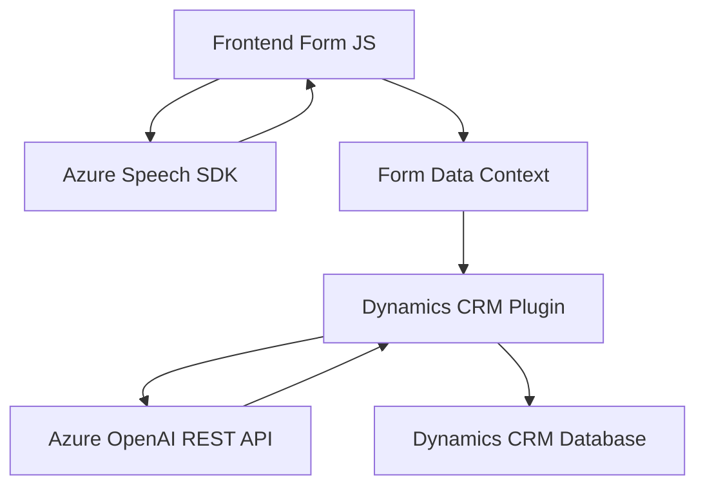

### Breve resumen técnico

La solución presentada en el repositorio combina tres tipos de arquitectura técnica:
1. **Front-end basado en JavaScript:** Manejo directo de formularios y síntesis/entrada de voz mediante Azure Speech SDK.
2. **Integración basada en plugins con Dynamics CRM:** Generación y transformación de datos mediante un plugin que interactúa con Dynamics CRM y la API de Azure OpenAI.
3. **Interacción con servicios de Azure:** Uso de Azure Speech SDK en el cliente y Azure OpenAI en el back-end para procesamiento y mejoras de datos.

---

### Descripción de arquitectura

La solución sigue una arquitectura en **n capas** con integración de servicios externos y desarrollo basado en eventos. Esto incluye:
1. **Capa UI (JavaScript Front-End):** Framework basado en Dom manipulation para gestión del formulario y síntesis/entrada de voz.
2. **Capa de aplicación (Plugins en Dynamics CRM):** Plugins encapsulan lógicas específicas para transformar o trabajar con datos del CRM.
3. **Capa de servicios externos:** Uso de servicios REST de Azure (Speech y OpenAI), que se comunican asincrónicamente con la capa de backend.

Los patrones relevantes incluyen:
- **Carga diferida (Lazy Load)** para el SDK de Azure Speech.
- **Encapsulación modular** en funciones independientes para lectura de datos, síntesis de voz, y transcripción.
- **Delegación de responsabilidad** mediante el plugin y funciones específicas para tareas bien definidas (como transformar texto usando Azure OpenAI).

---

### Tecnologías usadas

1. **Microsoft Dynamics 365 CRM:** Interacción en tiempo de ejecución y extensibilidad mediante plugins.
2. **Azure Speech SDK:** Manejo de entrada de voz y síntesis de voz directamente en el cliente.
3. **Azure OpenAI API:** Transformación basada en inteligencia artificial en el servidor.
4. **Frameworks/librerías:**
   - **Newtonsoft.Json y System.Text.Json:** Procesamiento de datos JSON para comunicación con Azure OpenAI.
   - **JavaScript:** Funciones front-end en ES6+, trabajando en el navegador.
   - **Microsoft.Xrm.Sdk:** Para comunicación del plugin con Dynamics CRM.

---

### Diagrama Mermaid

---

### Conclusión final

La solución representa un sistema híbrido creado para facilitar la interacción entre usuarios finales, formularios de Dynamics CRM y servicios avanzados en la nube. Utiliza técnicas modernas como integración de APIs (REST), procesamiento modular e interacción asincrónica, todo dentro de una arquitectura en capas. Esto la hace altamente escalable y adaptable para escenarios futuros con mayor dependencia de inteligencia artificial y automatización. Sin embargo, estaría limitada por consideraciones de latencia debido al uso intensivo de servicios externos en tiempo real.