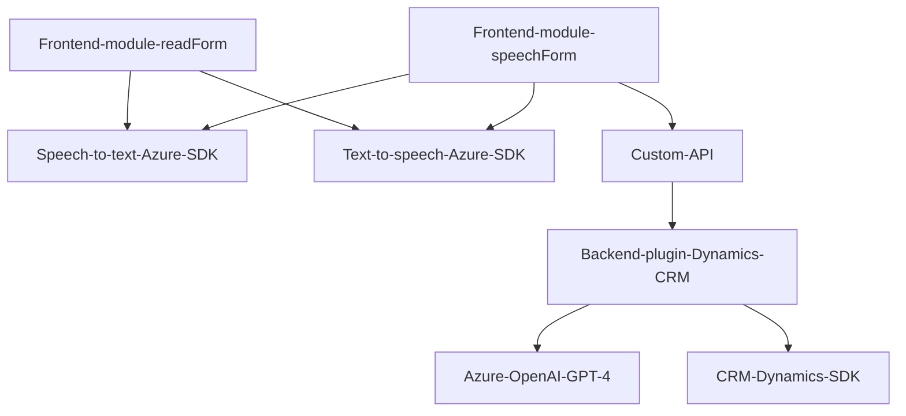

### Breve resumen técnico
El repositorio contiene tres módulos: uno orientado al frontend (sintetización y reconocimiento de voz), otro enfocado en la integración con un backend en Dynamics CRM, y un plugin diseñado para procesar texto usando Azure OpenAI Service integrado directamente en Dynamics CRM. La solución está enfocada en interfaz por voz (speech-to-text y text-to-speech) y transformación avanzada de texto mediante IA en un entorno CRM.

---

### Descripción de arquitectura
La solución tiene una **arquitectura híbrida** que combina:
1. **Frontend semi-modular**: Los archivos `readForm.js` y `speechForm.js` operan como módulos de frontend pero no cuentan con una separación estricta por capas (no usan frameworks como React/Angular). No hay evidencia de un diseño reactivo ni comunicación con un servidor excepto el uso de SDK y APIs directamente.
    - **Event-driven**: Responde a eventos (input, grabaciones de voz, transcripción).
2. **Backend como plugin Dynamics CRM**: El archivo `TransformTextWithAzureAI.cs` se ajusta a un patrón **plugin** y funciona dentro de Dynamics CRM para procesar texto. Su ejecución se enmarca dentro de eventos CRM.
3. **Dependencias externas**: Integración con servicios de Azure (Speech SDK y Azure OpenAI).

La solución conecta servicios externos (SDK y OpenAI API) con un frontend basado en ejecución directa del navegador (sin entornos SPA) junto a un procesamiento backend realizado en Dynamics CRM, asemejándose a una **arquitectura de microservicios asistidos por SDK**.

---

### Tecnologías usadas
- **Frontend:**
  - JavaScript estándar (ES6).
  - Azure Speech SDK (importado desde un paquete externo).
  - Procesamiento dinámico de formularios compatibles con Dynamics CRM.
  
- **Backend:**
  - Lenguaje C# con .NET Framework.
  - Dynamics CRM SDK (`IPlugin`, `IOrganizationService`, etc.).
  - Azure OpenAI Service (GPT-4) mediante REST API.
  - Librerías JSON (`System.Text.Json`, `Newtonsoft.Json.Linq`).

- **Patrones de diseño:**
  - Plugin Pattern. 
  - Event-driven (para interacción por voz y eventos en CRM).
  - Modularidad en el frontend (aunque básica y sin frameworks).
  - Microservicios utilizando servicios externos para procesamiento de voz e IA.

---

### Diagrama **Mermaid**

---

### Conclusión final
La solución integra una interfaz de usuario accesible mediante comandos de voz conectada con procesamiento avanzado de texto soportado por IA (GPT-4) en Dynamics CRM. Utiliza SDKs de Azure (Speech y OpenAI Service), mostrando un enfoque efectivo hacia accesibilidad y automatización.

**Áreas destacadas:**
- Flujo de datos modular y flexible en el frontend.
- Uso estratégico de SDKs externos para voz e inteligencia artificial.
- Plugin en backend diseñado para extensibilidad en Dynamics CRM.

Sin embargo, el repositorio carece de implementación de patrones comunes para escalabilidad en frontend (como MVC o frameworks SPA). La solución podría evolucionar integrando un framework frontend moderno y una estructura orientada a hexagonal o capas en el backend.