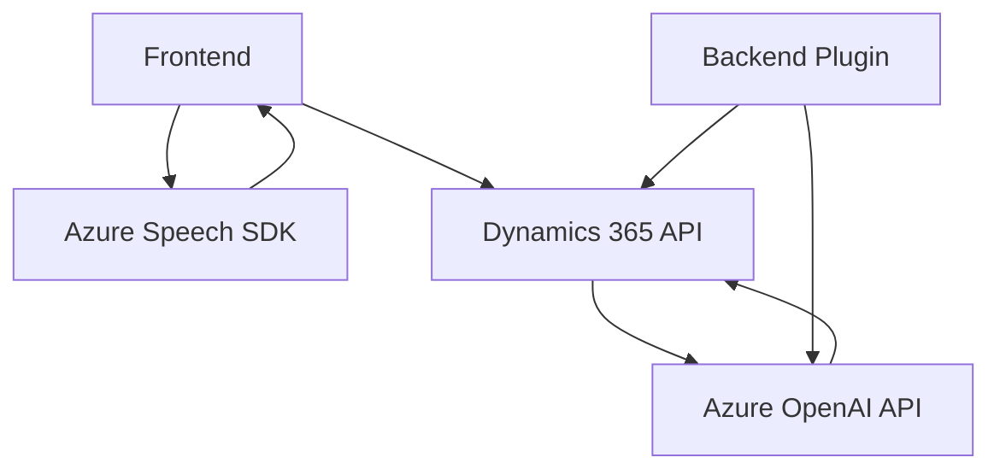

### Análisis del repositorio

**Breve Resumen Técnico:**
Este repositorio implementa una solución híbrida que interactúa con servicios externos para proporcionar funcionalidades avanzadas en una plataforma CRM (Dynamics 365). Las funciones principales giran en torno a la entrada y síntesis de voz utilizando el **Azure Speech SDK** y la transformación de texto a través de **Azure OpenAI API**. La estructura incluye tanto frontend (JavaScript) como backend (C#), lo que sugiere una arquitectura cliente-servidor asociada.

---

### Descripción de Arquitectura

1. **Tipo de solución**:  
   - La combinación de archivos y funcionalidades indica que se trata de una solución **híbrida**:
     - **Frontend**: Aborda la interacción del usuario, utiliza JavaScript para procesar datos en tiempo real mediante voz (speech-to-text y text-to-speech).
     - **Backend**: Implementa un **plugin** en Dynamics CRM con lógica extendida para transformación de texto utilizando Azure OpenAI API.

2. **Arquitectura**:  
   - El diseño del sistema tiene una **arquitectura de capas híbrida**:
     - **Frontend cliente**: Proporciona interacción directa con el formulario mediante tecnologías basadas en SDK (speech input y synthesis).
     - **Capa intermedia**: Usa API externas (Azure Speech y OpenAI) para delegar funcionalidades como el procesamiento de voz y transformación de texto.
     - **Backend funcional**: Ejecuta lógica avanzada en forma de plugins para Dynamics CRM, sincronizado y parametrizado por reglas de negocio.

3. **Modularidad y patrones**:
   - **Principio de responsabilidad única (SRP)**: Las funciones de lectura/síntesis de texto en el frontend y las transformaciones en el backend están adecuadamente desacopladas.
   - **Asincronía**: Uso de promesas y programación asíncrona para manejar servicios y APIs en tiempo real con eficiencia.
   - **Callback Pattern**: Se emplean callbacks en el frontend para garantizar la ejecución síncrona de procesos dependientes (como la carga del Azure Speech SDK).
   - **Service Facade Pattern**: Integración controlada de servicios externos como Azure Speech y OpenAI mediante funciones encapsuladas.

---

### Tecnologías Usadas

1. **Frontend (JavaScript)**:
   - **Azure Speech SDK**: Manejo de entrada y salida de voz, permitiendo el reconocimiento y síntesis de texto.
   - **Dynamics CRM API**: Manipulación de contexto del formulario en Dynamics (ej. `executionContext`, `formContext`).

2. **Backend (C#)**:
   - **IOrganizationService de Dynamics 365**: Gestiona operaciones con registros CRM.
   - **Azure OpenAI API**: Responder transcripciones utilizando modelos GPT (ej. GPT-4) adaptados.
   - **Bibliotecas en C#**:
     - `Newtonsoft.Json.Linq` y `System.Text.Json` para trabajar con JSON.
     - `System.Net.Http` para realizar solicitudes HTTP.

---

### Dependencias Externas

1. **Azure Speech SDK** (para frontend):
   - URL: `https://aka.ms/csspeech/jsbrowserpackageraw`.

2. **Azure OpenAI API** (para backend):
   - Configuración de endpoint: Proporcionada como parte del plugin (.NET).
   - Datos sensibles como **API Key** y región: Deben gestionarse mediante un almacén seguro como Azure Key Vault.

3. **Microsoft Dynamics CRM Service Context**:
   - Utilización del servicio `IOrganizationService` para interactuar con registros de CRM.

4. **JavaScript DOM Manipulation**:
   - Maneja atributos de formularios visibles mediante métodos de acceso como `attr.getValue`.

---

### Diagrama Mermaid

---

### Conclusión Final

Este repositorio implementa una solución interactiva que combina APIs y servicios externos con lógica personalizada mediante una arquitectura basada en integración de capas entre **frontend** y **backend**. Está diseñada para optimizar la funcionalidad de Dynamics CRM, añadiendo capacidades de inteligencia artificial (Azure OpenAI API) y entrada/salida de voz dinámica con Azure Speech SDK.

Sin embargo, algunas observaciones clave:
- **Fortalezas**: Modularidad, uso eficiente de servicios, integración con CRM y uso de SDK.
- **Posibles mejoras**:
  - Refinar la seguridad: Las claves API deben gestionarse de forma más segura mediante Azure Key Vault.
  - Escalabilidad: Aunque extensible, depender tanto de servicios cloud podría representar un cuello de botella si hay restricciones de uso en Azure.

La solución es particularmente adecuada para aplicaciones de CRM y casos de uso que involucren interacción mediante voz y procesamiento de lenguajes naturales.