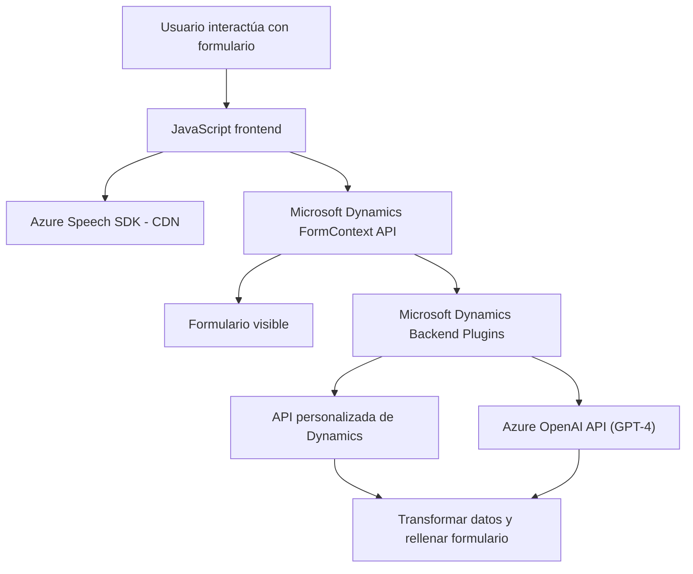

### Breve resumen técnico
El repositorio muestra ejemplos de un sistema que utiliza el **Azure Speech SDK** para reconocimiento y síntesis de voz, junto con integraciones en formularios gestionados mediante **Microsoft Dynamics CRM**. También incluye un **plugin en .NET** que comunica información con **Azure OpenAI API** para procesamiento de texto avanzado y transformación a JSON bajo reglas predeterminadas.

---

### Descripción de arquitectura
La solución está diseñada principalmente en un modelo de **N capas** y componentes modulares:
1. **Frontend**: Encapsula funcionalidades relacionadas con interfaces de usuario y lógica de entrada/salida, utilizando JavaScript y el Azure Speech SDK.
2. **Backoffice**: En el lado del servidor (mediante .NET y Dynamics SDK), se define la lógica de negocios y transformación de datos en integraciones CRM a través de plugins y operaciones API externas (Azure OpenAI).
3. **Integración externa**: Se conecta a servicios externos como Azure Speech SDK y OpenAI API, utilizando una arquitectura cliente-servidor.
4. **Patrones de diseño utilizados**:
   - **Plug-in Architecture**: Implementación de plugins y extensiones en Dynamics CRM.
   - **Factory y Encapsulación**: Se utiliza el patrón Factory para servicios Dynamics y encapsulación de lógica en funciones específicas.
   - **Lazy Loading**: En el frontend, las dependencias del Azure Speech SDK se cargan de manera dinámica desde un CDN.
   - **Abstracción modular**: Lógica separada por funciones en el frontend y clases en el backend. 

La arquitectura es extensible, escalable y basada en componentes desacoplados.

---

### Tecnologías usadas
1. **Frontend: JavaScript (ES6)**  
   - Funciones asíncronas, modularidad, y uso de APIs.
   - Integración con **Azure Speech SDK** para síntesis y reconocimiento de voz.  
   - API de Microsoft Dynamics para manipulación de formularios.
   
2. **Backend: .NET Framework / .NET Core**  
   - Lenguaje: **C#**.
   - SDK: **Dynamics 365 SDK** para desarrollar plugins.
   - Cliente HTTP para integraciones API (Azure OpenAI).

3. **Servicios externos**:
   - **Azure Speech SDK**: CDN como fuente del SDK para el frontend.
   - **Azure OpenAI**: Despliegue de modelos GPT-4 en backend.

4. **Dependencias adicionales**:
   - **System.Text.Json** y **Newtonsoft.Json** (manejo de JSON en .NET).
   - **System.Net.Http** para solicitudes HTTP.

---

### Diagrama Mermaid válido para GitHub
Aquí está un diagrama que explica cómo los componentes interactúan.

### Conclusión final
La solución integra un frontend en JavaScript para síntesis y reconocimiento de voz con Azure Speech SDK mientras interactúa con formularios configurados en **Microsoft Dynamics CRM**. Además, implementa una lógica en el backend, mediante plugins en C#, para procesar datos y enriquecer formularios con la API de **Azure OpenAI**. La arquitectura sigue el modelo **N capas** y utiliza conceptos como lazy loading, abstracción modular, diseño basado en plugins, y manejo eficiente de datos JSON y API HTTP. Este enfoque crea una solución escalable y apta para sistemas CRM avanzados.