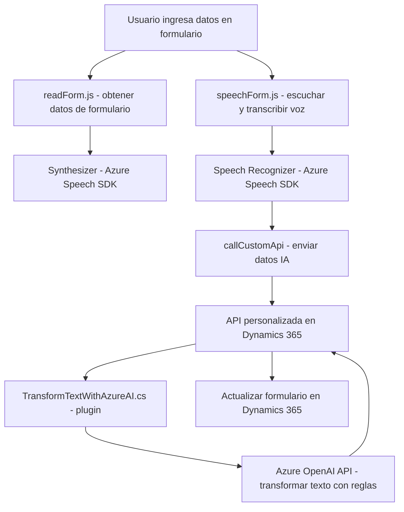

### Breve resumen técnico
El repositorio contiene tres archivos que implementan diferentes partes de una solución tecnológica. El primer archivo (`readForm.js`) se encarga de sintetizar el texto de un formulario en voz utilizando Azure Speech SDK. El segundo archivo (`speechForm.js`) implementa el reconocimiento de entrada por voz y la integración de los datos transcritos en formularios de Dynamics 365, utilizando APIs externas y servicios de IA. El tercer archivo (`TransformTextWithAzureAI.cs`) define un plugin que transforma texto recibido en Dynamics 365 utilizando el servicio Azure OpenAI y devuelve una respuesta estructurada en formato JSON.

---

### Descripción de arquitectura
La solución se basa en una arquitectura **modular**, organizada en función de tres capas principales:
1. **Presentación** (Frontend): Archivos relacionados con el manejo de formularios y reconocimiento de voz en el frontend mediante JavaScript. Los datos recogidos en esta capa interactúan con el servicio de la capa backend.
2. **Lógica de negocio** (Backend): Definida en el plugin de Dynamics 365 para integrarse con una solución en la nube basada en Azure OpenAI.
3. **Servicios externos**: Se integran dos principales servicios SaaS de Azure: Speech SDK como herramienta de síntesis y reconocimiento de voz, y OpenAI API para el procesamiento de datos basado en IA.

La arquitectura sigue el paradigma **en capas**, donde cada componente se conecta con el siguiente para completar el flujo desde la entrada de usuario hasta el procesamiento y almacenamiento de datos. Al implementar funciones específicas para cada responsabilidad, mantiene la separación de preocupaciones y facilita la escalabilidad con servicios basados en la nube.

---

### Tecnologías utilizadas
1. **Lenguajes de programación**:
   - **JavaScript**: Utilizado en el frontend para manejar la interacción con formularios y la integración con Azure Speech SDK.
   - **C#**: Utilizado para definir el plugin para Dynamics 365, que interactúa con Azure OpenAI.

2. **Frameworks y SDKs**:
   - **Azure Speech SDK**: Para el reconocimiento y la síntesis de voz desde JavaScript en un entorno web.
   - **Dynamics 365 SDK**: Para integrarse con la plataforma CRM de Microsoft.
   - **Azure OpenAI API**: Para transformar texto y obtener respuestas estructuradas con inteligencia artificial.

3. **Patrones de diseño y paradigmas**:
   - **Separación de responsabilidades**: Cada función tiene una finalidad específica.
   - **Carga dinámica de SDK**: Utilización de funciones para cargar dinámicamente dependencias externas.
   - **Plug-in Design**: Uso de la interfaz `IPlugin` en Dynamics 365.
   - **Repository Pattern**: Simplifica el acceso a los datos de Dynamics 365 mediante `Xrm.WebApi`.

---

### Dependencias externas y componentes
1. **Azure Speech SDK**: Utilizado en el frontend para la síntesis y reconocimiento de voz.
   - Servicio: Speech-to-Text y Text-to-Speech.
   - Deployed via: URL `https://aka.ms/csspeech/jsbrowserpackageraw`.

2. **Microsoft Dynamics 365 Web API**:
   - `Xrm.WebApi`: Biblioteca para integrar datos y transcripciones en formularios y entidades personalizadas.
   
3. **Azure OpenAI API**:
   - Modelos como GPT-4 utilizados para transformar texto.
   - Autenticación vía clave API.
   
4. **Servicios REST personalizados**:
   - API llamada desde `speechForm.js` (`callCustomApi`) para fines específicos (probablemente para transformar texto mediante IA).

5. **Otras dependencias**:
   - Módulos comunes de C# como `System.Net.Http`, `Newtonsoft.Json.Linq` para manejar conexiones y procesamiento de JSON.
   - JSON como formato de intercambio entre el frontend, backend y microservicios.

---

### Diagrama Mermaid válido para GitHub

---

### Conclusión final
La solución utiliza una arquitectura en capas que combina una interfaz específica para formularios web interactivos, un plugin que gestiona datos dentro de Dynamics 365, e integración con servicios en la nube como Azure Speech SDK y OpenAI API. El uso de patrones como **carga dinámica de scripts**, **separación de responsabilidades**, y **plugin-based design** refleja un enfoque bien estructurado y extensible. Sin embargo, para garantizar una implementación eficiente y segura, sería recomendable auditar todas las interacciones con APIs externas y verificar el manejo adecuado de excepciones y errores. La solución es robusta, ideal para aplicaciones que trabajen con conceptos relacionados con reconocimiento de voz, inteligencia artificial y CRM.