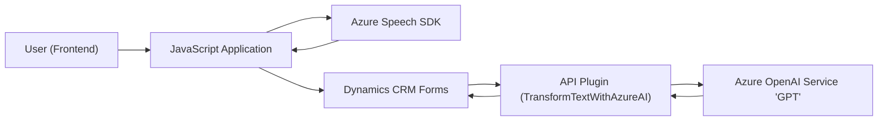

### Breve resumen técnico:

El repositorio presenta una solución variada compuesta por un **frontend** basado en JavaScript y un **plugin backend** en C# diseñado para integrarse con **Dynamics CRM** y **Azure APIs**. Esta solución combina procesamiento de voz y texto, transformando datos input y output mediante servicios de Azure AI y Speech SDK.

---

### Descripción de arquitectura:

La solución sigue el patrón arquitectónico **n capas**, dividiendo responsabilidades entre frontend y backend:
1. **Capa de presentación (Frontend)**: Realiza capturas de entrada y salida desde formularios, empleando procesamiento de voz con Azure Speech SDK.
2. **Capa de lógica de negocio (Plugin)**: Implementa reglas específicas mediante un API REST de Azure OpenAI y estructura respuestas en JSON.
3. **Integración externa**: Comunicación con APIs como Dynamics CRM, Azure Speech SDK y Azure OpenAI Service.

---

### Tecnologías usadas:

1. **Frontend**:
   - **JavaScript**: Procesamiento en tiempo real mediante funciones modulares y dinámicas.
   - **Azure Speech SDK**: Para síntesis y reconocimiento de voz.
   - **Dynamics CRM SDK (`Xrm.WebApi.online`)**: Interacción directa con formularios del sistema.

2. **Backend**:
   - **C#**: Desarrollo de plugins integrados en Dynamics CRM.
   - **Azure OpenAI Service**: Transformación de texto mediante modelos de aprendizaje profundo (GPT API).
   - **JSON Libraries**: `System.Text.Json` y `Newtonsoft.Json` para manejar estructuras complejas.

3. **Dependencias específicas**:
   - **Dynamics CRM SDK (`IOrganizationService`, `IPlugin`)**.
   - **Azure endpoints** (`https://aka.ms/csspeech/jsbrowserpackageraw`) para servicios de voz y procesamiento textual.

---

### Diagrama Mermaid válido para GitHub Markdown:

Representa las interacciones entre los componentes principales y los servicios externos:

---

### Conclusión final:

El repositorio combina procesamiento de voz, transformación de texto vía IA y gestión de formularios en una solución integrada. Su arquitectura multi-capa asegura separación de responsabilidades, mientras que las tecnologías utilizadas son adecuadas para su propósito: enriquecer interacciones con un sistema CRM mediante capacidades de voz e IA. Sin embargo, depender fuertemente de APIs específicas de Azure podría limitar su portabilidad en entornos ajenos a Microsoft.