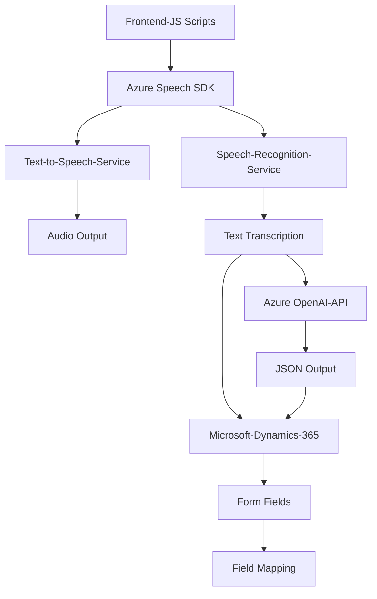

### Resumen Técnico del Repositorio
El repositorio presenta una solución que combina **integración de API externa**, **procesamiento de formularios web** y **plugins para Dynamics 365 CRM**. Las funcionalidades principales incluyen tanto la síntesis de texto a voz como el reconocimiento de voz, junto con un plugin que transforma texto en JSON utilizando **Azure OpenAI**. Estas características apuntan a una solución orientada a enriquecer la interacción en formularios y dinámicamente integrar datos procesados mediante servicios de inteligencia artificial.

---

### Descripción de la Arquitectura
La solución parece seguir una **arquitectura en capas**:
1. **Presentación (Frontend)**: Implementada mediante JavaScript para interactuar con formularios, cargar dinámicamente el SDK de Azure Speech y manejar la síntesis/reconocimiento de audio. El frontend actúa como intermediario entre el usuario y el procesamiento de voz/IA.
2. **Lógica de Negocio (Backend/Servicios)**: Plugins en Dynamics 365 procesan texto con Azure OpenAI y gestionan la lógica relacionada.
3. **Integración con servicios de terceros**: Uso de SDK y APIs de Azure para el procesamiento de texto a voz y reconocimiento de voz, además de la transformación avanzada de texto a JSON.

Los **componentes están altamente orientados a módulos funcionales**. Sin embargo, la dependencia de un sistema CRM (Dynamics 365) indica una arquitectura de **microservicios**, pero no se puede descartar una arquitectura híbrida entre n-capas y microservicios.

---

### Tecnologías Usadas
1. **Frontend:**
   - Lenguaje: JavaScript.
   - SDK: Azure Speech SDK, cargado dinámicamente desde un CDN.
   - Librerías adicionales: Posiblemente `Xrm.WebApi` para facilitar interacciones con Dynamics 365 APIs.
2. **Backend (Plugins):**
   - Lenguaje: C#.
   - Framework: .NET con Dynamics CRM SDK.
   - Bibliotecas:
     - `Newtonsoft.Json` para manipulación JSON.
     - Espacios de nombres .NET para operaciones con HTTP y JSON.
   - Servicios: 
     - Azure OpenAI API para transformación de texto.
3. **Patrones de Diseño:**
   - Modularización: Separación de responsabilidades dentro de funciones y archivos.
   - Singleton: Uso dinámico del objeto `SpeechSDK` para mantener estado.
   - Factory: Configuración del SDK.
   - Plugin Architecture: Implementación estándar de `IPlugin` para Dynamics CRM.
   - MVC (Modelo, Vista, Controlador): Los datos pasan del visor (formularios) al modelo (Azure API) y se gestionan mediante lógica.

---

### Diagrama **Mermaid**

---

### Conclusión Final
Este repositorio implementa una solución basada en **microservicios y arquitectura en capas**, combinando tecnologías modernas como **JavaScript**, **Azure Speech SDK**, **Microsoft Dynamics 365 APIs** y **Azure OpenAI API**. Está diseñado para interactuar con formularios basados en Dynamics 365, enriqueciendo la experiencia del usuario a través de capacidades avanzadas como síntesis de voz, reconocimiento de voz, y procesamiento de texto mediado por inteligencia artificial. Aunque el modelo apunta al uso de una arquitectura sólida, su dependencia de terceros como Microsoft Dynamics y Azure se observa como elemento crítico para su funcionamiento.