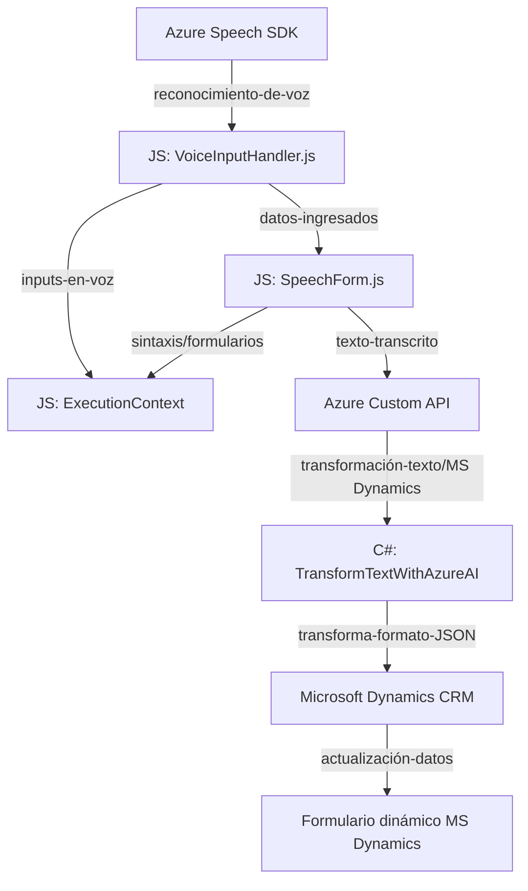

### **Breve Resumen Técnico**

El repositorio expuesto representa una solución tecnológica que se basa en la integración entre Microsoft Dynamics 365 y servicios de nube de Azure, específicamente Azure Speech SDK y Azure OpenAI. Implementa funcionalidades para la captura, transcripción de voz y procesamiento de texto, facilitando la interacción dinámica entre los usuarios, formularios y servicios en la nube para aplicaciones empresariales.

---

### **Descripción de Arquitectura**

La solución emplea una **arquitectura modular con enfoque en capas e integración vertical**. Podemos detallar su diseño como:

1. **Frontend (JavaScript)**:
   - Implementa módulos funcionales autónomos para la interacción directa con Dynamics 365 y servicios cloud.
   - Principalmente orientado a la experiencia de usuario y manejo de formularios, utilizando el Speech SDK para leer y transcribir información.

2. **Backend y Plugin (C#)**:
   - Extensión de Dynamics 365 mediante plugins para manipulación de datos y lógica empresarial.
   - Se integra con la Azure OpenAI API para transformar texto en objetos JSON, siguiendo reglas específicas mediante un enfoque de cálculo externo.

3. **Servicios Cloud Externos**:
   - Uso intensivo de Azure Speech SDK y Azure OpenAI como microservicios para agregar capas de Inteligencia Artificial y procesamiento de texto.

La interacción y flujo entre servicios sugieren una **arquitectura de integración por eventos**, donde la ejecución se basa en desencadenadores contextuales (en frontend y backend).

---

### **Tecnologías Usadas**

1. **Frontend (JS)**:
   - Azure Speech SDK para síntesis y reconocimiento de voz.
   - Funciones JavaScript modulares para manejar formularios y lógica de negocio.
   - Dependencias dinámicas cargadas usando `lazy-loading`.

2. **Backend (C#)**:
   - Microsoft Dynamics CRM SDK (`IPlugin`).
   - Azure OpenAI API para transformación avanzada de texto.
   - Bibliotecas para manipulación y parseo de JSON (`Newtonsoft.Json` y `System.Text.Json`).

3. **Patrones de Diseño**:
   - **Facade**: Simplifica la interacción con servicios complejos (ej. Speech SDK, OpenAI API).
   - **Modularidad**: Cada función/método está orientado a tareas específicas.
   - **Microservicios/Integración Externa**: Extensa delegación de procesos a servicios en la nube.
   - **Event-Driven Architecture**: Uso de desencadenadores contextuales en Dynamics CRM y SDK.

---

### **Diagrama Mermaid**

El siguiente diagrama representa las relaciones principales entre los componentes de la solución:

---

### **Conclusión Final**

La solución es una mezcla de frontend, backend y servicios en la nube para satisfacer necesidades de interacción avanzada entre usuarios y Microsoft Dynamics 365. Gracias al uso de Azure Speech SDK y Azure OpenAI API, aporta una capa de Inteligencia Artificial y comunicación más eficiente, útil para escenarios como la transcripción de voz, lectura de formularios y procesamiento de datos en aplicaciones empresariales. Su arquitectura modular facilita escalabilidad, mantenibilidad e integración con otros sistemas servicio-cloud.