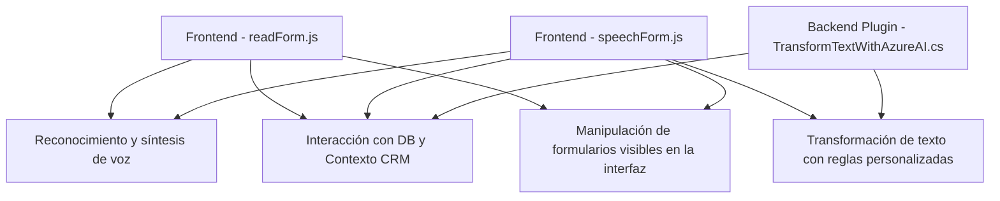

### Breve Resumen Técnico
El repositorio implementa funcionalidades relacionadas con **procesamiento y síntesis de voz** y **transformación de texto con IA** en un contexto integrado con **Dynamics 365 CRM**, utilizando APIs y servicios externos como **Azure Speech SDK** y **Azure OpenAI**. Está diseñado como una solución modular con ciertas características de una arquitectura basada en eventos y orientada a servicio.

---

### Descripción de Arquitectura
La solución en el repositorio presenta una **arquitectura multicapa**, dividida en las siguientes capas principales:

1. **Capa Frontend (JavaScript)**: Implementación de funcionalidades de reconocimiento de voz, síntesis textual y mapeo automático en formularios dinámicos.
   - Incluye dos archivos: `readForm.js` y `speechForm.js`.
   - Estas interacciones emulan características MVC (sin cumplir las normas exactas) como:
     - Modelo: Gestión y mapeo de datos de formularios.
     - Vista: Interacción con datos visibles en formularios de Dynamics.
     - Controlador: Lógica de negocio que maneja entrada de voz, conexión con APIs y actualización de datos.

2. **Capa Backend (Plugins)**: Uso de plugins como `TransformTextWithAzureAI.cs`, diseñado para interactuar con **Dynamics CRM** y **Azure OpenAI** para transformar texto según reglas predefinidas.
   - Adopta la arquitectura de plugins específica para Dynamics CRM.
   - Aplica el patrón de integración para consumir servicios externos.
   - Usa patrones de diseño como *Command* y *Repository* para estructurar la lógica en la ejecución de plugins.

3. **API Externa (Azure)**: APIs de **Azure Speech SDK**, **Azure OpenAI**, y probablemente la API nativa de **Dynamics CRM** para operaciones adicionales como gestionar datos en entidades CRM.

---

### Tecnologías Usadas
1. **Frontend**:  
   - JavaScript para funcionalidades web.  
   - Uso del SDK de Azure para síntesis y reconocimiento de voz (`https://aka.ms/csspeech/jsbrowserpackageraw`).  
   - API nativa de Dynamics CRM para actualización y consulta de datos.

2. **Backend Dynamics Plugin**:  
   - Lenguaje: C#.  
   - Framework: Dynamics CRM SDK (Microsoft.Xrm).  
   - Integración con servicios externos:
     - Azure OpenAI (GPT): Para transformar texto y aplicar normas personalizadas.
     - Microsoft SQL Server (posible interacción con bases de datos locales).

3. **Servicios Externos**:  
   - Azure Speech SDK: Reconocimiento y síntesis de voz.
   - Azure OpenAI Service: Transformaciones basadas en GPT y AI.
   - Dynamics CRM API for Web Operations: Manipulación de datos en formularios CRM.

4. **JSON Libraries**:  
   - Newtonsoft.Json y System.Text.Json: Manejo de datos estructurados JSON.

---

### Diagrama Mermaid

---

### Conclusión Final
El repositorio implementa una solución **multicapa** que combina un enfoque **orientado a eventos** en el frontend con una **arquitectura de plugins** en el backend para la integración con **Microsoft Dynamics CRM**. Con énfasis en servicios externos como **Azure Speech SDK** y **Azure OpenAI**, el proyecto aprovecha patrones de diseño como modularidad y callbacks en el frontend y patrones de integración API en el backend. Aunque es robusto en manejo de funcionalidades, existen áreas que podrían mejorarse, como el manejo seguro de claves de API y la extensibilidad del procesamiento estático del texto.