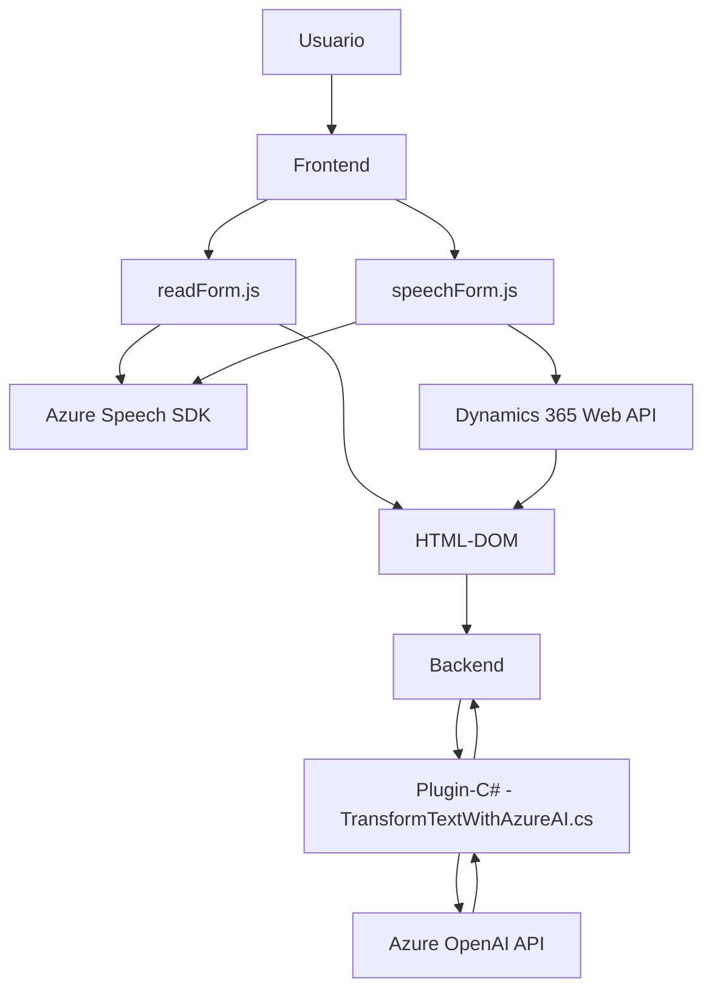

### Breve resumen técnico
El repositorio comprende tres principales archivos que operan en dos áreas: un **frontend basado en JavaScript ligado a formularios** (readForm.js y speechForm.js) y un plugin en C# (TransformTextWithAzureAI.cs) diseñado para Microsoft Dynamics CRM, que utiliza la API de Azure OpenAI para la transformación de texto. El sistema implementa funcionalidades para lectura y síntesis de voz, procesamiento de entrada de voz, aplicación de datos en formularios, y generación estructurada de JSON basado en reglas predefinidas.

---

### Descripción de arquitectura
El sistema emplea una arquitectura **n capas**. El archivo `TransformTextWithAzureAI.cs` pertenece a la capa de backend, mientras los archivos en el directorio `FRONTEND/JS` funcionan en el cliente web (frontend). En el backend, existe una clara implementación orientada a eventos y microservicios en la interacción con Azure OpenAI. El frontend implementa un flujo modular y reutilizable con distintas capas funcionales usando JavaScript, y actúa como interfaz de entrada para el usuario.

La arquitectura puede considerarse "extendida" de **Microsoft Dynamics CRM**, funcionando como una solución sobre su arquitectura monolítica principal, pero integrando servicios externos como Azure OpenAI y Azure Speech SDK para extender las capacidades del sistema.

---

### Tecnologías usadas
1. **Frontend (readForm.js y speechForm.js)**:  
   - **JavaScript**: [ES6+] para el desarrollo de las funciones.
   - **Azure Speech SDK**: Para síntesis y reconocimiento de voz, cargado dinámicamente desde un paquete web.
   - **Dynamics 365 Web API**: Para llamadas a datos relacionados con formularios.  
   - **Browser DOM API**: Manipulación de DOM y ejecución de scripts dinámica.

2. **Backend plugin (TransformTextWithAzureAI.cs)**:
   - **Microsoft Dynamics CRM SDK** (`Microsoft.Xrm.Sdk`): Integración directa con Dynamics CRM como un plugin.
   - **Azure OpenAI API**: Para transformación de textos.
   - **ASP.NET Framework (C#)**: Desarrollo de plugins.
   - **JSON Libraries**: Manejo de estructura JSON (uso de Newtonsoft.Json.Linq o System.Text.Json).
   - **HttpClient**: Para realizar peticiones HTTP.

---

### Diagrama Mermaid compatible con GitHub Markdown
Este diagrama representa la interacción entre los componentes del sistema, separando las responsabilidades entre el frontend y el backend, y mostrando las dependencias externas.

---

### Conclusión final
La solución es un combinación entre un **frontend interactivo** desarrollado en JavaScript para procesar datos en formularios, mediante síntesis y reconocimiento de voz (Azure Speech), y un **backend plugin** en C# que opera como parte de Microsoft Dynamics CRM, integrando capacidades de procesamiento de texto con APIs externas (Azure OpenAI). La arquitectura emplea herramientas modernas y patrones como modularidad y orientada a eventos, aunque podría mejorarse en temas de seguridad (por ejemplo, evitando claves de API en el código).