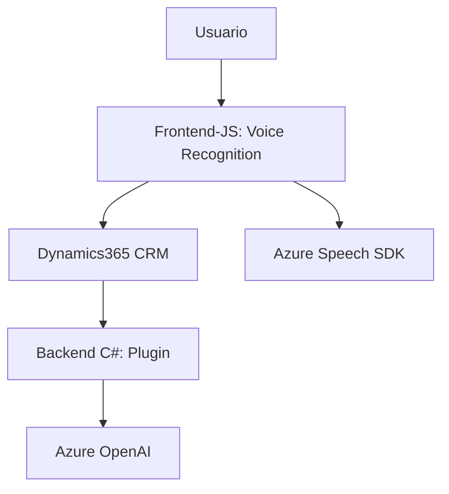

---

### **Breve resumen técnico**
El repositorio corresponde a una solución integrada con Microsoft Dynamics 365 CRM que implementa dos componentes principales:
1. **Frontend**: Funcionalidad para interactuar con un formulario en Dynamics 365 mediante entrada de voz procesada con Azure Speech SDK.
2. **Backend Plugin**: Servicio en C# para procesar datos a través de Azure OpenAI desde Dynamics 365 mediante el interface de plugin (`IPlugin`).

---

### **Descripción de arquitectura**
La solución puede clasificarse como una **arquitectura de n-capas**, donde diferentes niveles de la aplicación están aislados en componentes específicos:
- **Interface de usuario**: Gestionada mediante formularios de Dynamics 365 y scripts en JavaScript.
- **Lógica de negocios en el cliente**: Código JS que maneja entrada de voz y mapea datos transformados en los campos visibles de los formularios.
- **Lógica en el servidor**: Plugins en C# que procesan datos usando Azure OpenAI, transforman texto y responden a eventos ejecutados en Dynamics CRM.

La solución también incorpora integración con servicios externos como Azure OpenAI y Azure Speech SDK, ambos fundamentales para la funcionalidad.

---

### **Tecnologías usadas**
1. **Frontend (JavaScript)**:
   - **Azure Speech SDK**: Para reconocimiento y síntesis de voz.
   - **Dynamics 365 API (`Xrm.WebApi.online`)**: Para interactuar con formularios y realizar operaciones CRUD.
   - **Modular JS**: Uso de funciones separadas por funcionalidad como procesamiento de transcripciones, carga dinámica del SDK y mapeado de campos.

2. **Backend (C#)**:
   - **Microsoft Dynamics SDK (`Microsoft.Xrm.Sdk`)**: Para programación de plugins en eventos de CRM.
   - **Azure OpenAI API**: Transformación de texto según reglas.
   - **Newtonsoft.Json y System.Text.Json**: Para manejo de datos estructurados en formato JSON.
   - **HttpClient (System.Net.Http)**: Para comunicación con APIs remotas.

---

### **Patrones utilizados**
1. **Frontend**:
   - **Carga dinámica de dependencias**: Para optimizar rendimiento y reducir la carga inicial del navegador.
   - **Integración de servicios en la nube**: Uso de SDKs externos para habilitar capacidades avanzadas.
   - **Procesamiento modular**: Cada funcionalidad está encapsulada en funciones dedicadas.

2. **Backend**:
   - **Plugin Pattern**: Arquitectura basada en eventos de CRM para el desencadenamiento de lógica de negocio.
   - **Service Layer**: Encapsulación de la interacción con Azure OpenAI, separando la lógica de negocio de la comunicación con un servicio externo.

---

### **Diagrama Mermaid**

---

### **Conclusión final**
- La solución está diseñada para mejorar la interacción del usuario con los formularios de Dynamics 365 mediante entrada y salida de voz, procesando datos con Azure Speech SDK y Azure OpenAI.
- La arquitectura modular facilita la separación de roles entre capa frontend y backend, mientras que la integración con servicios externos como Azure hace posible implementar funcionalidades avanzadas como síntesis de voz y modelos de transformación de texto basados en IA.
- Las dependencias externas como Azure Speech SDK y OpenAI son críticas para el funcionamiento del sistema, lo que requiere garantizar su disponibilidad y la correcta configuración de credenciales.