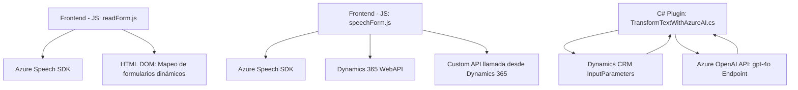

### Breve resumen técnico
El repositorio contiene una solución orientada a integrar la síntesis y reconocimiento de voz, procesamiento de texto y mapeo en formularios dinámicos dentro del ecosistema de Microsoft Dynamics 365. Utiliza el Azure Speech SDK para operaciones de texto a voz y reconocimiento de voz, mientras que el plugin de C# aprovecha la API de Azure OpenAI para transformar textos siguiendo reglas específicas.

---

### Descripción de arquitectura
La solución está organizada en tres niveles principales:
1. **Frontend/Javascript**: Para interacción del usuario con formularios en Dynamics 365, ejecutando operaciones de voz como lectura de datos del formulario y transcripción de audio. La lógica sigue una estructura modular y utiliza patrones de integración de dependencias.
2. **Backend/Plugin en C#**: Lógica específica de servidor que transforma texto utilizando la API Azure OpenAI dentro de Dynamics CRM. Implementa la arquitectura basada en eventos y el patrón Plugin.
3. **Dependencia externa (APIs)**: Usa APIs como el Azure Speech SDK y Azure OpenAI para capacidades avanzadas de voz e inteligencia artificial.

La arquitectura global es una **arquitectura híbrida basada en eventos (Event-Driven)** con separación de responsabilidades entre frontend y backend. Aunque está centralizada en Dynamics 365 como plataforma monolítica, los componentes están separados y utilizan patrones de capas.

---

### Tecnologías usadas
1. **Frontend**:
   - **JavaScript**:
     - HTML DOM para manipulación, mapeo dinámico de formularios.
     - Azure Speech SDK para texto a voz y reconocimiento de voz.
   - **Dependencias externas**: Carga dinámica del SDK de Azure Speech.
   - **Principios de diseño**: Modulares y reutilizables con separación de responsabilidades (SRP).

2. **Backend**:
   - **C# (.NET Framework)**:
     - Plugin Pattern en Dynamics 365 para eventos específicos de CRM.
     - Azure OpenAI API para procesamiento en lenguaje natural.
     - Librerías como `Newtonsoft.Json.Linq` para manejo de JSON.

3. **Plataformas y APIs**:
   - Plataforma Dynamics 365 CRM.
   - Azure OpenAI API.
   - Azure Speech SDK.

---

### Dependencias o componentes externos
1. **Azure Speech SDK**:
   - Texto a voz y reconocimiento de voz en frontend.
   - Asíncrono con carga dinámica en navegador.
2. **Azure OpenAI API**:
   - Procesamiento de texto con contexto personalizado y generación de outputs en JSON.
3. **Dynamics 365 API/Web Services**:
   - Actualización de formularios y atributos.
   - Custom API para transformación de datos transcritos.

---

### Diagrama Mermaid válido para Markdown en GitHub

---

### Conclusión final
Esta solución aprovecha tecnologías avanzadas como el Azure Speech SDK y la API Azure OpenAI para crear una experiencia que une voz, texto y datos dinámicos dentro del ecosistema de Microsoft Dynamics 365. Su arquitectura modular y orientada a servicios permite una fuerte integración entre frontend (basado en JavaScript) y backend (basado en C# Plugin y Azure APIs). Aunque su implementación depende en gran medida de Dynamics 365, la solución está bien estructurada y utiliza patrones como separación de responsabilidades (SRP) y event-driven programming para administrar la interacción entre sus elementos internos y externos.