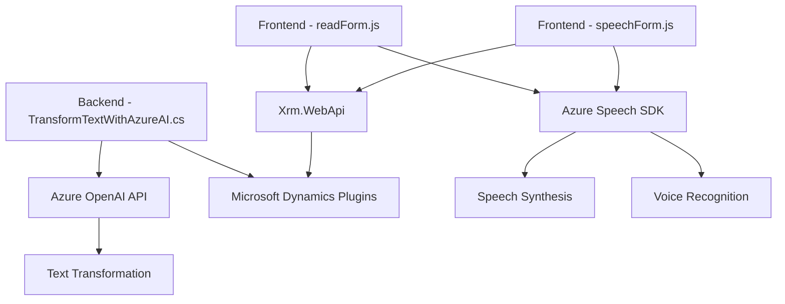

### Breve resumen técnico
Este repositorio contiene fragmentos de código con la implementación de varias funcionalidades para generar procesamiento en tiempo real con `Azure Speech SDK`, integrar reconocimiento de voz/transcripción y procesamiento de datos enriquecidos mediante **Azure OpenAI**. Los análisis principales han sido proporcionados para tres archivos: `readForm.js`, `speechForm.js` y `TransformTextWithAzureAI.cs`.

---

### Descripción de arquitectura  
- **Tipo de solución**: Principalmente una aplicación orientada a datos y eventos, con una estructura dual que incluye un frontend basado en JavaScript y un backend que extiende funcionalidades de Dynamics CRM mediante un plugin en C#.
- **Arquitectura**: Compartida entre tres componentes:
  - Frontend **n capas** para la manipulación cliente-servidor.
  - Backend **plugin/event-driven architecture** basado en extensiones modularizadas en Dynamics CRM.
  - Integración en tiempo real con APIs en la nube (Azure Speech y OpenAI).

---

### Tecnologías usadas  
1. **Frontend**:
   - Lenguaje: JavaScript (ES6+).
   - SDK: Azure Speech SDK (cargado dinámicamente desde un CDN).
   - Dependencias: Xrm.WebApi (API de Dynamics).
2. **Backend**:
   - Lenguajes: C# para implementación de plugins (Dynamics CRM).
   - SDK: Microsoft Dynamics CRM SDK.
   - APIs: Azure OpenAI para procesamiento de texto.
   - Dependencia JSON: Newtonsoft.Json para manejar objetos JSON.
3. **Servicios externos**:
   - Azure Speech SDK: Para reconocimiento de voz y síntesis en frontend.
   - Azure OpenAI: Para enriquecimiento y transformación de texto basado en normas predefinidas.

---

### Patrones arquitectónicos en uso  
1. **Frontend**:
   - Modularidad: Separación de responsabilidades en funciones para carga SDK, extracción de atributos, síntesis de voz y procesamiento.
   - Inicialización dinámica: `ensureSpeechSDKLoaded` carga dependencias externas si no están disponibles, asegurando robustez.
   - Gestión de eventos: Procesos conectados a contextos de ejecución (ejemplo: formularios y transcripciones).
   - API-driven: Comunicación entre frontend y APIs externas para operaciones distribuidas.
   
2. **Backend**:
   - Plugin-first: Extensión basada en eventos especializada en reglas predefinidas (acciones centradas en Dynamics CRM).
   - REST Integration: Conexión eficiente con APIs mediante `HttpClient`.
   - Transformación estructurada: Manipulación de datos basada en JSON e integración OpenAI.

---

### Diagrama Mermaid válido para GitHub  

---

### Conclusión final  

El repositorio muestra una solución híbrida compuesta por:
1. **Frontend avanzado** utilizando `Azure Speech SDK` para reconocimiento y síntesis de voz, con una gestión modularizada de los datos visuales y atributos de formularios.
2. **Backend inteligente** extendiendo Microsoft Dynamics CRM con plugins en C#, claramente diseñados para comunicación REST y transformación estructurada mediante **Azure OpenAI**.

La arquitectura es predominantemente **n capas** con componentes bien integrados, dinámicos y adaptables. Este diseño enfatiza el rendimiento ligero en cliente y procesamientos enriquecidos vía APIs externas, creando un sistema adecuado para aplicaciones empresariales modernas.