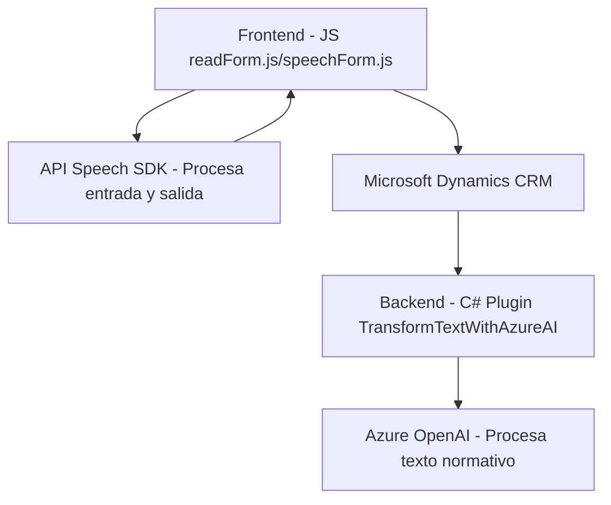

### **Resumen técnico:**

Este repositorio parece ser una solución orientada a la integración de servicios de Azure y Dynamics CRM para mejorar la interacción con formularios a través de voz y generación de texto estructurado. Se enfoca tanto en la transcripción y síntesis de voz como en el procesamiento de datos con inteligencia artificial.

---

### **Descripción de arquitectura:**

1. **Tipo de solución:** 
   - Es una solución híbrida compuesta por componentes de frontend (integración de Azure Speech SDK en entornos cliente) y backend (Plugins en Dynamics CRM).
   - Principalmente, está diseñada para manejar datos de formularios y aprovechar la interacción con servicios de Microsoft Azure y Dynamics CRM para generar texto estructurado y sintetizar voz.

2. **Arquitectura:**
   - **N capas (3 capas):** La solución cumple con el patrón de arquitectura de tres capas:
     - **Presentación (Frontend):** Consiste en funcionalidades orientadas a realizar la interacción del usuario con los formularios y servicios de voz/micrófono.
     - **Negocio:** Integración en Dynamics CRM para procesar datos de manera lógica y estructurada.
     - **Acceso a datos:** Comunicación con APIs externas (Azure Speech SDK y Azure OpenAI) y servicios integrados de Dynamics CRM para realizar transformaciones y obtener resultados.

---

### **Tecnologías utilizadas:**
1. **Frontend:**
   - **JavaScript:** Manejo de eventos, validación, procesamiento y acceso al DOM.
   - **Azure Speech SDK:** Para síntesis de voz y procesamiento de transcripciones.
   - **Microsoft Dynamics CRM SDK (Xrm):** Para integración con formularios y APIs personalizados.

2. **Backend:**
   - **C#:** Lenguaje imperativo y orientado a objetos para implementar plugins.
   - **Microsoft Dynamics CRM:** Gestión de objetos, datos y parámetros del sistema CRM.
   - **Azure OpenAI:** Realización de transformaciones de texto usando IA.
   - **Frameworks .NET y Newtonsoft.Json:** Serialización y deserialización de JSON.

---

### **Dependencias identificadas y componentes externos:**
1. **Azure Speech SDK:** Para habilitar la síntesis y transcripción de voz.
2. **Azure OpenAI Service:** Procesamiento de texto mediante inteligencia artificial.
3. **Microsoft Dynamics CRM (Xrm):** API nativa y sistema para trabajar con formularios y registros organizacionales.
4. **System.Net.Http:** Para realizar solicitudes HTTP (C#).
5. **Newtonsoft.Json:** Biblioteca para trabajar con datos JSON en el backend.
6. **Window API:** Usada para cargar dinámicamente la dependencias del Speech SDK en frontend.
7. **Xrm.WebApi.online:** Para realizar llamadas a APIs personalizadas en una organización basada en Dynamics CRM.

---

### **Diagrama Mermaid válido para GitHub:**

---

### **Conclusión final:**

El análisis revela que el repositorio constituye una solución híbrida orientada a integrar un servicio de síntesis y transcripción de voz, así como el procesamiento de textos mediante IA, en un sistema diseñado para operar sobre Microsoft Dynamics CRM. El uso de tecnologías avanzadas como Azure Speech SDK y Azure OpenAI demuestra un enfoque moderno y funcional, pero también señala áreas a mejorar, como la gestión segura de credenciales.

La solución tiene un diseño estructurado con responsabilidades bien definidas y usa patrones comunes, como la arquitectura en tres capas, el patrón de plugin en Dynamics CRM y el enfoque SOA. Su dependencia de servicios externos como Azure requiere monitoreo y actualización permanente.