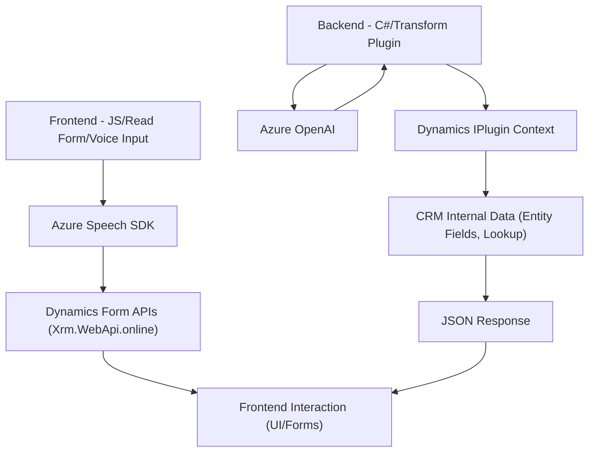

### Breve Resumen Técnico
El repositorio presenta una solución de integración entre Microsoft Dynamics CRM y servicios en la nube de Microsoft Azure, específicamente el SDK de Azure Speech y Azure OpenAI. La funcionalidad cubre:
1. **Frontend**: Archivos JavaScript que permiten la interacción del usuario mediante formularios soportando entrada de voz y síntesis de texto a voz.
2. **Backend**: Un plugin en C# que procesa datos mediante Azure OpenAI, transformando texto según necesidades específicas.

### Descripción de Arquitectura
La arquitectura parece ser de **n-capas** con integración de servicios externos. Se utiliza Dynamics CRM como núcleo de operaciones, con módulos frontend para interacción del usuario y un plugin backend para extensiones personalizadas. No hay separación explícita en microservicios. Los componentes trabajan bajo una arquitectura **orientada a eventos** (plugin en Dynamics) y servicios externos.

1. **Capas Identificadas**:
   - **Frontend** (UI/UX): Archivos JS relacionados con formularios de Dynamics CRM.
   - **Backend**: Plugin de Dynamics CRM que interactúa con servicios externos (Azure OpenAI).

2. **Patrones Usados**:
   - **Lazy Initialization**: Asegura que el SDK de Azure Speech se carga sólo si es necesario.
   - **Factory**: Gestión del plugin Dynamics CRM para interactuar con el servicio API.
   - **Modulo Funcional**: Código dividido por responsabilidades.

### Tecnologías Usadas
1. **Frontend**:
   - Azure Speech SDK.
   - Dynamics CRM APIs.
   - JavaScript.

2. **Backend**:
   - SDK de Microsoft Dynamics CRM (`IPlugin`).
   - C# (manejo de lógica en plugins).
   - Azure OpenAI (GPT-4 para texto).
   - HTTP Client para llamado a APIs externas.
   - JSON/XML parsers (`Newtonsoft.Json`, `System.Text.Json`).

### Dependencias o Componentes Externos
1. **Azure Speech SDK**:
   - Proceso de síntesis y reconocimiento de voz desde formularios.
2. **Azure OpenAI**:
   - Transformación de texto usando GPT-4 en el backend.
3. **Microsoft Dynamics CRM**:
   - Base para integración de frontend y backend.
4. **Xrm.WebApi.online**:
   - Interacciones con datos del sistema CRM vía APIs web.

---

### Diagrama Mermaid (Repositorios y Flujo)

---

### Conclusión Final
La solución está diseñada como **n-capas** para extender Microsoft Dynamics CRM con integración avanzada usando Azure (Speech SDK y OpenAI). Ofrece un flujo completo de interacción donde el usuario puede trabajar con voz y obtener procesamiento IA en tiempo real. Esta arquitectura es adecuada para entornos orientados a la automatización del flujo de trabajo empresarial y mejora la experiencia del usuario en escenarios CRM, utilizando patrones modernos como Lazy Initialization, API integration, y una estructura modular eficiente.
