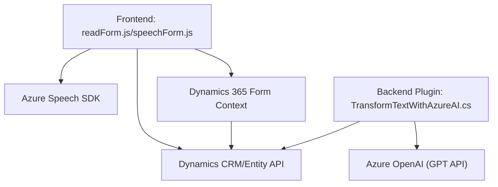

### Breve Resumen Técnico

El repositorio es una solución de múltiples componentes donde:
1. Los archivos `readForm.js` y `speechForm.js` son parte del **frontend** basado en JavaScript, enfocados en la interacción con formularios para la síntesis de voz, reconocimiento de voz y procesamiento de datos con Azure Speech SDK.
2. El archivo `TransformTextWithAzureAI.cs` es parte de un **plugin** de Dynamics CRM (.Net Framework en C#), diseñado para interactuar con un servicio de procesamiento de lenguaje natural (Azure OpenAI SDK).

Es una solución integrada que utiliza servicios en la nube y depende de plataformas empresariales como Dynamics 365 y Azure para el procesamiento avanzado.

---

### Descripción de Arquitectura

La arquitectura combina elementos de **n capas** y **hexagonal/dominio**:
1. **N capas**: Los archivos `readForm.js` y `speechForm.js` implementan el manejo de formularios y servicios asincrónicos en la capa lógica del cliente, consumiendo servicios externos de Azure. Además, el plugin `TransformTextWithAzureAI.cs` actúa en la capa lógica del backend de Dynamics CRM.
2. **Hexagonal**: El plugin de Dynamics CRM se integra mediante puertos y adaptadores para interactuar con servicios de Azure OpenAI, diferenciando claramente las responsabilidades entre el manejo del dominio y la interacción externa.

---

### Tecnologías, Frameworks y Patrones

1. **Frontend (JavaScript):**
   - **Azure Speech SDK:** Para síntesis de voz y reconocimiento de habla.
   - **Modularización:** Funciones bien definidas para tareas independientes.
   - **Async/Promises:** Para gestión de datos y carga dinámica de dependencias externas.
   - **Patterns:** Factory (creación de configuraciones para el SDK), separación de responsabilidades.

2. **Backend (C#, Dynamics CRM Plugin):**
   - **Microsoft.Xrm.Sdk:** Plugin para personalizar la lógica del negocio en Dynamics CRM.
   - **Azure OpenAI API (GPT):** Para procesamiento avanzado de texto.
   - **REST**: Uso de solicitudes HTTP para interacción con servicios externos.
   - **Patterns:** Encapsulación de lógica en métodos estáticos, integración con APIs externas.

---

### Dependencias o Componentes Externos

1. **Azure Speech SDK:** Para síntesis y reconocimiento de voz en el frontend.
2. **Azure OpenAI API (GPT):** Para procesar texto en el backend del plugin.
3. **Dynamics CRM/WebApi:** Para conectarse con entidades y formularios desde los scripts frontend y el plugin backend.
4. **Newtonsoft.Json:** Para serialización y deserialización de datos en formato JSON.

---

### Diagrama Mermaid

---

### Conclusión Final

Esta solución combina un frontend en **JavaScript** altamente modular y orientado a interacción con formularios y voz, con un plugin backend en **C#** diseñado para gestionar procesamiento de texto avanzado mediante servicios de Azure. La arquitectura destaca por su integración con **Azure Speech SDK** y **OpenAI** para reconocimiento y procesamiento de datos, y su compatibilidad directa con entornos empresariales como Dynamics 365. Los patrones como **modularidad**, **n capas** y **orientación al dominio** están bien representados. Es una solución sólida, aunque podría beneficiarse de mejores prácticas para el manejo de claves y endpoints sensibles.