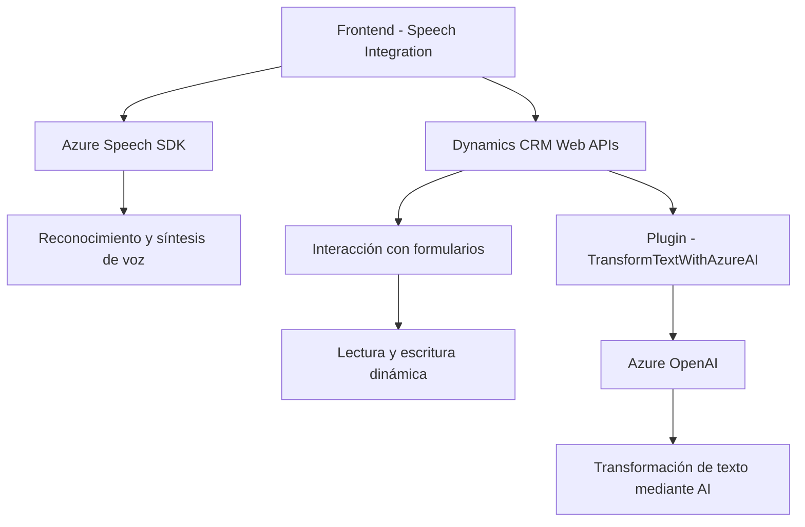

**Breve Resumen Técnico:**

El repositorio describe un sistema de integración entre una interfaz web (frontend) y otras herramientas como Microsoft Dynamics 365 y Azure Speech SDK. Su enfoque principal es facilitar la interacción mediante entrada de voz, reconocimiento de texto, generación dinámica de contenido, y el uso de APIs externas. Además, hay un plugin de backend en C# para Dynamics que ejecuta transformaciones en texto usando Azure OpenAI.

---

**Descripción de Arquitectura:**

Este sistema está organizado como una solución modular integrada que utiliza una arquitectura de **capas n-tiers**:
1. **Frontend:** Maneja la interacción del usuario para entrada de voz y lectura de formularios. Funcionalidad ligada principalmente a Azure Speech SDK.
2. **Backend:** Plugins (.NET C#) dentro de Dynamics CRM para transformar y manejar datos con Azure OpenAI mediante integración en tiempo real.
3. **APIs externas:** Dependencias clave como Azure OpenAI y Azure Speech SDK permiten ejecutar funciones específicas con inteligencia artificial (IA).

Mientras el frontend y plugins trabajan dentro de Dynamics 365, la solución usa patrones como modularidad, programación basada en eventos, integración de APIs, y repository pattern para búsquedas.

---

**Tecnologías Usadas:**

1. **Frontend:**
   - Lenguaje: JavaScript (navegador).
   - Framework/SDK:
     - **Azure Speech SDK:** Para síntesis y reconocimiento de voz.
     - Dynamics 365 Web APIs (`formContext`, `attr.controls`).

2. **Backend Plugins:** 
   - Lenguaje: C# (.NET Framework).
   - Librerías: 
     - `Microsoft.Xrm.Sdk` (API Dynamics).
     - `Newtonsoft.Json` y `System.Json` (manejo avanzado de JSON).
   - Servicios: 
     - Azure OpenAI para transformación de texto mediante APIs REST.

3. **APIs Externas:**
   - Azure OpenAI.
   - Azure Speech SDK.
   - Microsoft Dynamics 365 CRM Web APIs.

---

**Diagrama Mermaid:**

---

**Conclusión Final:**

La solución presentada combina tecnologías modernas como SDKs de Microsoft y Azure. Su principal fortaleza es la integración fluida de funcionalidades de entrada y salida de voz en Dynamics CRM mediante APIs avanzadas como Azure Speech SDK y OpenAI. Aunque se basa en una arquitectura de capas con una fuerte integración de API externas, su modularidad permite adaptaciones y mejora continua. Es ideal para sistemas empresariales donde la interacción mediante voz y transformación inteligente de texto son fundamentales.