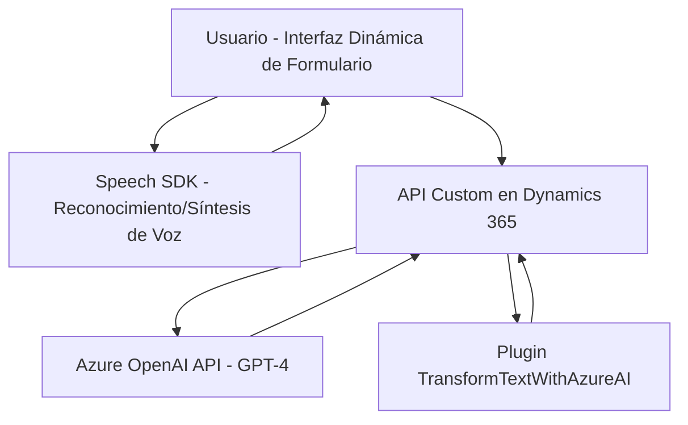

## Breve resumen técnico

Este repositorio está diseñado principalmente para extender funcionalidades en aplicaciones CRM (como Microsoft Dynamics 365) mediante voz, inteligencia artificial (Azure OpenAI), y síntesis de datos. Los archivos analizados reflejan una integración entre servicios cloud (Azure SDKs) y sistemas locales mediante plugins y módulos frontend de JavaScript.

---

## Descripción de arquitectura

La arquitectura del sistema utiliza una estructura **modular**, con componentes que gestionan distintos aspectos de la funcionalidad:

1. **Frontend (JavaScript)**: Se implementa funcionalidad en el navegador para interactuar con formularios dinámicos:
   - Reconocimiento de voz, síntesis de audio (Azure Speech SDK).
   - Manejo de eventos y procesamiento de datos localmente.
   - Comunicación con APIs externas.

2. **Backend (Microsoft Dynamics CRM)**:
   - Plugins en C# diseñados para extender las capacidades de CRM mediante reglas específicas.
   - Integración con Azure OpenAI para realizar transformaciones complejas basadas en modelos GPT.

La solución sigue una **arquitectura en capas**:
- **Capa de presentación**: código JavaScript que interactúa con usuarios para capturar y procesar voz/texto y aplicar los cambios relacionados en los formularios.
- **Capa de negocio/servicios**: Plugins (`TransformTextWithAzureAI.cs`) y métodos encapsulados que diseñan y transforman respuestas mediante servicios cloud (Azure OpenAI y Azure Speech).
- **Capa de interacción con servicios**: Métodos que manejan cargas de SDKs, llamadas HTTP, y comunicación con APIs externas.

También incorpora **orientación a servicios (SOA)** al delegar transformaciones al ecosistema de Azure, convirtiéndolo en un cliente activo de servicios basados en la nube.

---

## Tecnologías usadas

1. **Frontend:**
   - Lenguaje: JavaScript (ECMAScript).
   - Frameworks/librerías:
     - Azure Speech SDK (https://aka.ms/csspeech/jsbrowserpackageraw).
     - Nativo del navegador (DOM).
   - Dinámico: Reconocimiento/Síntesis de voz, manipulación de formularios.

2. **Backend:**
   - Lenguaje: C# (.NET Framework).
   - SDK/Framework:
     - Microsoft Dynamics CRM SDK para plugins.
     - Servicios HttpCliente para consumir APIs.
     - Azure OpenAI (Models GPT).

3. **Servicios en la nube:**
   - **Azure Speech API**: Procesamiento y generación de voz.
   - **Azure OpenAI API**: Transformación de texto mediante GPT-4.

4. **Comunicación**:
   - REST API para interacción con el backend y los servicios cloud.

---

## Diagrama Mermaid válido para GitHub

---

## Conclusión final

El repositorio implementa una solución basada en **Microsoft Dynamics 365** que extiende el sistema a través de funcionalidades de voz, manipulación avanzada de datos y transformación inteligente mediante IA (Azure OpenAI). Técnicamente, utiliza una arquitectura modular y orientada a servicios con integración de APIs en la nube. La combinación de tecnologías frontend y dependencias backend permite un entorno colaborativo para procesos automáticos y manuales optimizados.

Esta combinación hace que la solución sea **modular, extensible y robusta**, adecuada para escalar funcionalidades CRM de acuerdo con los requisitos del negocio.