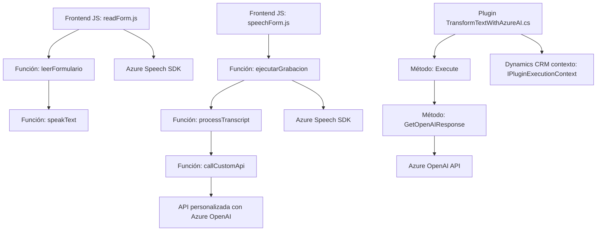

### Resumen Técnico
El repositorio comprende múltiples archivos con funcionalidades relacionadas a la integración de reconocimiento y síntesis de voz, manipulación de datos en formularios, y un plugin en Dynamics CRM que utiliza Azure OpenAI. Está orientado al procesamiento de datos y voz en tiempo real, con arquitectura integrada entre servicios externos, API REST y Dynamics CRM.

---

### Descripción de Arquitectura
La arquitectura tiene los siguientes componentes:
1. **Front-end con JavaScript:** Archivos como `readForm.js` y `speechForm.js` implementan funcionalidades del cliente web relacionadas con el reconocimiento y síntesis de voz mediante el SDK de Azure Speech, creando una capa de interacción para los usuarios.
2. **Plugin de Dynamics CRM:** `TransformTextWithAzureAI.cs` actúa como un microservicio dentro del CRM, procesando texto mediante Azure OpenAI.
3. **Infraestructura orientada a servicios:** Utiliza servicios externos (SDK de Azure Speech y Azure OpenAI) integrados mediante API REST, sustentando una arquitectura modular y orientada a microservicios.

Aunque los componentes están orientados a tareas específicas, están acoplados por el uso del SDK de Azure Speech y las integraciones con Dynamics CRM. El uso de eventos y callbacks muestra patrones event-driven en el frontend.

---

### Tecnologías Utilizadas
1. **Frontend:**
   - **JavaScript:** Base para el manejo de lógica cliente.
   - **Azure SDK:** Servicios de reconocimiento y síntesis de voz (SDK de Azure Speech).
   - **CRM Dynamics:** Interacción directa desde formularios del modelo CRM.

2. **Backend Plugin:**
   - **C# (.NET):** Para desarrollar el plugin dentro de Dynamics CRM.
   - **Azure OpenAI API:** Procesamiento de lenguaje natural mediante modelos inteligentes como GPT.
   - **HTTP REST API:** Comunicación con Azure.
   - **Newtonsoft JSON:** Manejo y serialización de datos en JSON.

---

### Diagrama Mermaid
Aquí está un diagrama sencillo que representa los archivos principales y sus interacciones.

---

### Conclusión Final
Esta solución es una arquitectura híbrida:
- **Frontend:** Modular y orientado a eventos, con elementos que interactúan directamente con el SDK de Azure Speech.
- **Plugin Backend:** Un microservicio dentro de Dynamics CRM que expande las capacidades del sistema utilizando Azure OpenAI.
- **Arquitectura global:** Aunque utiliza elementos de microservicios, la relación entre componentes presenta rastros de un sistema basado en capas.

El diseño muestra una clara integración con servicios externos y componentes locales, lo que lo hace robusto para manejar tareas específicas como el reconocimiento de voz, síntesis de voz, y procesamiento avanzado de texto. Sin embargo, la dependencia del contexto de Dynamics CRM limita parcialmente la flexibilidad para aplicaciones fuera de ese ecosistema.