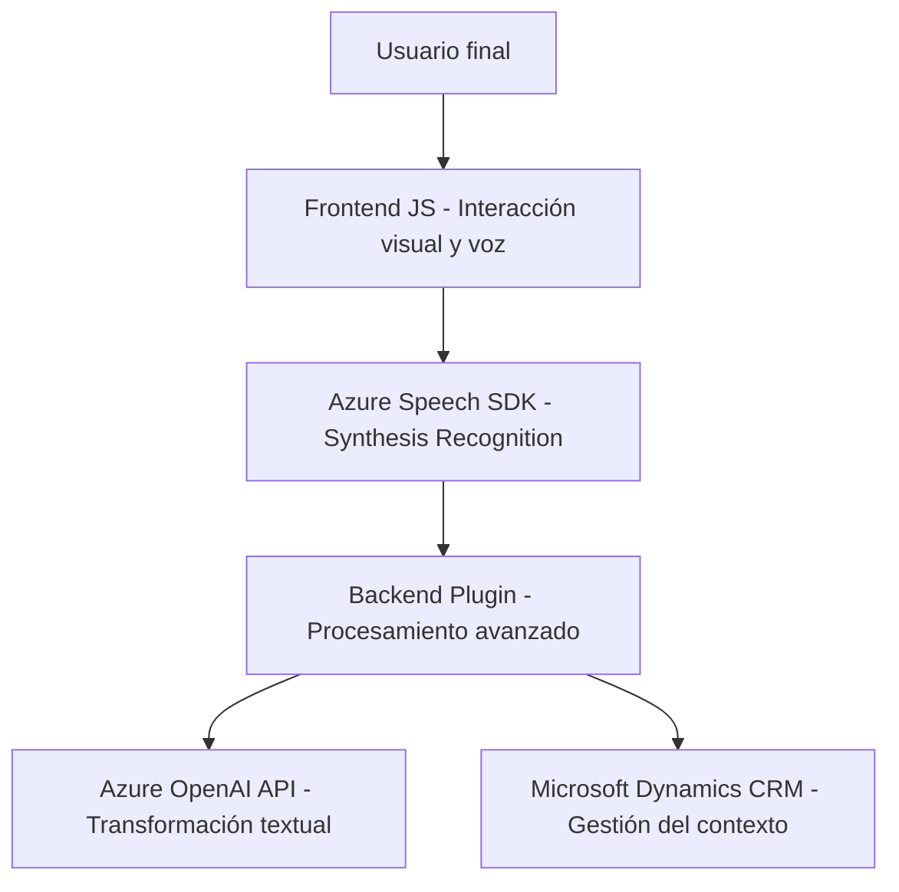

## Resumen técnico
Este repositorio incluye varios archivos que colaboran para implementar una solución interactiva con capacidades de síntesis y reconocimiento de voz, además de generación de texto con inteligencia artificial usando servicios de Azure. Está compuesto de un **frontend** en JavaScript que usa el Azure Speech SDK y un **plugin backend** en C# para procesamiento de texto vía Azure OpenAI.

---

## Descripción de arquitectura
La arquitectura está basada en una separación de responsabilidades mediante una estructura **orientada a capas**:
1. **Frontend:** Proporciona interacción con el usuario, permitiendo entrada y salida de voz.
2. **Backend (Plugin):** Implementa servicios de procesamiento de texto mediante integraciones con Azure OpenAI y Dynamics CRM.
3. **Servicios externos:** Dependencias clave como Azure Speech SDK y Azure OpenAI manejan tareas específicas de AI y síntesis/reconocimiento de voz.

---

## Tecnologías usadas
1. **Frontend:**  
   - **JavaScript.**
   - **Azure Speech SDK:** Biblioteca para reconocimiento y síntesis de voz.  
   - **APIs del navegador:** Manipulación dinámica del DOM y fechas (e.g., `toLocaleDateString`).  

2. **Backend (Plugin):**  
   - **Microsoft Dynamics CRM:** Extensiones basadas en plugins.  
   - **Azure OpenAI Service:** Interacción con GPT-4 para procesamiento avanzado.  
   - **C# .NET Framework:** Integración plugin para Dynamics CRM.  
   - **System.Net.Http:** Para llamadas a APIs.  
   - **Newtonsoft.Json / System.Text.Json:** Para manipulación de JSON estructurado.  

3. **Integración de servicios externos:**  
   - Integración con Azure Speech SDK y Azure OpenAI.

---

## Diagrama Mermaid válido para GitHub Markdown

---

## Conclusión final
La solución representa una arquitectura orientada hacia capas, integrada con servicios externos de AI (Azure Speech y OpenAI). El frontend (JavaScript) proporciona una experiencia interactiva al usuario, mientras que el backend (C# Plugin) extiende las capacidades usando servicios avanzados de procesamiento de texto. La solución muestra un diseño modular y altamente desacoplado, empleando patrones como **Delegate**, **Dynamic Loading**, y **Data Mapping**. Esto permite que el sistema sea escalable y fácilmente mantenible, con dependencias claramente definidas.