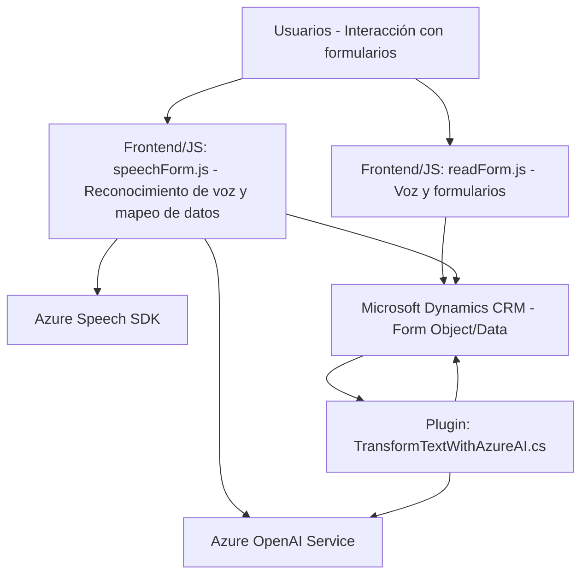

### Breve resumen técnico:
El repositorio contiene tres tipos de archivos organizados en diferentes carpetas, cada uno desempeñando una función específica:
1. **Frontend/JS:**
   - Contiene archivos `readForm.js` y `speechForm.js` relacionados con la gestión de formularios en Dynamics CRM utilizando reconocimiento y síntesis de voz proporcionados por Azure Speech SDK.
   - Implementaciones centradas en la interacción del usuario y la integración con servicios externos.
2. **Plugins/TransformTextWithAzureAI.cs:**
   - Define un plugin que utiliza Azure OpenAI para transformar texto de Dynamics CRM en un formato estructurado como JSON, aplicando normas definidas por el usuario.

### Descripción de arquitectura:
La arquitectura basada en el análisis del repositorio revela un enfoque modular con las siguientes características:
1. **Arquitectura n-capas**:
   - Dividida en capas principal:
     - Capa de presentación (Frontend), orientada a la interacción de usuarios.
     - Capa lógica (Plugin) que actúa como middleware entre Dynamics CRM y el servicio Azure OpenAI.
     - Capa de almacenamiento/datos (manejo interno por Dynamics CRM).
2. **Patrones aplicados**:
   - **Cliente-API:** Los archivos JS invocan APIs (Azure Speech SDK y Dynamics CRM) directamente.
   - **Facade Pattern:** En ambos archivos JS, las funciones encapsulan la lógica compleja de integración con servicios externos y procesamiento.
   - **Plugin-based Architecture:** En el caso de TransformTextWithAzureAI, se implementa como un complemento al CRM, según normas de Microsoft Dynamics.

### Tecnologías usadas:
1. **Frontend:**
   - **JavaScript (ES6)**: Lenguaje base para las funcionalidades de voz.
   - **Azure Speech SDK (JS)**: Para síntesis y reconocimiento de voz.
   - **Dynamics CRM APIs**: Integración directa con formularios del sistema CRM.
2. **Backend (Plugin):**
   - **C#:** Desarrollo de plugins en Dynamics CRM.
   - **Microsoft Dynamics SDKs:** Para interactuar con los recursos del sistema CRM.
   - **Azure OpenAI Service:** Externalización del procesamiento de texto avanzado basado en IA.
   - **JSON:** Formato para intercambio de datos entre el CRM y Azure OpenAI.
   - **HTTP para comunicación con API externa**.

### Dependencias o componentes externos:
1. **Azure Speech SDK:** Usado por los archivos JS para sintetizar y reconocer voz.
2. **Azure OpenAI Service:** Utilizado por el plugin para transformar texto usando un modelo GPT.
3. **Microsoft Dynamics CRM APIs:** La base de interacción de los archivos JS (front) y plugins (backend).
4. **System.Net.Http:** Para la comunicación del plugin con el endpoint de Azure OpenAI.
5. **CRM Form Object Model:** Explotado directamente en las acciones de los formularios.

---

### Diagrama Mermaid:

---

### Conclusión final:
Este sistema está diseñado para integrarse completamente con Microsoft Dynamics CRM y extender sus funciones mediante la incorporación de capacidades de voz (Azure Speech SDK) y transformación avanzada de texto usando IA (Azure OpenAI Service). La arquitectura modular facilita el mantenimiento y escalabilidad, al separar claramente las capas de presentación, lógica y datos. Sin embargo, su dependencia en servicios externos como Azure requiere que el sistema esté desplegado en entornos con conectividad estable y asegurada. La implementación es adecuada para aplicaciones empresariales orientadas a mejorar la productividad y experiencia del usuario mediante tecnología de voz e inteligencia artificial.