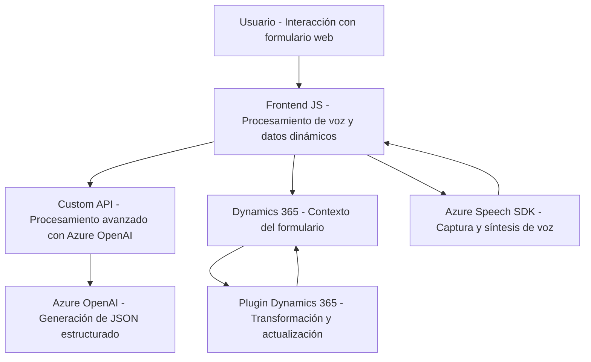

### Breve resumen técnico:
El repositorio parece albergar una solución que utiliza capacidades de conversión de voz a texto y síntesis de voz: integra Azure Speech SDK y Azure OpenAI. Su funcionalidad incluye la interacción dinámica con formularios basados en Dynamics 365, procesamiento de voz y texto, y aplicaciones específicas como un plugin para tareas personalizadas en Dynamics. Es una arquitectura modular con dependencias externas para procesamiento avanzado y servicios de nube.

---

### Descripción de arquitectura:
La arquitectura del repositorio es **modular** y tiene una estructura de **n capas**:
1. **Capa de presentación o frontend**: Módulos JavaScript en integración directa con formularios web, haciendo uso de bibliotecas y SDK para gestionar la lógica de interacción del usuario (captura, síntesis y transcripción).
2. **Capa de negocio**: Un plugin para Dynamics CRM que se ejecuta sobre la plataforma de Microsoft. Implementa reglas específicas para transformación de datos.
3. **Capa de integración**: Llamadas a servicios en la nube como Azure Speech SDK (para voz) y Azure OpenAI API (para procesamiento avanzado).

Además, sigue principios de arquitectura como la separación de responsabilidades (funciones por tarea específica) e integración de servicios externos.

---

### Tecnologías usadas:
1. **Microsoft Dynamics 365**:
   - Frontend basado en interacción con formularios.
   - Uso de `Xrm.WebApi` para ejecutar APIs personalizadas.
   - Plugins desarrollados como extensiones (`IPlugin`).
2. **Azure Speech SDK**:
   - Síntesis de voz y reconocimiento de voz (procesos asincrónicos).
3. **Azure OpenAI**:
   - Procesamiento avanzado de texto para generar JSON estructurado.
4. **JavaScript**:
   - Frontend modular.
   - Lógica basada en eventos y asíncrona (callbacks/Promesas).
5. **C#**:
   - Backend para los plugins.
   - Invocación de APIs REST mediante `HttpClient`.
6. **Newtonsoft.Json y System.Text.Json**:
   - Manipulación de datos JSON en el plugin de Dynamics.
7. **Patrones utilizados**:
   - **Orientación a eventos** (callback en SDKs, activadores en plugins).
   - **Modularidad** (separación de funciones en frontend y métodos claros en backend).
   - **Integración externa mediante SDKs y APIs REST**.

---

### Diagrama Mermaid:

---

### Conclusión final:
Esta solución es un sistema integrado que combina voz, texto y la interacción dinámica con formularios en Dynamics 365. Utiliza un modelo de **n capas**, donde cada componente (frontend, backend y servicios externos) tiene responsabilidades claras. Se destacan las dependencias externas (Azure Speech SDK, Azure OpenAI) para capacidades avanzadas, haciéndolo eficiente pero altamente dependiente de servicios cloud. La modularidad garantiza una arquitectura flexible apta para escalar o ser adaptada según necesidades de negocio.