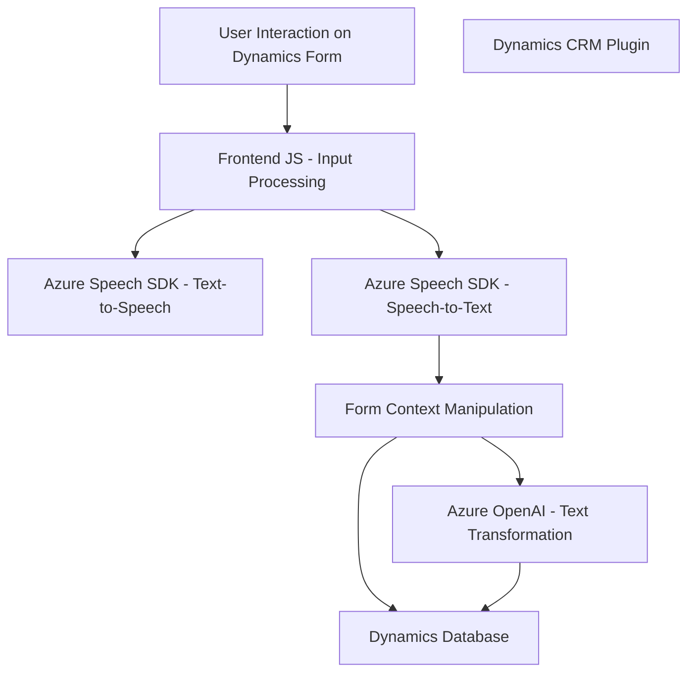

### Breve Resumen Técnico
El repositorio contiene componentes para procesamiento de voz y texto, interactuando con formularios visibles en Dynamics 365 y servicios externos como Azure Speech SDK y Azure OpenAI. Las funcionalidades incluyen extracción de datos de formularios, síntesis de voz, transcripción de audio a texto, mapeo de datos a campos de CRM, aplicación de valores interactivamente, y transformación de texto mediante procesamiento de lenguaje natural.

---

### Descripción de Arquitectura
La arquitectura sigue un enfoque modular y distribuido:
1. **Frontend Modular**: JavaScript para interacciones dinámicas con formularios en Dynamics 365, con acciones como síntesis de voz y transcripción de voz en texto.
2. **Backend con Plugins de Dynamics CRM**: Código C# integrado como plugins en CRM, que extiende funcionalidades como transformación de texto.
3. **Integración con Servicios Externos**: Uso de Azure Speech SDK para entrada y salida de voz, y Azure OpenAI para estructuración avanzada de datos (texto a JSON).

**Patrones de arquitectura**:
- Modularidad: Dividido por funciones específicas (lectura, síntesis, transcripción, transformación).
- Integración de servicios: Aprovecha APIs externas (Azure).
- Interacción con Dynamics CRM: Modifica formularios y datos a través de plugins y APIs.
- Cliente-Servidor: El cliente (JavaScript) actúa como una capa UX interactiva mientras el servidor completa las acciones avanzadas con plugins y servicios externos.

**Técnicas utilizadas**:
- Modular programming.
- Client-side execution for dynamic interactivity.
- Server-side plugins for advanced computations.

---

### Tecnologías Usadas
1. **Frontend**:
   - JavaScript
   - Azure Speech SDK
   - Dynamics 365 WebAPI

2. **Backend**:
   - C#
   - Microsoft Dynamics SDK (Microsoft.Xrm.Sdk)
   - Azure OpenAI API
   - Libraries: Newtonsoft.Json, System.Text.Json, System.Net.Http

---

### Diagrama Mermaid Válido para GitHub Markdown

---

### Conclusión Final
La solución combina un frontend dinámico basado en JavaScript para interactuar con formularios de Dynamics 365, con integración de servicios avanzados como síntesis y reconocimiento de voz a través de Azure Speech SDK. Además, integra un backend extensible con plugins en C# que emplean Azure OpenAI para transformar texto de forma estructurada. La arquitectura modular facilita la escalabilidad y personalización de funcionalidades, mientras que la interacción con APIs externas garantiza una solución robusta y avanzada.