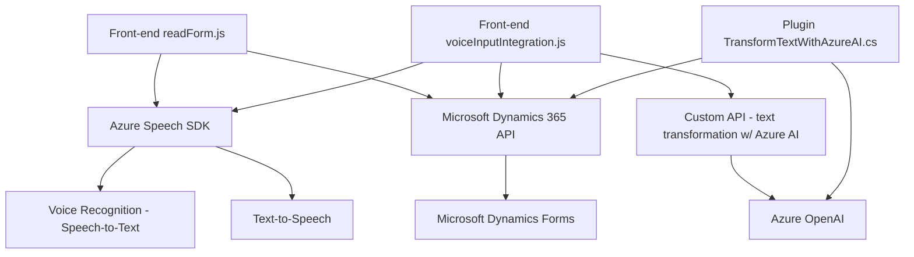

### Breve resumen técnico del repositorio
El repositorio parece ser un sistema basado en Microsoft Dynamics 365 que utiliza el `Azure Speech SDK` para implementar funcionalidades de texto a voz (TTS) y reconocimiento de voz a texto (STT). Además, integra una API personalizada y un plugin que utiliza Azure OpenAI para transformar texto en un formato estructurado utilizando reglas específicas. Está compuesto principalmente por archivos JavaScript para funcionalidades front-end relacionadas con formularios y voz, además de un archivo C# para el desarrollo de un plugin utilizado en Dynamics 365.

---

### Descripción de arquitectura
La solución tiene una mezcla de arquitecturas orientadas a servicios y de capa:

1. **Capa de Presentación**: Archivos como `readForm.js`, `speechForm.js` y `voiceInputIntegration.js` implementan funcionalidades JS en el navegador que interactúan con Microsoft Dynamics 365 y sus formularios. Usan el Azure Speech SDK para sintetización y reconocimiento de voz, y también interactúan con APIs externas.
   
2. **Lógica de Negocio & Integración**:
   - El archivo C# actúa como una capa de lógica empresarial en el contexto de una **arquitectura basada en plugins** en Dynamics 365 CRM, transformando el texto utilizando Azure OpenAI y devolviendo datos estructurados.
   
3. **Servicios Externos**:
   - Se integran servicios como Azure Speech SDK para procesamiento de audio/voces, y Azure OpenAI para transformación de texto con IA.

En general, la solución sigue un enfoque modular con arquitectura de componentes distribuida:

- La lógica distribuida utiliza un enfoque **dependiente de servicios externos** para sintetización y reconocimiento de voz y procesamiento de datos con APIs.
- Integra funcionalidades específicas en Dynamics CRM mediante el patrón de **plug-in** que cumple reglas y eventos configurados en un modelo empresarial.

---

### Tecnologías, frameworks y patrones utilizados
#### **Tecnologías:**
- **Front-end**: JavaScript para procesamiento del formulario y entrada de voz.
- **Back-end**: C# para la lógica del plugin en Microsoft Dynamics 365.
- **Azure Speech SDK**: Utilizado para reconocimiento y síntesis de voz.
- **Azure OpenAI**: Procesa texto de entrada y genera resultados transformados en formato JSON estructurado.
- **Microsoft Dynamics CRM API**: Manipulación de formularios, llamado a Web API y mapping de datos.
- **Json Libraries**: Uso de `System.Text.Json` y `Newtonsoft.Json`.
- **HTTP Communication**: Manejo de solicitudes y respuestas usando `HttpClient`.

#### **Patrones de diseño:**
1. **Modularidad**: Código organizado en funciones y clases que facilitan la reutilización, testeo y legibilidad.
2. **Dependencia dinámica**: El SDK de Azure Speech se carga dinámicamente según se necesite.
3. **MVVM** (en el código JavaScript): Implícito, se observa la separación de la lógica del modelo/formulario y las acciones del usuario.
4. **Integración externa**: Uso extensivo de servicios externos de Azure.
5. **Interacción basada en eventos**: Plug-ins en Dynamics CRM disparados por eventos preconfigurados.

---

### Diagrama Mermaid compatible con GitHub Markdown
A continuación se genera un diagrama para representar los componentes principales del repositorio y sus interacciones:

---

### Conclusión final
Este repositorio representa una solución híbrida con características de integración, captura de voz y transformación de texto en una arquitectura que combina elementos de **n capas** (front-end y back-end separado) y **servicios externos** (Azure SDK y OpenAI). Es una solución ideal para mejorar la interacción usuario-sistema en un entorno de Microsoft Dynamics CRM, usando tecnologías modernas de IA y voz.

Sin embargo, es importante considerar:
1. **Seguridad**: Asegurarse de que las claves API (Azure Speech y OpenAI) estén gestionadas de manera segura en un almacén de secretos.
2. **Monitorización**: Implementar un sistema de registro de errores y auditoría para las interacciones con servicios externos y formularios.
3. **Optimización del rendimiento**: Revisar el uso de solicitudes HTTP asíncronas y los mecanismos de recuperación en caso de fallos del servicio externo.

En general, la solución está adecuadamente estructurada y es modular, lo que facilita la escalabilidad y el mantenimiento. Sin embargo, es cauteloso trabajar en una arquitectura robusta para evitar extremos de dependencia en servicios externos.