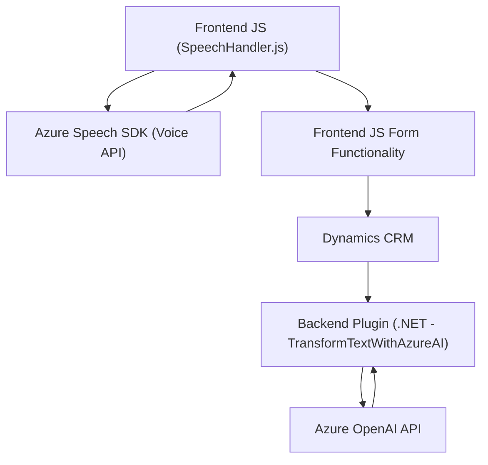

## Breve resumen técnico
El contenido proporcionado representa diferentes componentes de un sistema que integra capacidades de reconocimiento y síntesis de voz con la funcionalidad de integración a una plataforma de formularios (posiblemente Dynamics 365). Además, utiliza servicios de Azure AI para inteligencia artificial y creación de soluciones dinámicas.

Los archivos presentados se dividen principalmente en dos tipos:
1. **Frontend JavaScript:** Manejo client-side para interacción dinámica con formularios y reconocimiento de voz utilizando Azure Speech SDK.
2. **Plugin backend (.NET):** Transformación de textos mediante Azure OpenAI dentro del contexto de Dynamics CRM.

---

## Descripción de arquitectura
La solución tiene una arquitectura **mixta** con separación entre frontend (implementado en `JavaScript`) y funciones específicas backend (`.NET Plugin`). El frontend maneja la interacción de usuario, captura y procesamiento de formularios, y envía datos a APIs/SDKs para su posterior análisis. El backend, por otro lado, actúa como un complemento de Dynamics CRM para la transformación de datos usando Azure OpenAI.

Los patrones arquitectónicos detectados incluyen:
- **Modularidad:** División en archivos con roles específicos.
- **Patrón Plugin:** Para extender la funcionalidad backend en eventos de Dynamics CRM.
- **API Client-Side:** Uso del servicio Azure Speech SDK para reconocimiento de voz, carga dinámica y síntesis de texto.
- **Integración con servicios externos:** Utilización de Azure Speech SDK y Azure OpenAI para capacidades extendidas.

En general, la arquitectura se asemeja a **n capas** con funcionalidad dividida entre capa de presentación (Frontend JS) y capa lógica de negocio (Plugin .NET).

---

## Tecnologías usadas
1. **Frontend (JavaScript)**  
   - Azure Speech SDK: Para síntesis y reconocimiento de voz.
   - Modulación en funciones: Separación de responsabilidades en métodos.
   - API para manipular formularios y datos recognoscibles.

2. **Backend (.NET)**  
   - Framework: Implementación de Microsoft Dynamics CRM Plugin.
   - Azure OpenAI API: Para transformación de texto en JSON estructurado.
   - Newtonsoft.Json: Para manipulación de contenido JSON.

3. **Servicios**
   - Azure Speech SDK y OpenAI.

---

## Diagrama Mermaid

---

## Conclusión Final
La solución presentada integra funcionalidad avanzada de captura, reconocimiento y síntesis de voz en el lado del cliente utilizando Azure Speech SDK, con una extensión backend basada en plugins para Dynamics CRM. La arquitectura es una mezcla de **n capas** con módulos bien definidos de frontend y backend. Además, el uso de APIs externas optimiza la solución para tareas específicas como la transformación de datos dinámicos y capacidades IA. Este enfoque demuestra una implementación moderna y flexible altamente escalable al integrarse con plataformas de terceros como Azure y Dynamics.