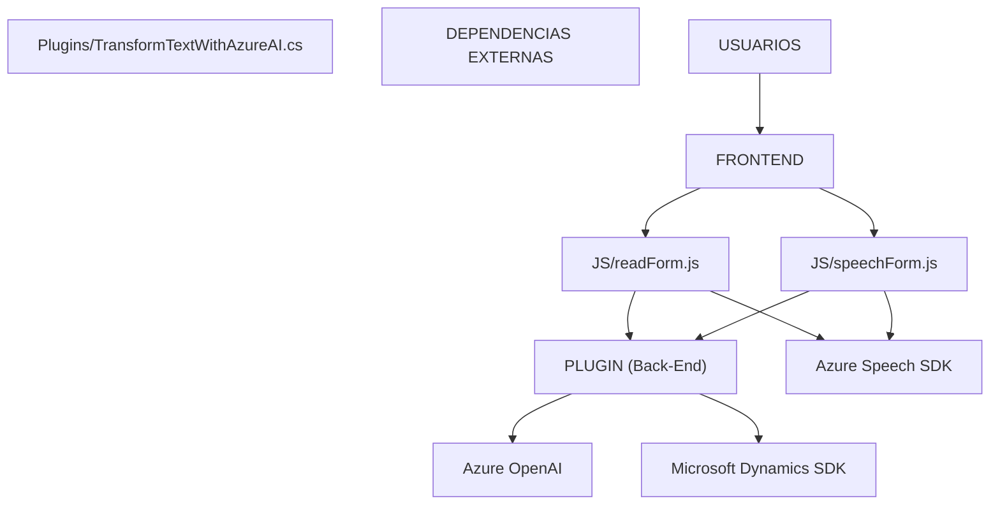

### Breve resumen técnico:
El repositorio contiene una solución orientada a la interacción entre interfaces de formulario, procesamiento de voz y servicios cognitivos basados en Azure (Azure Speech SDK y Azure OpenAI Service). Está diseñada para integrarse con Microsoft Dynamics CRM con soporte para API personalizada, habilitando funcionalidades de entrada-salida de voz, mapeo de datos de formularios y enriquecimiento de datos con IA.

---

### Descripción de arquitectura:
1. **Tipo de solución:** 
   - Es principalmente una arquitectura híbrida que combina frontend (interacción con detalles en JavaScript) y plugins backend en Microsoft Dynamics CRM.
   - Funcionalmente, parece estructurada para extender capacidades CRM con servicios cognitivos en una arquitectura distribuida cliente-servidor.

2. **Patrón arquitectónico:** 
   - Los scripts en JavaScript siguen el modelo de arquitectura **n capas**, donde una capa interactúa con formularios y otra se conecta con servicios externos. 
   - Para los plugins en .NET, se sigue el **Plugin Design Pattern**, muy común en Microsoft Dynamics CRM, lo que permite inyectar lógica extensible directamente en eventos del sistema.
   - También emplea servicios externos, apuntando hacia una arquitectura orientada a servicios (SOA).

---

### Tecnologías usadas:
1. **Frontend:**
   - **JavaScript** para interacción con formularios y el proceso del Speech SDK.
   - **Azure Speech SDK:** Integración mediante un script cargado dinámicamente para el reconocimiento de voz y síntesis de texto a voz (Text-to-Speech).

2. **Backend:**
   - **Microsoft Dynamics SDK:** Para la interacción directa con formularios y datos dentro del ecosistema Dynamics CRM, usando APIs como `Xrm.WebApi`.
   - **Azure OpenAI API:** Procesamiento de lenguaje natural para transformar y enriquecer datos de texto haciéndolos compatibles con representaciones en JSON.

3. **Frameworks y Librerías:**
   - **Newtonsoft.Json** y **System.Text.Json:** Para manipulación de datos JSON en el backend.
   - **System.Net.Http:** Para comunicación HTTP entre el plugin y el servicio Azure OpenAI.

4. **Patrones implementados:**
   - **Facade:** En el manejo del Speech SDK encapsulando la lógica detrás de funciones específicas (`ensureSpeechSDKLoaded`).
   - **Callback:** Para tareas basadas en eventos en el manejo de flujos del Speech SDK.
   - **Factory Pattern:** Notable en el mapeo y dinamismo del contexto de formularios en las funciones `getFieldMap`.
   - **Client-Server Architecture (Servicios Cognitivos):** Procesos como la integración con Azure Speech y OpenAI emplean arquitectura cliente-servidor usando solicitudes asincrónicas.

---

### Diagrama Mermaid:

---

### Conclusión final:
La solución se integra entre interfaces de usuario (frontend) y una lógica backend con plugins ejecutándose en Microsoft Dynamics CRM. La arquitectura es multinivel y combina elementos de patrones como Facade, Factory y Plugin Design Pattern para simplificar la interacción de entrada/salida por voz y el enriquecimiento de datos mediante OpenAI. Es un buen ejemplo de integración de servicios cognitivos en un ecosistema corporativo tradicional basado en CRM.