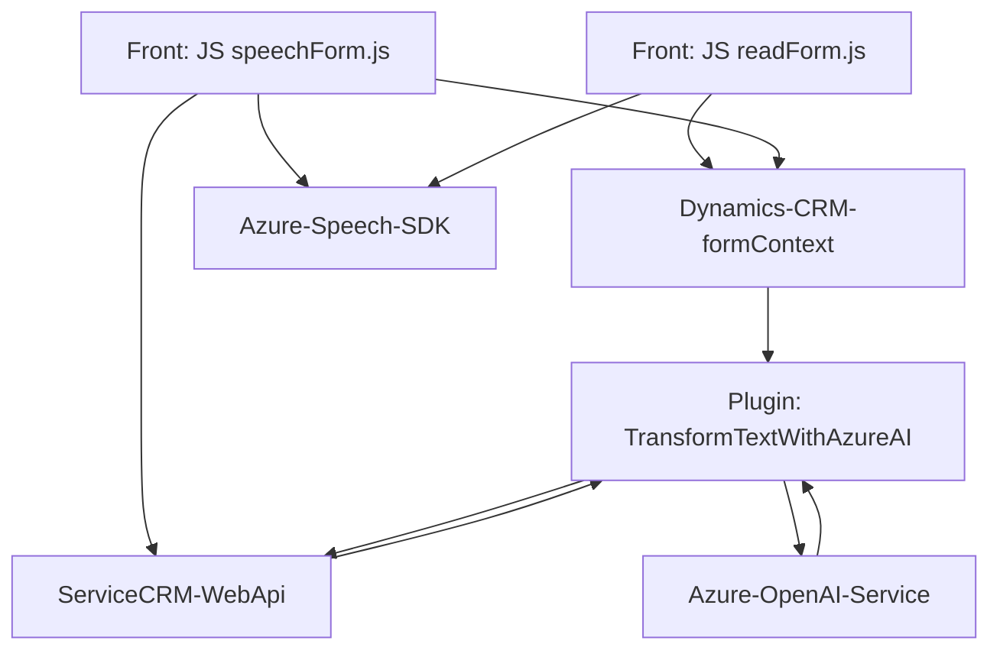

## Breve resumen técnico:

El proyecto integra múltiples componentes para proporcionar funcionalidades relacionadas con el procesamiento de formularios y síntesis de voz para aplicaciones CRM, específicamente Microsoft Dynamics CRM. Utiliza una combinación de tecnologías front-end y back-end para interactuar con external APIs como Azure Speech SDK y Azure OpenAI services.

---

## Descripción de arquitectura:

La solución presenta una arquitectura híbrida compuesta por los siguientes elementos:

1. **Front-end (JavaScript)**:
   - Scripts relacionados con el procesamiento de voz y formularios.
   - Alto acoplamiento funcional con los contextos de Dynamics CRM (`executionContext` y `formContext`).
   - Interacción con el servicio de Azure Speech SDK para reconocimiento y síntesis de voz.

2. **Back-end Plugin (C#)**:
   - Definición de un plugin que opera como lógica ampliada en Dynamics CRM.
   - Consume la API de Azure OpenAI para procesar el texto y devolver objetos JSON estructurados según normas dictadas por el usuario.

### Resumen de arquitectura:
Se trata de un **arquitectura en n capas** (multicapa), donde:
- **Front**: Maneja la interacción del usuario y llama APIs externas.
- **Back-end en Dynamics CRM con Plugins**: Ejecuta lógica específica (transformación de datos) y realiza llamadas a APIs de terceros como Azure OpenAI.

---

## Tecnologías, frameworks y patrones usados:

### **Tecnologías:**
1. **Front-end**:
   - JavaScript ES6: Utilizado para implementar lógica funcional. Soporte para asincronismo (promesas y callbacks).
   - Azure Speech SDK: Para síntesis y reconocimiento de voz.
   - Dynamics CRM JavaScript API: Para manipulación de formularios y datos de la plataforma CRM.

2. **Back-end**:
   - C# (ASP.NET Framework): Usado para desarrollar plugins que interactúan con el Workflow de Dynamics CRM.
   - Azure OpenAI Service: Provee procesamiento inteligente y transformación textual para convertir datos en formatos específicos.
   - Microsoft Dynamics CRM SDK: Para acceso programático al contexto del sistema CRM.

3. **Dependencias externas**:
   - `Newtonsoft.Json`: Para el manejo de estructuras JSON.
   - Libraries estándar de .NET para solicitudes web (`HttpClient`) y operaciones sobre cadenas y JSON.

### **Patrones:**
1. **Carga Dinámica de Dependencias**:
   - En el front-end, las librerías como Azure Speech SDK se cargan desde un CDN bajo demanda, reduciendo el overhead inicial.
   
2. **Delegación mediante Callbacks**:
   - Gran uso de funciones anidadas y asincrónicas en el front-end para modularizar el flujo en procesos dependientes del API.

3. **Command Processing**:
   - En `speechForm.js`, las transcripciones de voz se analizan como comandos que actualizan el formulario. Las claves visibles se traducen en valores internos del sistema CRM.

4. **Plugin Pattern en Dynamics CRM**:
   - La clase C# (`TransformTextWithAzureAI.cs`) cumple una función de plugin que se engancha directamente al flujo de eventos del CRM, cumpliendo con el principio de responsabilidad única.

---

## Componentes y dependencias externas:

1. **Dependencias front-end externas**:
   - Azure Speech SDK.
   - Microsoft Dynamics CRM JavaScript API para manipulación dinámica de formularios (e.g., `formContext`, `executionContext`).
   
2. **Dependencias back-end externas**:
   - Azure OpenAI service para generar JSON estructurados con transformación de texto.
   - Microsoft Dynamics CRM SDK para eventos de plugin y control programático de entidades.
   - Bibliotecas de .NET Framework para solicitudes HTTP y JSON.

---

## Diagrama **Mermaid**:

---

## Conclusión final:

Este repositorio representa una solución destinada a integrar el reconocimiento y síntesis de voz con formularios funcionales en Dynamics CRM. La arquitectura en n capas, con integración directa de servicios externos como Azure Speech SDK y Azure OpenAI, permite una implementación robusta y modular. Usa múltiples patrones como carga dinámica de dependencias y delegación de procesamiento mediante APIs externas, garantizando una escalabilidad y adaptabilidad ideal para entornos empresariales. Sin embargo, dada su dependencia de servicios externos (SDK y APIs), requiere monitoreo constante y gestión de claves API para evitar interrupciones.