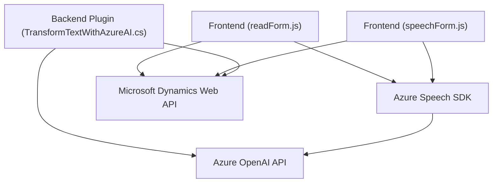

### Breve resumen técnico:

El repositorio presenta tres componentes principales:
1. **Frontend JavaScript (`readForm.js` y `speechForm.js`)**
   - Implementa interacción entre usuarios y servicios externos para reconocimiento de voz y síntesis de texto en aplicaciones CRM utilizando el **Azure Speech SDK**.
   - Procesa formularios para leer/actualizar datos y utiliza servicios de voz e inteligencia artificial para enriquecer la experiencia.

2. **Back-end Plugin (`TransformTextWithAzureAI.cs`)**
   - Implementa un plugin basado en Microsoft Dynamics CRM que utiliza el **Azure OpenAI API** para transformar texto según reglas predefinidas y devolver un JSON estructurado al CRM, donde se completan los campos del sistema.

---

### Descripción de la arquitectura:

Esta solución combina una **arquitectura mixta** de integración entre varios componentes:
1. **Frontend:** Aparece como una solución separada que interactúa con APIs (ex. Dynamics CRM y Azure Speech/AI), utilizando JavaScript como lenguaje principal.
   - A nivel técnico, utiliza patrones de **modularidad funcional**, organizando el código en diferentes funciones con responsabilidades altamente específicas.
   - Los módulos están diseñados para interactuar con controles dinámicos de la UI del CRM.
   
2. **Back-end:** Representado por un plugin de Dynamics CRM con un patrón de diseño típico de extensiones.
   - Se observa el patrón de **servicio** que encapsula la integración hacia el Azure OpenAI Service mediante solicitudes HTTP API dentro del CRM.
   - La arquitectura del plugin sigue un modelo de integración en una capa lógica del sistema en Dynamics 365 CRM.

Esta solución tiene una forma **híbrida** y contempla una arquitectura **n capas** con elementos de **arquitectura dirigida por servicios (SOA)** debido a la fuerte interacción con APIs externas y la conectividad directa con servicios de IA y CRM.

---

### Tecnologías, frameworks y patrones utilizados:
1. **Frontend:**
   - **JavaScript**: Lenguaje de programación.
   - **Azure Speech SDK**: Lógica de síntesis de texto y reconocimiento de voz.
   - **Microsoft Dynamics CRM Web API**: Interacción dinámica con el SDK para la asignación de datos en el CRM.
   - **Patrones:**
     - Modularidad funcional.
     - Middleware para procesamiento de datos y aplicación a UI.

2. **Back-End Plugin:**
   - **C#/.NET Framework**: Lenguaje y marco utilizados para el plugin.
   - **Azure OpenAI API**: Transformación de texto automatizada con modelos GPT.
   - **Microsoft Dynamics SDK**: Extensión basada en el patrón plugin para el CRM.
   - **Patrones:**
     - Plugin Pattern.
     - Input/Output isolation dentro del CRM.
     - Integración con servicios externos mediante HTTP.

---

### Dependencias o componentes externos presentes:
1. **Azure Services:**
   - Azure Speech SDK: Para síntesis y reconocimiento de voz.
   - Azure OpenAI API: Para la transformación de texto.
2. **Microsoft Dynamics 365:** Utilizado como sistema CRM para manejar entidades, formularios y flujos de negocio.
3. **Frontend/JS:**
   - Framework básico en JavaScript con librerías externas y dependencias dinámicas a servicios online.
4. **Backend C#:**
   - Integración de Newtonsoft.Json, System.Net.Http y servicios de Dynamics CRM.

---

### Diagrama Mermaid válido para GitHub Markdown:

---

### Conclusión Final:
El repositorio describe una solución integrada que utiliza componentes de Front-end y Back-end para proporcionar funcionalidades avanzadas de reconocimiento de voz, síntesis de texto y transformación de datos con IA. La arquitectura es **híbrida en capas**, con integración de servicios externos y comunicación bidireccional con el Microsoft Dynamics CRM. Además, adopta patrones funcionales y de plugin para mantener el código modular, eficiente y adaptable a futuros requerimientos.