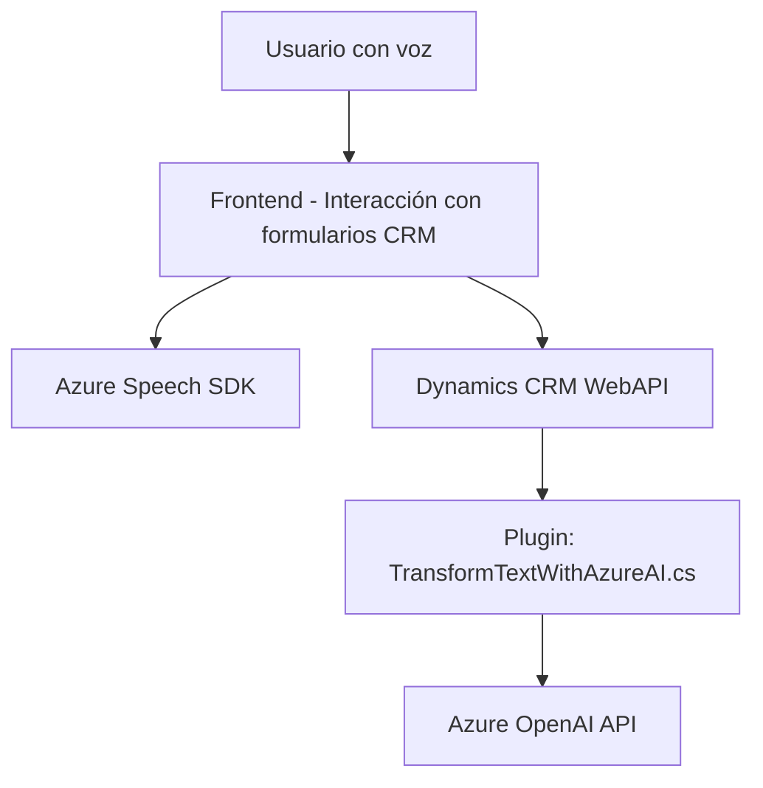

### Resumen técnico:

El repositorio analizado contiene tres archivos que forman parte de una solución SaaS integrada con Azure Speech SDK y Dynamics CRM. El objetivo general de estos archivos es implementar funcionalidades dinámicas para la interacción entre entrada de voz, síntesis de texto y un sistema CRM, además de transformar texto con IA para su procesamiento en el CRM.

---

### Descripción de arquitectura:

La solución presenta una arquitectura híbrida y distribuida:
1. **Frontend:** Consta de dos archivos JavaScript (`readForm.js` y `speechForm.js`) cuya finalidad principal es la interacción entre usuarios y formularios en el ambiente de Dynamics CRM. Ambos usan llamadas asíncronas y patrones orientados a servicios.
2. **Backend:** Contiene un archivo C# (`TransformTextWithAzureAI.cs`) que actúa como Plugin en Dynamics CRM implementando lógica de procesamiento avanzada con Azure OpenAI.

Arquitectura detectada:
- **Híbrida:** Incluye estructura de integración entre frontend y un backend utilizando patrones de capa de servicio en CRM.
- **Servicio distribuido:** Uso de APIs externas (Azure Speech SDK y Azure OpenAI) simplifican y desacoplan la solución.
- **Service Layer:** Tanto el frontend como el backend están claramente separados, donde cada pieza interactúa vía APIs para realizar su acción.

---

### Tecnologías usadas:

1. **Frontend:**
   - **Lenguaje:** JavaScript.
   - **Framework y SDK externo:** Azure Speech SDK.
   - **Manipulación de formularios:** APIs del modelo de Dynamics CRM para lectura y actualización de datos del frontend (con `executionContext`).

2. **Backend:**
   - **Lenguaje:** C#.
   - **Framework:** .NET para Plugins de Dynamics CRM.
   - **Bibliotecas:** 
     - `Microsoft.Xrm.Sdk` para interacción con datos CRM.
     - `System.Net.Http` para consumo de APIs externas.
     - `Newtonsoft.Json` o `System.Text.Json` para procesamiento de JSON.
   - **Servicio externo:** Azure OpenAI API para realizar transformaciones de texto semánticas y automatizadas.

---

### Diagrama Mermaid:

---

### Conclusión final:

Este repositorio contiene una solución orientada a la captura y procesamiento de voz en aplicaciones basadas en Dynamics CRM. La solución utiliza integración con servicios externos mediante APIs (Azure Speech SDK y Azure OpenAI), presenta fuerte desacoplamiento entre frontend y backend que sigue principios de servicios distribuidos. La arquitectura implementada asegura escalabilidad, funcionalidad modular y actualización dinámica de datos mediante llamadas asíncronas y procesamiento avanzado. Este diseño es especialmente útil para construir aplicaciones CRM personalizadas con automatización y procesamiento asistido por IA.