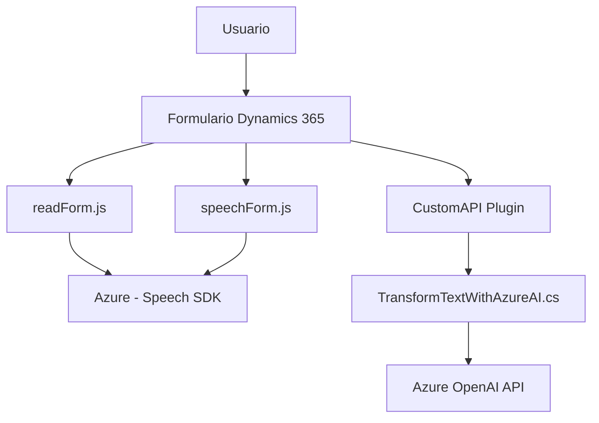

# Análisis y explicación técnica

### Breve resumen técnico:
El repositorio representa una solución híbrida que mezcla capas frontend (JS en contexto Dynamics 365), middleware C# (plugins para Dynamics CRM), y un servicio externo en la nube (Azure Speech SDK y Azure OpenAI). El objetivo principal es mejorar la interacción de usuario mediante conversión multimedia (texto a voz, voz a texto) y transformación de datos hacia objetos estructurados JSON.

---

### Descripción de arquitectura:
La arquitectura del repositorio es un **multi-capa híbrida**, donde se integra un sistema compuesto por 3 grandes bloques:

#### 1. **Frontend (Web Scripts)**:
   - Los archivos JavaScript (`readForm.js`, `speechForm.js`) interactúan directamente con los formularios y APIs de Dynamics 365 usando el contexto del formulario (FormContext) para lectura y escritura de datos. 
   - La integración con un servicio externo, como el **Azure Speech SDK**, se gestiona mediante la carga dinámica de scripts en el navegador, siguiendo criterios de eficiencia y flexibilidad.

#### 2. **Middleware/Plugin (C#)**:
   - El archivo en C# (`TransformTextWithAzureAI.cs`) define un **plugin** para Dynamics CRM, que permite enviar datos a una inteligencia artificial basada en Azure OpenAI y transformar texto en JSON estructurado. Utiliza patrones como *Plugin Pattern* y *Facade Pattern* para manejar datos y transacciones.

#### 3. **Servicios Externos**:
   - Los servicios de **Azure Speech SDK** y **Azure OpenAI** están integrados a esta solución para ofrecer procesamiento de voz avanzado y transformación de texto mediante inteligencia artificial.

Desde una perspectiva de diseño surgen claros indicios de una **arquitectura orientada a servicios (SOA)**, con bloqueos funcionales separados en forma de servicios frontend, middleware y APIs externas. Aunque no es completamente desacoplada (no una arquitectura de **microservicios**), los componentes permiten modularidad parcial.

---

### Tecnologías usadas:
1. **Frontend/JavaScript**:
   - **JavaScript**: Idioma principal del frontend.
   - **Dynamics 365 Form Context API**: API para manipular datos en formularios.
   - **Azure Speech SDK**: Conversión de texto a voz y transcripción de voz.
   - **Carga dinámica de scripts** (Pattern): Para integrar Azure Speech SDK al cliente.

2. **Middleware/C# Plugins**:
   - **C# con .NET**: Para desarrollo de plugins personalizados.
   - **Microsoft.Xrm.Sdk**: Framework para crear plugins en Dynamics CRM/365.
   - **System.Net.Http/Json**: Para comunicación con servicios REST.
   - **Azure OpenAI (GPT models)**: Transformación de texto en JSON estructurado.

3. **Patrones de arquitectura usados**:
   - **Service Layer**: Organización lógica de las funciones en múltiple capas (frontend, middleware y APIs externas).
   - **Service-Oriented Architecture (SOA)**: Componentes desacoplados integrados mediante servicios.
   - **Plugin Pattern**: Estricta implementación basada en `IPlugin` en Dynamics CRM.
   - **Facade Pattern**: Facilidad para abstraer interacciones con APIs externas como OpenAI en el backend.

---

### Diagrama Mermaid válido:

---

### Conclusión final:
Este repositorio refleja una solución robusta y altamente especializada centrada en Dynamics 365. La arquitectura se inclina hacia un modelo **Service-Oriented Architecture** que integra servicios externos (Azure Speech y OpenAI) con capas de frontend y middleware. El uso de tecnologías como plugins C# en Dynamics CRM y cargas dinámicas de scripts le otorgan flexibilidad, mientras que los patrones como Service Layer y Facade facilitan la gestión de complejidad. Aunque el acoplamiento de servicios podría limitar la escalabilidad, es una solución ideal para entornos empresariales controlados.