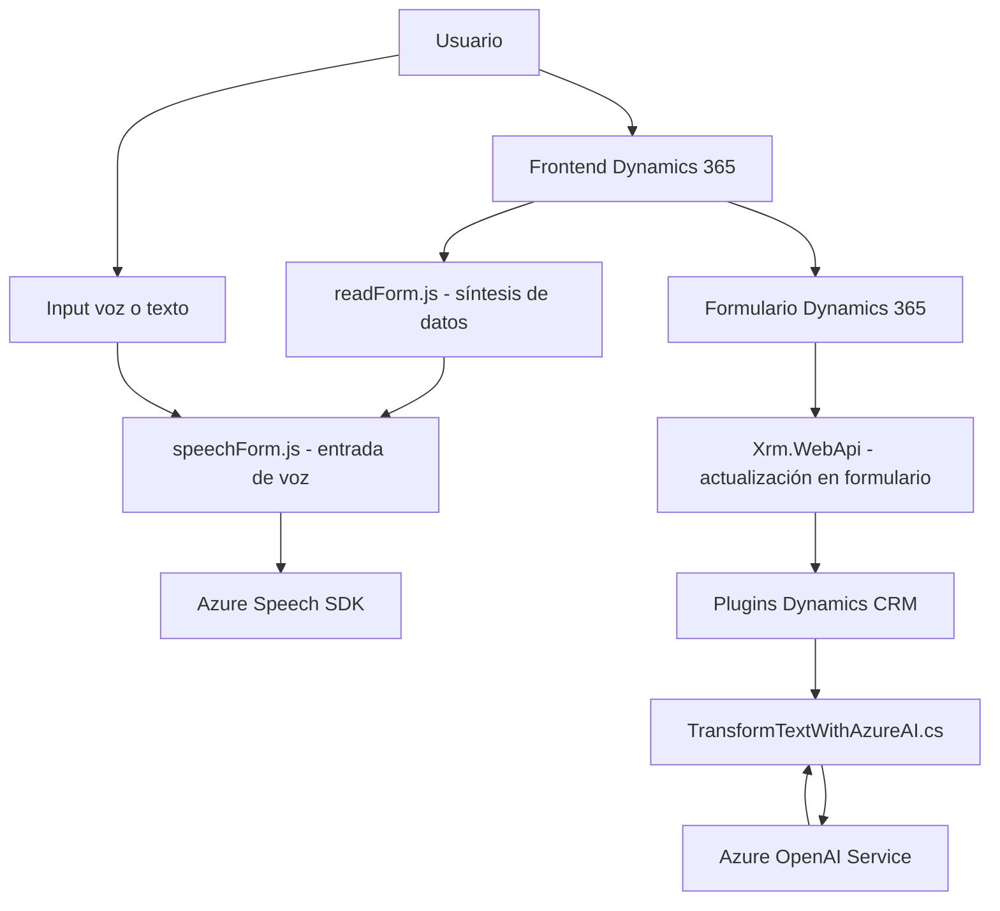

### Análisis detallado de la solución basada en la estructura del repositorio y los archivos:

#### 1. **Tipo de solución:**
La solución presenta tanto funcionalidades de _frontend_ como _backend_, lo que indica que se trata de una aplicación que integra una interfaz de usuario (UI) para interacción directa con usuarios y un backend centrado en la integración con servicios externos como Azure Speech SDK y APIs relacionadas con Dynamics 365 CRM. En esencia, el proyecto configura:
- **Frontend:** Componentes JavaScript (`readForm.js` y `speechForm.js`) implementan lógica directamente en la interfaz del cliente.
- **Backend:** Un plugin en C# (`TransformTextWithAzureAI.cs`) interactúa con Dynamics CRM utilizando Azure OpenAI para procesar transformaciones semánticas.

La solución parece corresponder a un ecosistema que combina **frontend dinámico** y **lógica backend de extensibilidad CRM**, común en aplicaciones integradas con Dynamics 365.

---

#### 2. **Tecnologías, frameworks y patrones de diseño:**
**Frontend:**
- Tecnologías:
  - JavaScript: Para la creación de funciones que manejan lógica de interacción con formularios y SDKs.
  - **Azure Speech SDK**: Integración para síntesis y reconocimiento de voz.
  - HTML5 (implícito en la interacción de formularios).
  - Dynamics 365 Client-Side SDK: Uso del `executionContext`, que permite interactuar con formularios y datos relacionados en Dynamics 365.

- Patrones de diseño:
  - **Singleton:** La función `ensureSpeechSDKLoaded` evita múltiples instancias del SDK de Azure Speech.
  - **Modular:** Las funciones como `getVisibleFieldData`, `getReadableValue`, y `applyValueToField` están bien encapsuladas, permitiendo reutilización para distintas tareas.
  - **Interactor/MVC:** Manejo dividido entre entrada (voz o transcripciones), procesamiento (evaluación y asignación de datos transcritos) y salida (actualización del formulario).

**Backend Plugin (C#):**
- Tecnologías:
  - **Microsoft Dynamics CRM SDK**: Para extender funcionalidades nativamente en el CRM mediante eventos como pre-creación o pos-creación de registros.
  - **Azure OpenAI Service**: Consumo de servicios que transforman texto basado en modelos de lenguaje avanzados.
  - **System.Net.Http:** Solicitudes HTTP para interactuar con APIs REST externas.
  - **JSON (System.Text.Json)**: Manejo del esquema de datos entre el plugin y el servicio de Azure.

- Patrones de diseño:
  - **Plugin Design Pattern:** Utiliza la estructura estándar de los plugins en Dynamics CRM (`IPlugin`, `IServiceProvider`, etc.) para responder a eventos del sistema.
  - **Facade:** `GetOpenAIResponse` remite todas las solicitudes HTTP al servicio de Azure en un componente centralizado.
  - **Microservicio:** Lo evidencia la delegación de tareas específicas (transformación semántica) al servicio de Azure OpenAI.

---

#### 3. **Tipo de arquitectura:**
La arquitectura puede clasificarse como **híbrida**:
- **Frontend basado en capas:** Aunque no es explícito, los archivos JavaScript siguen una estructura que separa claramente la lógica de interacción (entrada voz o síntesis) de procesamiento y la modificación de datos en el cliente. Este enfoque se alinea con patrones MVC-like o capas simples.
- **Backend basado en plugins:** El archivo `TransformTextWithAzureAI.cs` sigue la arquitectura tradicional de plugins en Dynamics CRM.
- **Exposición de microservicio:** Mediante la integración con Azure Speech SDK y el servicio Azure OpenAI se implementa funcionalidad no nativa al CRM, evidenciando un diseño distribuido al estilo microservicio.

---

#### 4. **Dependencias y componentes externos posibles:**
- **Dependencias detectadas:**
  - **Azure Speech SDK:** Para síntesis y entrada de voz.
  - **Dynamics CRM SDK:** Para interacción con formularios y procesamiento en contexto (`executionContext`).
  - **Azure OpenAI Service:** Consumo de procesamiento semántico basado en IA.
  - **Bibliotecas de manejo de HTTP:** Uso de `System.Net.Http.HttpClient` para solicitudes REST.
  - **Manejo JSON:** `System.Text.Json` en backend y dinámicas implícitas en frontend.

- **Otros componentes que podrían existir:**
  - **Servicios externos configurados en Dynamics CRM:** Webhooks o APIs personalizadas complementarias.
  - **Base de datos interna:** Almacenamiento y recuperación de datos dentro de Dynamics CRM.
  - **Autenticación y gestión de claves:** Para conformar y verificar la autenticidad de las claves frente a Azure Speech y Azure OpenAI.

---

#### 5. **Diagrama Mermaid compatible con GitHub Markdown:**

---

#### Conclusión final:
La solución está configurada como un ecosistema híbrido centrado en Dynamics 365. Combina un frontend con dinámica de interacción en formularios modificados por entrada de voz y síntesis de datos mediante Azure Speech SDK. En paralelo, un backend en C# trabaja como _plugin_ basado en eventos para procesar textualmente los datos mediante Azure OpenAI y actualizar los registros en CRM.

Este diseño utiliza patrones modulares y componentes reutilizables que integran varias tecnologías en una arquitectura intuitiva. La implementación de microservicios como Azure Speech SDK y Azure OpenAI muestra una orientación hacia soluciones distribuidas y específicas para mejorar la funcionalidad de base. Se trata de un modelo escalable y robusto, adecuado para sistemas habilitados para IA y con dependencias externas.