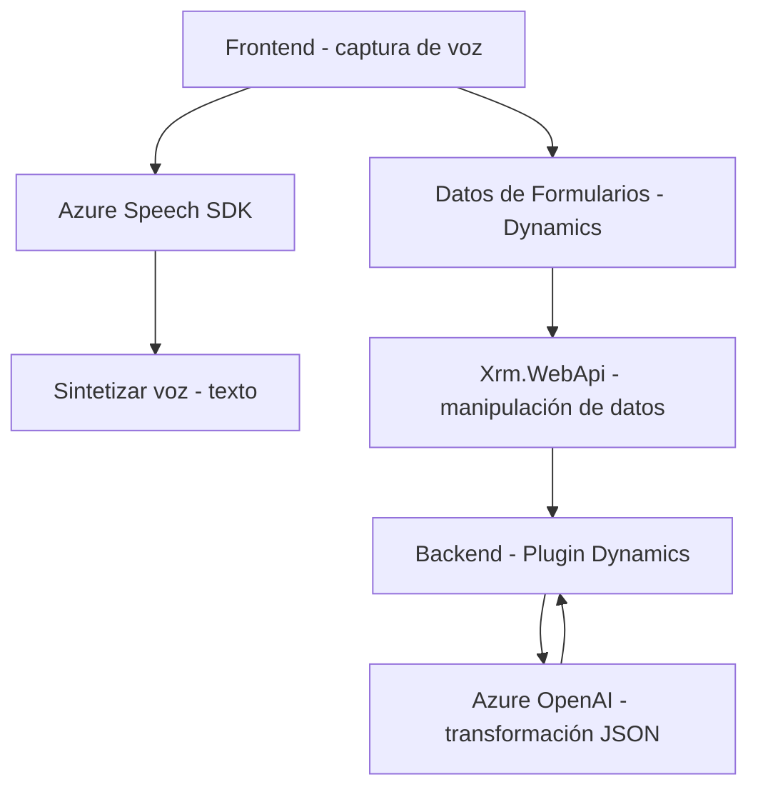

### Resumen técnico
El repositorio muestra una solución orientada a la interacción con formularios utilizando interfaces cliente y servicios externos, integrando tecnologías como Azure Speech SDK y Dynamics 365. Además, incluye un plugin para procesamiento avanzado de texto con IA en el entorno Dynamics CRM.

---

### Descripción de arquitectura
La solución tiene dos principales componentes:
1. **Frontend**: Implementado en archivos JavaScript, donde se manejan las interacciones de usuario, formulación de texto desde datos del formulario visual y reconocimiento de voz. Utiliza el patrón **Service Layer** para organizar funcionalidades como inicio de voz, lectura de datos y síntesis de texto a voz.
2. **Backend (Dynamics Plugin)**: Arquitectura basada en **Modelo de Plugins** de Dynamics CRM para la integración con OpenAI. Este componente se comunica con el servicio de Azure para transformar y estructurar datos semánticos conformes a reglas predefinidas.

Esto sugiere una arquitectura de **n-capas** donde:
- **Capa Cliente** contiene los archivos frontend para la interacción principal.
- **Capa Intermedia y API** actúa como un puente entre formularios y servicios externos (Azure Speech y OpenAI).
- **Capa de Procesamiento Backend** realiza transformaciones avanzadas y manipulación más específica de datos.

Adicionalmente, el backend sigue un esquema de **integraciones heterogéneas**, consumiendo servicios externos para procesamiento.

---

### Tecnologías usadas
1. **Frontend**:
   - **JavaScript ES6+**
   - **Dynamics 365 APIs (Xrm.WebApi)** para manipulación de formularios.
   - **Azure Speech SDK** para captura y síntesis de voz.
   - **Modularización funcional**: Funciones específicas para extracción de datos, interacción y actualización de UI.

2. **Backend**:
   - **Microsoft Dynamics Plugins**: Implementación basada en `IPlugin` para responder a eventos internos del CRM.
   - **Azure OpenAI**: Integración vía REST API para procesamiento de textos.
   - **Newtonsoft.Json** y **System.Text.Json** para manipulación de JSON.

3. **Patrones utilizados**:
   - **Service Layer**: Las funciones en el frontend organizan interacciones basadas en servicios.
   - **Dependency Injection**: En plugins Dynamics se inyecta el `IServiceProvider`.
   - **External API Integration**: Para consumo de Azure Speech y OpenAI.

---

### Diagrama Mermaid válido para GitHub

---

### Conclusión final
La solución es un sistema de **n-capas**, con una integración que conecta el cliente (Frontend) a servicios externos como Azure Speech y OpenAI para mejorar la experiencia de usuario y facilitar la gestión de datos en Dynamics CRM. Los plugins aseguran el correcto procesamiento de texto estructurado. Esto aporta escalabilidad y un diseño modular que puede evolucionar fácilmente hacia una arquitectura más distribuida, como microservicios.