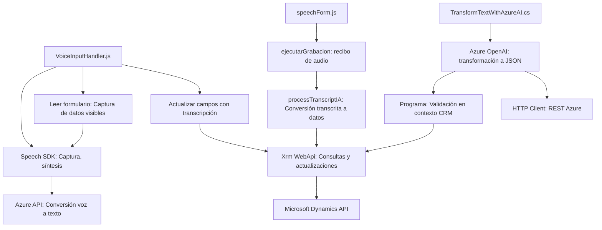

# Análisis detallado del repositorio proporcionado

## Breve resumen técnico
El repositorio se centra en integrar funcionalidades de accesibilidad (entrada/salida por voz) y procesamiento en aplicaciones empresariales de Microsoft Dynamics CRM mediante el uso de **Azure Speech SDK** y **Azure OpenAI Service**. Se aborda desde tres perspectivas: **frontend (JavaScript)** para interacción directa con el usuario, **back-end (plugin en C#)** para integraciones robustas, y un enfoque modular para facilitar la escalabilidad y adaptabilidad.

---

## Descripción de la arquitectura
### Tipo de solución
La solución se describe como una integración entre APIs externas (Azure Speech y Azure OpenAI) y Microsoft Dynamics, diseñada para facilitar accesibilidad en formularios dinámicos y procesamiento de datos en tiempo real tanto en el cliente como en el servidor. Combina elementos de **API**, **frontend dinámico** y **plugins backend**.

### Arquitectura empleada
La arquitectura resaltada presenta características **n-capas** y **orientada a servicios**, con componentes distribuidos y funcionalidades separadas:
1. **Frontend** (VoiceInputHandler.js, speechForm.js):
   - Con componentes modulares que interactúan directamente con el usuario.
   - Lectura/síntesis de los datos, utilizando **Azure Speech SDK**.
2. **Backend plugin** (TransformTextWithAzureAI.cs):
   - Procesa solicitudes del sistema CRM, transformando texto con **Azure OpenAI Service**.
3. **Integración con APIs externas** (Azure Speech, Azure OpenAI).

### Tecnologías empleadas
#### Frontend:
- **Lenguaje**: JavaScript.
- **Framework**: APIs de Microsoft Dynamics para formularios dinámicos.
- **Azure Speech SDK**: Para convertir texto a voz y captura por micrófono.
- **DOM APIs**: Interacciones directas con el DOM del navegador.

#### Backend:
- **Lenguaje**: C# (plugin compatible con Dynamics CRM).
- **Framework**: Modelo de extensibilidad basado en `IPlugin` de Dynamics CRM.
- **Azure OpenAI Service**: Para transformación de texto en JSON mediante inteligencia artificial.

#### Otros elementos:
- **Servicios externos**: Azure Speech SDK y Azure OpenAI.
- **Paquete JSON**: Uso en backend para manipular matrices y objetos JSON.
- **API Dynamics**: Operaciones como `Xrm.WebApi`.

---

## Dependencias y componentes externos
1. **Dependencias del Frontend**:
   - **Azure Speech SDK**: JavaScript SDK para voz (versión descargada dinámicamente).
   - **Navigator API**: Para capturar entrada de voz desde el navegador.
   - **Xrm Web API**: Librería oficial de Dynamics para interacción con datos y formularios.

2. **Dependencias del Backend**:
   - **Azure OpenAI Service**: Integración mediante REST endpoint para generación de respuestas JSON estructuradas.
   - **Newtonsoft.Json y System.Text.Json**: Para manipulación y transformación de objetos JSON.
   - **Microsoft Dynamics SDK**: Uso de inyección mediante `IServiceProvider`, con clases como `Entity`, `EntityReference`.

3. **Tecnologías clave externas**:
   - **HTTP Client**: Para llamadas REST a servicios Azure OpenAI.
   - **DOM API**: Manupulación directa de los formularios.

---

## Diagrama Mermaid

---

## Conclusión final
Este repositorio refleja una solución técnica sólida para integrar accesibilidad por voz y procesamiento basado en IA en formularios dinámicos. Sus elementos de arquitectura **modular** y **orientada a servicios** permiten adaptabilidad y extensibilidad en aplicaciones empresariales como Microsoft Dynamics CRM. Está diseñado para complementarse con herramientas externas (Azure Speech y Azure OpenAI), asegurando flexibilidad y escalabilidad en la solución.