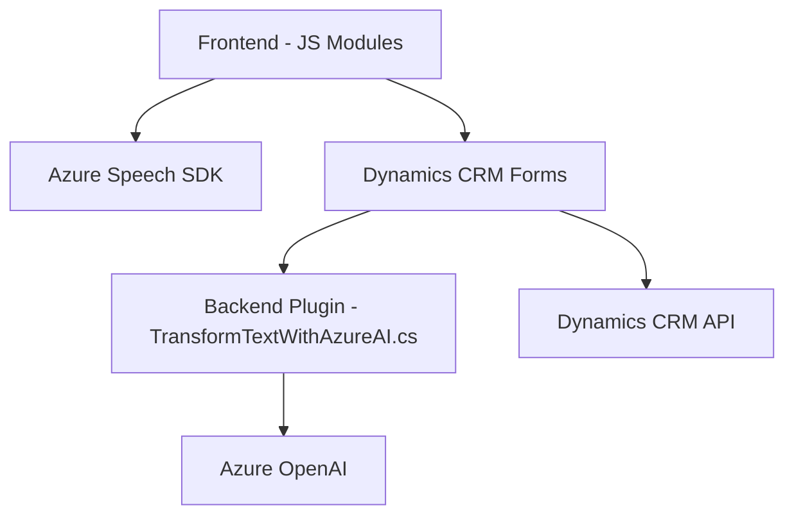

### Breve Resumen Técnico:
El repositorio contiene una solución compuesta por módulos frontend y plugins para Dynamics CRM, con énfasis en la integración con servicios de Azure como Speech SDK y OpenAI. Los archivos analizados implementan funcionalidades para captura, síntesis y transformación de datos mediante reconocimiento de voz, manipulación de formularios en la interfaz de forma dinámica y procesamiento avanzado con IA.

---

### Descripción de Arquitectura:
1. **Tipo de solución**:
   - La solución implementa un frontend basado en JavaScript y un backend plug-and-play para Dynamics 365 CRM.
   - Se enfoca en extender funcionalidades de Dynamics mediante reconocimiento de voz y transformación de texto a JSON estructurado.

2. **Tipo de arquitectura**:
   - **Frontend**: Modularizado con un enfoque de separación por funcionalidades (synthesis, data mapping, callback handling).
   - **Plugins**: Basado en el patrón gravitacional de **Plugin/Extend API** para Dynamics CRM.
   - La arquitectura global puede clasificarse como **n-capas**:
     - **Capa de presentación**: Frontend en JavaScript.
     - **Capa lógica de negocio**: Plugins que procesan texto y actualizan datos del CRM.
     - **Capa de acceso a datos**: Interacciones asincrónicas con APIs externas (Azure Speech SDK y Azure OpenAI).

---

### Tecnologías Usadas:
1. **Frontend (JavaScript)**:
   - **Azure Speech SDK**: Usado para síntesis y reconocimiento de voz.
   - **Dynamics 365 CRUD APIs**: Para manipular campos y atributos de formularios del CRM.
   - **Modularización en JavaScript**: Las funciones están divididas por tareas específicas dentro de un diseño funcional.

2. **Backend (C#)**:
   - **Microsoft.Xrm.Sdk**: Para integrar plugins con Dynamics CRM.
   - **HTTP Client**: Envio de POST requests a Azure API.
   - **Azure OpenAI GPT-4**: Transformación de texto en JSON estructurado utilizando reglas específicas.
   - **Newtonsoft.Json**: Manejo de JSON para gestionar el procesamiento de datos estructurados.

---

### Dependencias o Componentes Externos:
1. **Azure Speech SDK**: Reconocimiento y síntesis de voz en el frontend.
2. **Azure OpenAI GPT-4**: Manejo avanzado de IA para procesar texto y generar JSON estructurado.
3. **Dynamics 365 Web API**: APIs online para CRUD de campos en formularios.
4. **Newtonsoft.Json**: Librería para manejo de JSON en el plugin de C#.

---

### Diagrama Mermaid:
A continuación, se describe la interacción entre las capas y los componentes principales de la arquitectura:

---

### Conclusión Final:
El repositorio implementa una solución orientada a mejorar la interfaz y las funcionalidades de Dynamics 365 CRM combinando las capacidades del reconocimiento de voz por Azure Speech SDK y el poder de procesamiento basado en IA de Azure OpenAI. La arquitectura es de tipo n-capas con una clara separación entre lógica de presentación, negocio y acceso a datos, haciendo uso de patrones robustos como la modularización, integración de APIs, y el uso de plugins para extender las capacidades del sistema CRM.