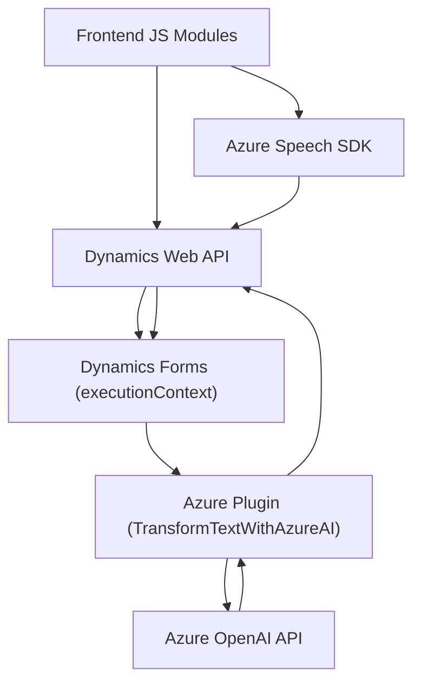

### Breve resumen técnico
El repositorio parece contener tres tipos de componentes principales:
1. **Frontend:** Archivos JavaScript que procesan datos de formularios visibles en interfases de Dynamics 365 y los conectan con servicios de voz e IA, como Azure Speech SDK.
2. **Backend-plugin:** Un componente basado en C#, que extiende la funcionalidad de Dynamics CRM mediante un plugin que consume la **API de Azure OpenAI** para transformar texto según reglas definidas.
3. **External Dependencies:** Integración con servicios externos como Azure Speech SDK y Azure OpenAI API para síntesis de voz y procesamiento avanzado de texto.

---

### Descripción de arquitectura
La solución parece adoptar una arquitectura híbrida:
- **Frontend:** Es modular y funcional, organizado en funciones autónomas que interactúan con los datos disponibles en formularios del cliente en Dynamics 365.
- **Backend-plugin:** Sigue el patrón de arquitectura de *plugin-based design* dentro de Dynamics CRM. Extiende las capacidades del CRM mediante conexiones a servicios externos.
- **Modelo de integración:** El sistema está centrado en integración vía APIs (Azure Speech y Azure OpenAI). Se utiliza un patrón adaptador para interconectar el frontend con servicios externos.
- **Estructura Global:** Aunque hay dos componentes separados (frontend y backend-plugin), se observa una tendencia a un diseño modular dentro de una arquitectura de **n capas**, dado que los datos se mueven desde el frontend hacia el backend, pasando por APIs y servicios.

---

### Tecnologías utilizadas
1. **Frontend:**
   - **JavaScript:** Para manipulación de DOM y ejecución de la lógica en Dynamics 365.
   - **Azure Speech SDK:** Para conversión texto → voz y reconocimiento de voz.
   - **Dynamics Web API:** Interacción directa con entidades de CRM.
2. **Backend-plugin:**
   - **C#/.NET Framework:** Desarrollo de plugins para Dynamics CRM.
   - **Newtonsoft.Json:** Manipulación de estructuras JSON.
   - **Azure OpenAI:** Para procesamiento avanzado de texto.
3. **Externas:**
   - **APIs REST:** Comunicación con Azure Speech y OpenAI mediante conexiones HTTP asincrónicas.

---

### Dependencias externas detectadas
1. **Azure Speech SDK:** Utilizado en el frontend para síntesis de voz y reconocimiento de voz.
2. **Azure OpenAI API:** Implementado en el backend-plugin para transformar texto de forma inteligente.
3. **Microsoft Dynamics CRM Web API:** Integración directa con entidades y formularios de Dynamics CRM.
4. **Newtonsoft.Json:** Biblioteca externa para el manejo de JSON en el plugin de C#.
5. **HttpClient (System.Net.Http):** Utilizado para la comunicación REST desde el plugin.

---

### Diagrama Mermaid válido para GitHub

---

### Conclusión final
El sistema presenta una solución híbrida adecuada para sistemas empresariales que requieren un alto nivel de interacción entre los usuarios y los datos de formularios en Dynamics CRM:
1. **Interactividad:** El **frontend JavaScript** habilita la síntesis y el reconocimiento de voz mediante Azure Speech SDK directamente en formularios visibles al usuario.
2. **Automatización inteligente:** El **backend-plugin** utiliza la tecnología de Azure OpenAI para transformar textos y aplicar reglas personalizadas de negocio.
3. **Adaptación:** El código aplica patrones como la carga dinámica de dependencias (speech SDK) y adaptadores para integrar APIs externas (Speech/OpenAI) con Dynamics CRM.

La arquitectura de **n capas** está bien estructurada para su propósito, combinando tecnologías modernas como las APIs de Azure y un enfoque modular que reduce el acoplamiento entre componentes.