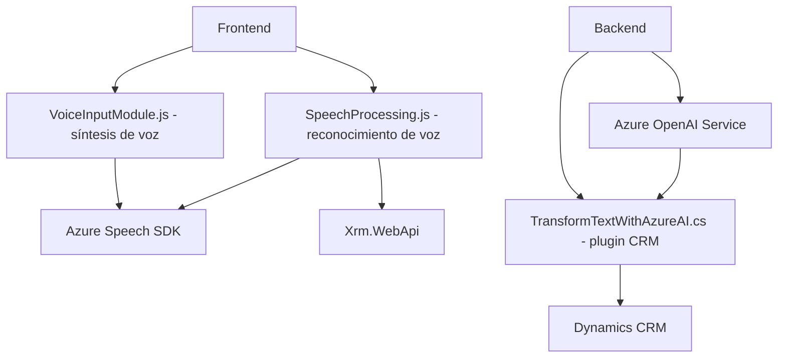

### Breve resumen técnico:
El repositorio implementa una solución híbrida que combina procesamiento en frontend con funcionalidades específicas en backend utilizando Azure OpenAI Service y Speech SDK. Este sistema se enfoca principalmente en la interacción de voz (reconocimiento y síntesis), transformación de texto mediante IA, y manipulación de datos en formularios, como los que se encuentran comúnmente en sistemas CRM.

---

### Descripción de arquitectura:
- **Tipo de solución:** 
  Sistema híbrido que gestiona formularios en **frontend** y utiliza **plugins** de **backend** en Dynamics CRM con integración de servicios externos como Azure Speech SDK para reconocimiento/síntesis de voz y Azure OpenAI Service para procesos inteligentes.

- **Arquitectura:** 
  Se organiza bajo una estructura de **n capas**, donde el frontend gestiona la interfaz y lógica del cliente, el backend incorpora una **pluggable architecture** para Microsoft Dynamics CRM, y la comunicación con APIs externas añade una capa adicional de integración. Aunque cada componente tiene una relativa independencia, no adopta la arquitectura de microservicios.

---

### Tecnologías usadas:
1. **Frontend:**
   - **JavaScript**: Para manipulación de DOM y lógica en tiempo de ejecución.
   - **Azure Speech SDK**: Para reconocimiento de voz, síntesis y procesamiento de entrada hablada.
   - **API Xrm.WebApi**: Para comunicación con Dynamics CRM.

2. **Backend:**
   - **C#** (Microsoft.Xrm.Sdk): Para el desarrollo de plugins de Dynamics CRM.
   - **Azure OpenAI Service**: Para el procesamiento y transformación de texto con IA avanzada.
   - **HTTP Requests**: Integración con APIs externas mediante solicitudes POST.
   - **Newtonsoft.Json** y **System.Text.Json**: Para manejo y estructuración de JSON.
   - **System.Net.Http**: Comunicación con APIs externas.

3. **Infraestructura externa:**
   - **Dynamics CRM**: Gestión de formulación y datos empresariales.
   - **Azure**: Servicios de IA (Speech SDK y OpenAI).

---

### Dependencias o componentes externos:
1. **Azure Speech SDK**: Para procesamiento de audio, interpretación y síntesis de voz.
2. **Azure OpenAI Service**: Para transformación avanzada de texto utilizando IA.
3. **Microsoft Dynamics CRM**: Contexto de formulación y operaciones empresariales.
4. **Sistema HTTP Requests (API personalizada)**: Comunicaciones con una API adicional en algunos casos para manipular datos generados por IA.
5. **JavaScript (Librerías y módulos)**: Para funciones dinámicas en el frontend.

---

### Diagrama Mermaid (100 % compatible con GitHub Markdown):

---

### Conclusión final:
La solución presentada describe un sistema que mezcla tecnologías frontend y backend para interactuar con formularios habilitados para voz y servicios inteligentes basados en IA. Su arquitectura basada en **n capas**, junto con el uso de **patrones como adapter y pluggable**, proporciona un diseño modular y extensible. La combinación de **Azure Speech SDK**, **Azure OpenAI** y **Dynamics CRM** demuestra una apuesta estratégica por integraciones con servicios robustos en la nube para ofrecer funcionalidades avanzadas en entornos empresariales. 