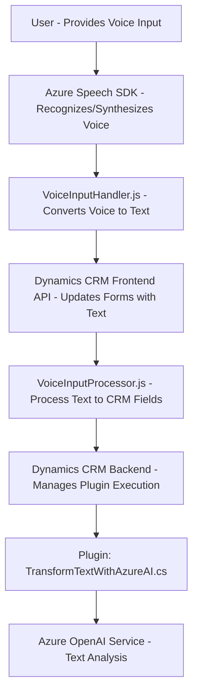

### Breve resumen técnico
La solución descrita en el repositorio integra tecnología de reconocimiento de voz, procesamiento de texto y síntesis de voz mediante **Azure Speech SDK** y **Azure OpenAI Service** con formularios dinámicos de **Microsoft Dynamics CRM**. Combina código frontend (JavaScript) para procesamiento del lado del cliente, con un plugin backend (.NET/C#) para extender operaciones del CRM y realizar procesamiento avanzado de texto utilizando OpenAI.

---

### Descripción de arquitectura
La arquitectura es una **multicapa híbrida**, con una separación entre el frontend (JavaScript) que interactúa con el browser y backend (Dynamics CRM + C#). Aunque no es estrictamente una arquitectura de microservicios, sí aprovecha servicios externos (Azure Speech SDK para reconocimiento/síntesis de voz y Azure OpenAI para IA). En general:
1. Cada capa tiene responsabilidades bien definidas:
   - **Frontend (JavaScript):** Recibe y procesa datos del usuario, integra Azure Speech SDK para reconocimiento y síntesis de voz.
   - **Backend (Plugin en C#):** Amplía las capacidades del servicio CRM mediante lógica personalizada y llama a servicios en Azure OpenAI.
2. Utiliza servicios externos para funciones avanzadas como reconocimiento de voz y optimización con IA.

### Tecnologías usadas
1. **Frontend:**
   - **Azure Speech SDK**: Para reconocimiento y síntesis de voz.
   - **JavaScript**: Manipulación del DOM y configuración del SDK.
   - **Microsoft Dynamics CRM API**: Proporciona datos de formularios y permite aplicar valores dinámicamente.

2. **Backend:**
   - **Microsoft Dynamics CRM (.NET-based)**: Plataforma principal donde el plugin se ejecuta.
   - **C# (.NET Framework)**: Lenguaje utilizado para desarrollar el plugin.
   - **Azure OpenAI service (GPT)**: Procesamiento de texto avanzado mediante solicitud HTTP REST.
   - **System.Net.Http**: Comunicación vía API REST.
   - **System.Text.Json**: Para manipular datos JSON.
   - **Newtonsoft.Json** (contenido residual): Librería para manejo de JSON, no utilizada explícitamente.

3. **Patrones de diseño:**
   - Modularity (funciones bien segmentadas por operaciones específicas).
   - Integration via external APIs (Azure Speech SDK y OpenAI Service se manejan como dependencias externas).
   - Plug-in extensibility model (para insertar lógica personalizada en Dynamics CRM).
   - Factory (Azure SpeechConfig) y Adapter (para unir datos entre input de voz ↔ formularios). 

---

### Diagrama Mermaid válido para GitHub Markdown

---

### Conclusión final
La solución es una **hybrid architecture** orientada a la interacción entre el cliente y servicios de Azure de forma eficiente. El frontend utiliza tecnologías modernas (Azure Speech SDK y lógica en JavaScript) mientras que el backend extiende la funcionalidad de Dynamics CRM con un plugin en C#. En términos de diseño, se aplica una estructura modular, patrones de integración y extensibilidad, permitiendo una gran capacidad de adaptación y escalabilidad.