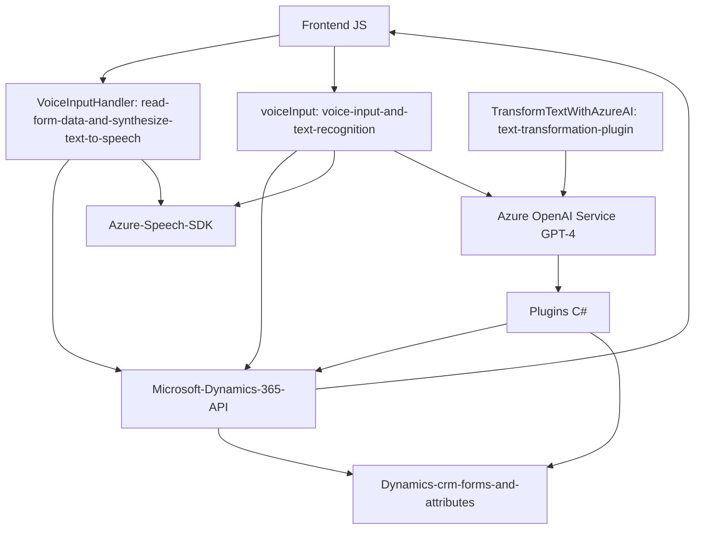

### Breve Resumen Técnico
El repositorio contiene una solución orientada hacia la integración de Microsoft Dynamics 365 con el servicio Azure Speech SDK y el Azure OpenAI Service (GPT-4). Este enfoque permite procesar formularios, realizar síntesis de voz, capturar datos mediante reconocimiento de voz y transformar texto mediante inteligencia artificial.

### Descripción de Arquitectura
La solución se basa en una combinación de arquitecturas de **event-driven** y **n capas**, con integración hacia servicios externos (Azure Speech SDK y Azure OpenAI). La estructura expone un claro modelo de separación de responsabilidades:
1. **Frontend Folder**: Código para extender la funcionalidad de los formularios de Dynamics 365 mediante la generación de síntesis de voz (VoiceInputHandler.js) y captura basada en entrada de micrófono (voiceInput.js).
   - Incluye integración con Azure Speech SDK.
   - Procesa los datos del formulario y permite su conversión en texto hablado o en transcripciones de entrada que se reflejan nuevamente en el formulario.
2. **Plugins Folder**: Extensiones lado servidor para Dynamics 365 (C# plugin). Este plugin consume la API de Azure OpenAI para transformar texto en estructuras JSON según reglas predefinidas.

### Tecnologías Usadas
1. **Frontend**:
   - **HTML/JavaScript**: Para la extensión de funcionalidades de los formularios.
   - **Azure Speech SDK**: Para síntesis de voz, reconocimiento de entrada por micrófono y procesamiento en tiempo real.
   - **Microsoft Dynamics 365 Javascript API**: Para interactuar con formularios en Dynamics CRM, acceder a campos y modificar sus valores.

2. **Backend (Plugins)**:
   - **C#**: Usado para implementar el plugin de Dynamics CRM.
   - **Newtonsoft.Json** y **System.Text.Json**: Para manipulación y generación de JSON.
   - **System.Net.Http**: Para realizar integraciones con la API REST de Azure.
   - **Azure OpenAI Service (GPT-4 API)**: Para la transformación avanzada de texto en estructuras de datos JSON.

### Tipo de Solución
La solución implementa una **integración API** con Microsoft Dynamics 365 y Azure Speech/OpenAI Services. Es una **enterprise application** orientada a expandir las capacidades de Dynamics 365 usando **cloud services**. Puede ser considerado un híbrido entre **plugin-based architecture** y **microservice integration.**

### Características de la Arquitectura
1. **Event-Driven**: Muchas funcionalidades dependen del inicio de eventos (por ejemplo, la activación de callbacks tras la carga del SDK o el inicio de tareas tras la entrada de voz).
2. **N Capas**: Separación de responsabilidades en distintas capas (Frontend para interacción con el usuario y Server Plugins para la lógica del negocio y la integración con Azure).
3. **Cloud-Based Integration**: Aprovechamiento de tecnologías SaaS/PaaS, como Azure Speech y Azure OpenAI.

### Dependencias o Componentes Externos
1. **Azure Speech SDK**: Usado en el frontend (para síntesis y reconocimiento de voz).
2. **Azure OpenAI Service**: Implementado vía C# en el plugin para generación de respuestas JSON estructuradas, basado en tecnología GPT-4.
3. **Microsoft Dynamics 365 API**: Integración para acceder, actualizar y manipular datos en formularios.
4. **Newtonsoft.Json**/REST Client Libraries: Para consumir APIs externas y manejar datos JSON.

---

### Diagrama **Mermaid** (100% compatible con GitHub Markdown)

---

### Conclusión Final
La solución evidencia una sólida integración entre los formularios de Microsoft Dynamics 365 y servicios avanzados en la nube (Azure Speech SDK y Azure OpenAI). La arquitectura combina características de **event-driven** y **n capas**, con claro enfoque modular que separa las funciones del frontend y del backend. El uso de tecnologías modernas de reconocimiento y procesamiento de voz junto con inteligencia artificial hace que la solución sea robusta y adaptable a entornos empresariales dinámicos y variados.