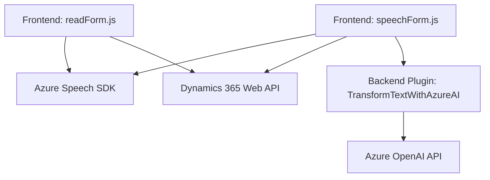

### Análisis Técnico del Repositorio

#### Breve Resumen Técnico
El repositorio contiene tres módulos principales:
1. **readForm.js**: Código en JavaScript para lectura de datos visibles en formularios y síntesis de voz usando **Azure Speech SDK**.
2. **speechForm.js**: Código en JavaScript para integración multimedia con reconocimiento de voz, utilizando **Azure Speech SDK y Dynamics CRM WebAPI** para automatizar procesos en formularios.
3. **TransformTextWithAzureAI.cs**: Plugin desarrollado para Dynamics 365 CRM que interactúa con **Azure OpenAI GPT** y transforma texto ingresado según un conjunto de normas.

---

### Descripción de Arquitectura
1. **Tipo de solución**:
   - Es una solución **híbrida basada en servicios**, que combina el uso de:
     - **Frontend Web** (JavaScript) para la manipulación interactiva del usuario y la integración con servicios de la nube.
     - **Backoffice Plugin (C#)** como parte de Dynamics CRM para ejecutar transformaciones con servicios de inteligencia artificial externa como Azure OpenAI.

2. **Arquitectura**:
   - **Híbrida**: Integración de un Frontend interactivo para manipulación de datos con servicios de voz (Azure Speech SDK), comunicación bidireccional con fundamentos en las APIs de Dynamics CRM, y delegación de lógica de procesamiento avanzado al plugin en C# para transformaciones de textos haciendo uso de Azure OpenAI.
   - **Event-driven Architecture**: La solución está orientada por eventos del usuario (entrada en formularios, activación de reconocimiento de voz).
   - **n Capas**: Adopta una arquitectura en capas donde el frontend y el backend interactúan con Dynamics CRM. La capa de servicios externos incluye SDKs como Azure Speech y OpenAI GPT.

3. **Patrones utilizados**:
   - **Integración de SDK**:
     - Utiliza **Azure Speech SDK** dentro de código frontend para síntesis y reconocimiento de voz.
     - En el backend usa **Azure OpenAI API** para procesamiento de texto con IA avanzada.
   - **Single Responsibility Principle**:
     - Cada función está diseñada para realizar tareas específicas (captura de datos, síntesis, interacción con APIs, manejo de formularios).
   - **Event-driven Programming** en el flujo del frontend.

4. **Dependencias o Componentes Externos**:
   - **Azure Speech SDK**: Para síntesis y reconocimiento de voz.
   - **Azure OpenAI GPT (API REST)**: Para transformar texto con reglas específicas.
   - **Dynamics 365 Web API SDK**: Manipulación de formularios y entidades en un sistema CRM.
   - **Plugins de Dynamics CRM**: Extensión del CRM utilizando Microsoft SDK.

---

### Tecnologías Usadas
1. **Frontend (JavaScript)**:
   - Azure Speech SDK (interfaz del navegador).
   - Dynamics CRM Web API para manipulación de formularios.
   - Event-driven architecture para capturar y procesar acciones del usuario en la interfaz.

2. **Backend/Plugin para Dynamics CRM (C#)**:
   - Azure OpenAI para transformaciones de texto mediante REST API.
   - Librerías del SDK de Dynamics CRM (`Microsoft.Xrm.Sdk`, `Microsoft.Xrm.Sdk.Query`) para manipulación directa en CRM.
   - JSON handling: `Newtonsoft.Json` y `System.Text.Json`.

---

### Diagrama Mermaid

---

### Conclusión Final
La solución definida en el repositorio es un sistema híbrido que combina funcionalidades frontend para integración multimedia con plugins backend especializados en la manipulación de datos utilizando Dynamics CRM y servicios de inteligencia artificial. Técnicamente, se observa una clara separación de responsabilidades a través de módulos específicos y el uso de SDKs idealmente acoplados (Azure Speech SDK y OpenAI). En cuanto a arquitectura, sigue un enfoque **event-driven** y de **n capas** integrando módulos y microservicios externos que potencian la funcionalidad del sistema. La documentación es adecuada, con descripciones claras y organizadas. Sin embargo, sería útil mejorar la gestión de las dependencias internas entre el código del frontend y los plugins para asegurar escalabilidad y mantenibilidad.