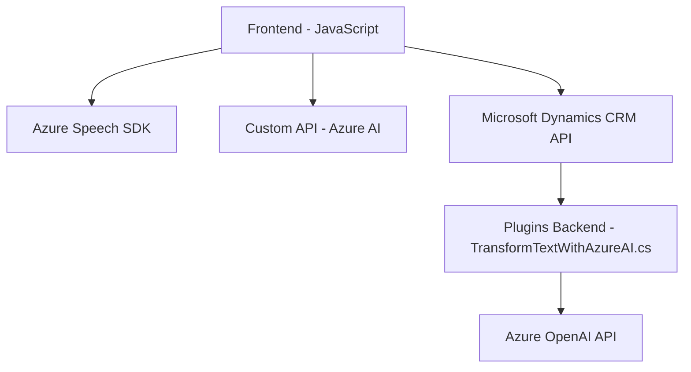

### Breve resumen técnico
El repositorio contiene varios archivos que implementan funcionalidades relacionadas con servicios de entrada de voz, procesamiento de voz y texto, y manipulación dinámica de datos en formularios de una plataforma tecnológica basada en Microsoft Dynamics CRM. Integran **Azure Speech SDK** y **Azure OpenAI API** para avanzar en la interacción humano-computadora (HCI), optimizando experiencias mediante reconocimiento de voz y utilizando IA para enriquecer los datos con semántica.

---

### Descripción de arquitectura
La solución utiliza elementos de arquitectura **n-capas**, típicos en aplicaciones empresariales. Se divide en las siguientes capas:
1. **Frontend/cliente (JavaScript):** 
   - Contiene los scripts para gestión de formularios y voz, interactuando directamente con dependencias como Azure Speech SDK y Custom APIs.
2. **Backend/servidor (Plugins en C#):**
   - Implementa un patrón **plugin** propio de Dynamics CRM para interactuar directamente con los servicios y la API de Azure OpenAI.
   
Está diseñado como una solución que actúa en el contexto de sistemas basados en Dynamics CRM, donde la capa de interfaz de usuario (web) se comunica con servicios externos y el backend. Este enfoque modular también emula principios de arquitectura **hexagonal**, especialmente por la separación de lógica de negocio y adaptadores externos.

---

### Tecnologías usadas
1. **Frontend:**
   - **JavaScript:** Utilizado para interactuar con formularios, transmitir datos y ejecutar Speech SDK.
   - **Azure Speech SDK:** Para reconocimiento de voz y síntesis de texto a voz.
   - **Microsoft Dynamics 365 Platform APIs:** Para interactuar con formularios y entidades.

2. **Backend:**
   - **C# (.NET Framework):** Implementación del plugin de Dynamics CRM.
   - **Microsoft Xrm SDK:** Para interactuar con Dynamics CRM.
   - **Azure OpenAI (GPT):** Como servicio externo para transformación semántica del texto.

3. **General:**
   - **HTTP Requests:** En el caso del plugin, consumiendo APIs externas mediante `HttpClient`.

---

### Diagrama **Mermaid**

---

### Conclusión final
La solución integra tecnologías modernas con enfoques arquitectónicos modulares y desacoplados, maximizando reutilización y extensibilidad mediante servicios en la nube como Azure Speech SDK y OpenAI, junto con el ecosistema de Dynamics CRM. 

La arquitectura es robusta y apunta a **n-capas** con influencia del estilo **hexagonal**: el frontend orientado hacia experiencias de usuario avanzadas, el backend minimizado mediante plugins, y adaptadores que interactúan con APIs externas. Las extensiones para procesamiento de texto con IA y manejo dinámico de voz hacen que esta solución sea ideal para entornos empresariales buscando eficiencia y enriquecimiento semántico en sus operaciones.