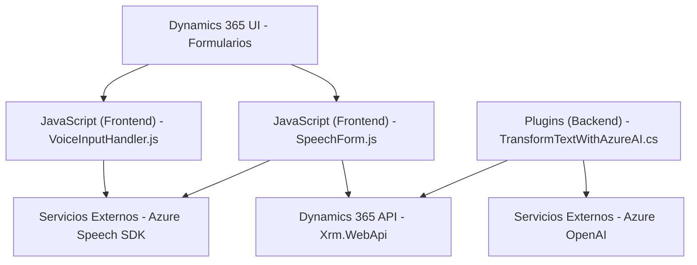

### Análisis Técnico

#### Breve resumen técnico

El repositorio contiene tres componentes principales utilizados en una solución que integra procesamiento de formularios con capacidades de síntesis y reconocimiento de voz (speech-to-text) y análisis de texto con **inteligencia artificial (IA)** mediante servicios de Microsoft Azure. Estos componentes están diseñados para funcionar dentro de aplicaciones basadas en **Dynamics 365 CRM**.

---

#### Descripción de la Arquitectura

**Tipo de solución:**
Este repositorio forma parte de una solución **híbrida**, que integra una capa frontend para interactuar con formularios y una capa backend (un plugin) que aprovecha servicios de IA de Azure (Speech SDK y OpenAI). Además, hay integración con la API de **Dynamics 365** para actualizar formularios y realizar búsqueda de datos.

**Arquitectura predominante:**
1. **Frontend:** Adopta un enfoque modular de funciones JavaScript que facilitan la integración entre la UI (formularios) y servicios de reconocimiento/síntesis de voz orientado a **interacción dinámica**.
2. **Backend:** Implementa un único plugin en **C#** que opera como un servicio REST para consumo de **Azure OpenAI**. Se ajusta a una **arquitectura de n capas**, con comunicación directa entre:
   - la lógica del plugin,
   - servicios externos (Azure OpenAI),
   - y Dynamics 365 CRM.

**Patrones utilizados:**
a) **Patrón basado en eventos:** Implementado mediante funciones como `ensureSpeechSDKLoaded`, que espera la carga dinámica del SDK antes de ejecutar la lógica asociada.  
b) **Externalización de servicios:** Utiliza servicios de IA como **Azure Speech SDK** y **Azure OpenAI** mediante llamadas HTTP REST.  
c) **Encapsulación:** El código segmenta funcionalidades en módulos/fichas con funciones específicas reutilizables.  
d) **Orquestación de servicios:** El plugin actúa como mediador entre Dynamics CRM y Azure OpenAI, asegurando una separación de responsabilidades.

---

#### Tecnologías, frameworks, y dependencias utilizadas

1. **Frontend (JavaScript):**
   - **Azure Speech SDK:** Para reconocimiento y síntesis de voz.
   - **Dynamics 365 Form Context API:** Utilizada para acceder, modificar, y controlar atributos y campos en formularios.
   - **Promises/Callbacks:** En funciones asincrónicas como carga de SDK y llamadas a servicios externos.
   - Modularidad de funciones: Evita dependencia entre módulos y emplea internamente divisiones según tareas específicas, como extracción de datos de campos (`getVisibleFieldData`) y asignación de datos a campos (`applyValueToField`).

2. **Backend (C#):**
   - **Microsoft.Xrm.Sdk:** Framework para desarrollo y extensión de Dynamics CRM a través de plugins.
   - **Newtonsoft.Json** y **System.Text.Json:** Para manipulación avanzada de JSON.
   - **Azure OpenAI SDK o API directa:** Proporciona capacidades de procesamiento semántico avanzado del texto de entrada.

---

#### Dependencias o componentes externos

1. **Microsoft Azure Services:**  
   - **Azure Speech SDK:** Para reconocimiento y síntesis de voz.  
   - **Azure OpenAI Service:** Para transformar texto y obtener respuestas estructuradas en JSON.

2. **Dynamics 365 SDK:**  
   - Utilizada en el plugin y en los archivos JavaScript para interactuar con la API proporcionada por Dynamics CRM (campos, parámetros, `Xrm.WebApi`).  

3. **Librerías adicionales (backend):**  
   - **System.Net.Http:** Para realización de llamadas externas a APIs.  
   - **Newtonsoft.Json.Linq:** Procesamiento de JSON proveniente de la respuesta de AI.  

---

### Diagrama Mermaid válido para GitHub Markdown

---

### Conclusión Final

La solución está diseñada para interactuar con aplicaciones de **Dynamics 365** y optimiza la experiencia de usuario en formularios mediante capacidades de reconocimiento de voz, síntesis de voz, y análisis avanzado del texto basado en **inteligencia artificial (IA)**. La arquitectura es un híbrido, con una capa frontend modular independiente y una capa backend como servicio plugin bajo el framework de Dynamics CRM.

Este sistema utiliza patrones modernos como arquitecturas basadas en eventos, externalización de servicios y modularidad, para lograr una robusta integración entre tecnologías web y servicios avanzados de Microsoft Azure. La elección de **Azure Speech SDK** y **OpenAI** refleja una apuesta por servicios altamente escalables y optimizados para operaciones de IA.