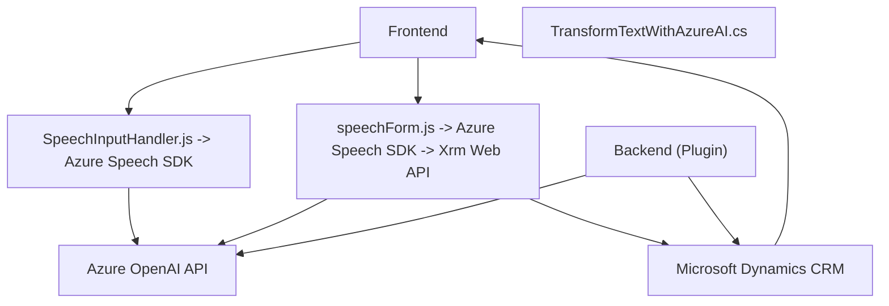

### Breve resumen técnico:

Este repositorio consta de varios archivos relacionados con funcionalidades como manejo de formularios en el frontend, reconocimiento y captura de entrada de voz, integración con servicios de inteligencia artificial (como Azure OpenAI y Speech SDK) y un plugin para Microsoft Dynamics CRM que realiza transformaciones de texto utilizando Azure AI.

El repositorio se enfoca en realizar operaciones de síntesis y reconocimiento de voz, así como transformar datos con servicios de IA para sus funcionalidades de soporte al sistema CRM.

---

### Descripción de arquitectura:

La arquitectura parece consistir en las siguientes secciones:

1. **Frontend**: Maneja la interfaz de usuario para capturar datos desde formularios (Frontend/JS/readForm.js y speechForm.js), además de implementar el reconocimiento y síntesis de voz con servicios de Azure.  
2. **Backend Plugin**: Desarrollado para integrarse con Microsoft Dynamics CRM como un composable plugin basado en la interfaz `IPlugin`. Se integra con Azure OpenAI (Modelo GPT) para brindar interfaces inteligentes y procesar datos del cliente. Este plugin puede ser invocado directamente desde CRM como parte de sus procesos de ejecución.
3. **Servicios externos**:
   - **Azure Speech SDK**: Para el reconocimiento y síntesis de voz.
   - **Azure OpenAI API**: Para transformar texto en JSON procesado según normas específicas.

La solución no utiliza microservicios y parece implementarse como un sistema modular con integración directa a servicios de Azure. No sigue estrictamente una arquitectura hexagonal, aunque sí incorpora principios de desacoplamiento en la arquitectura de plugin y funciones modulares en la capa frontend. En conjunto, se reconoce esta arquitectura como **n capas**, con enfoque en integración de API externas.

---

### Tecnologías usadas:

1. **Frontend**:
   - **JavaScript**: Es el lenguaje principal para la lógica de frontend.
   - **Azure Speech SDK**: Para el procesamiento de entrada/salida de voz.
   - Sistema CRM (probablemente Dynamics CRM): Extensión programática mediante Xrm Web API.

2. **Backend**:
   - **C#**: Lenguaje principal del plugin `TransformTextWithAzureAI.cs`.
   - **Microsoft Dynamics SDK**: Para el desarrollo de funcionalidades específicas en Dynamics CRM como parte del ciclo de plugins.
   - **Azure OpenAI API**: Consumida vía HTTP con `HttpClient`.
   - **Newtonsoft.Json** y **System.Text.Json**: Para manejo avanzado de datos en formato JSON.

---

### Diagrama Mermaid válido para GitHub:

---

### Conclusión final:

Este repositorio implementa una **n capas** solución integrada con Microsoft Dynamics CRM, servicios de **Azure Speech SDK** y **Azure OpenAI API**. Su finalidad principal es mejorar la experiencia de usuario al interactuar con formularios de CRM, al proporcionar capacidades de entrada de voz y transformación inteligente de texto vía IA.

El diseño es modular y cohesivo, con un uso eficiente de patrones como el plugin para CRM, el patrón fachada para la organización de funcionalidades específicas, y una integración adecuada con APIs externas. La arquitectura puede evolucionar hacia un enfoque más distribuido como microservicios si se requiere mayor escalabilidad, aunque actualmente parece adecuada para su propósito.