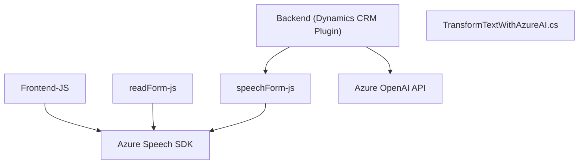

### Resumen técnico
El repositorio contiene elementos diseñados para integrar servicios de inteligencia artificial (Azure Speech y Azure OpenAI) en formularios web, específicamente en el contexto de Dynamics 365 CRM. Las funcionalidades abarcan entrada por voz, síntesis de texto a voz y transformación inteligente de texto. Esto incluye componentes en JavaScript para interacción cliente y un plugin en .NET para realizar procesamiento en el backend.

---

### Descripción de arquitectura
La solución sigue una arquitectura híbrida de **n capas** que integra:
1. **Frontend web** con interacción dinámica mediante JavaScript para reconocimiento y síntesis de voz.
2. **Middleware y backend** mediante un plugin en Dynamics 365 CRM que utiliza servicios de Azure OpenAI.
3. **Capas externas** que integran servicios en la nube (Azure Speech y OpenAI).

El modelo predomina en un estilo monolítico por su vinculación con el ecosistema de Dynamics 365 CRM, aunque hace uso de servicios distribuidos para ampliar las capacidades cognitivas y de interacción por voz.

---

### Tecnologías usadas
1. **Frontend (JavaScript)**:
   - Azure Speech SDK: Reconocimiento y síntesis de voz.
   - DOM Manipulation.
   - Uso de promesas y callbacks para manejar eventos asíncronos.

2. **Backend (.NET)**:
   - Dynamics CRM Plugin Framework (Microsoft.Xrm.Sdk).
   - Azure OpenAI para procesamiento de texto.
   - HTTP client (System.Net.Http) para consumo de APIs externas.
   - JSON handlers: Newtonsoft.Json.Linq y System.Text.Json.

3. **APIs**:
   - Azure Speech SDK (`https://aka.ms/csspeech/jsbrowserpackageraw`).
   - Azure OpenAI (`https://openai-netcore.openai.azure.com/`) con GPT-4 further configured.

---

### Diagrama Mermaid

---

### Conclusión final
El repositorio implementa una solución que extiende las capacidades de interacción en aplicaciones de negocio al incorporar servicios de voz y procesamiento de lenguaje natural. La arquitectura se basa en una integración de múltiples capas:
- **Cliente**: Manejo de entrada y síntesis de voz con Azure Speech SDK.
- **Backend**: Plugin CRM que procesa datos mediante Azure OpenAI para automatizar análisis de texto y actualizaciones de formularios.

Aunque el sistema expone características de acoplamiento entre el CRM y componentes de Azure, la modularidad en el diseño lógico (división de responsabilidades en funciones y servicios) permite su escalabilidad y adaptación para sistemas similares fuera del entorno Dynamics 365.