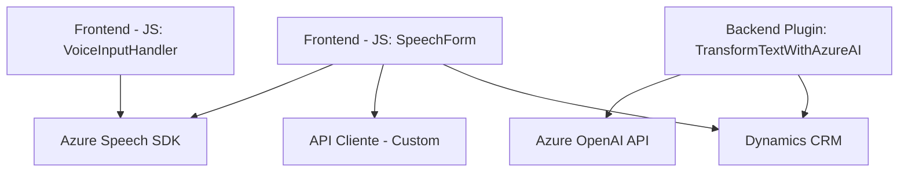

### Breve Resumen Técnico

El repositorio describe una solución que integra reconocimiento de voz y procesamiento de texto con servicios de Azure (Azure Speech SDK, OpenAI API). Los archivos del frontend añaden funcionalidades de síntesis y reconocimiento de voz, mientras que el archivo del plugin implementa transformación inteligente de texto en un CRM como Dynamics. Se infiere una arquitectura modular y basada en microservicios frontend/backend.

---

### Descripción de Arquitectura

#### Tipo de solución:
1. **Componentes Frontend:** Implementan funcionalidades de reconocimiento de voz y control de formularios de cliente usando **JavaScript**.
2. **Plugin Backend:** Extiende funcionalidades del CRM para procesamiento avanzado del texto y transformaciones mediante **Azure OpenAI API**.
3. **Integración de Servicios Externos:** Dependencia del SDK cloud **Azure Speech** y la API **Azure OpenAI**.

#### Arquitectura global:
La solución se adapta a una arquitectura **n capas** orientada a la separación lógica de responsabilidades:
- **Frontend:** Microfrontend desacoplado con lógica de reconocimiento y síntesis de voz.
- **Backend:** Plugin modular para procesamiento avanzado en el servidor del CRM.

El sistema exhibe características de un modelo **event-driven** por cómo las funciones en frontend y backend responden dinámicamente a eventos de usuario (ej., entrada de voz).

---

### Tecnologías Usadas

1. **Frontend:**
   - **Azure Speech SDK:** Para reconocimiento de voz y síntesis de texto en JavaScript.
   - **Xrm.WebApi:** Para acceso y manipulación de datos del CRM desde el frontend.
   - **Promesas (async/await):** Gestión eficiente de tareas asincrónicas.
   - **Modularidad:** Separación funcional mediante archivos independientes.

2. **Backend Plugin:**
   - **Azure OpenAI:** Para transformación inteligente de texto.
   - **HTTP Client API:** Realización de solicitudes HTTP para consumir APIs externas.
   - **Dynamics CRM SDK:** Utilización de `IPlugin` para extender la funcionalidad del CRM.

---

### Diagrama Mermaid 100% Compatible con GitHub Markdown

---

### Conclusión Final

El repositorio implementa un sistema modular que potencia un **CRM**, como Dynamics, mediante funcionalidades avanzadas de reconocimiento de voz y procesamiento automatizado de texto. La arquitectura destaca por su limpieza y uso estratégico de servicios cloud como **Azure Speech SDK** y **Azure OpenAI API**, logrando integrar innovadores servicios cognitivos de manera eficiente.