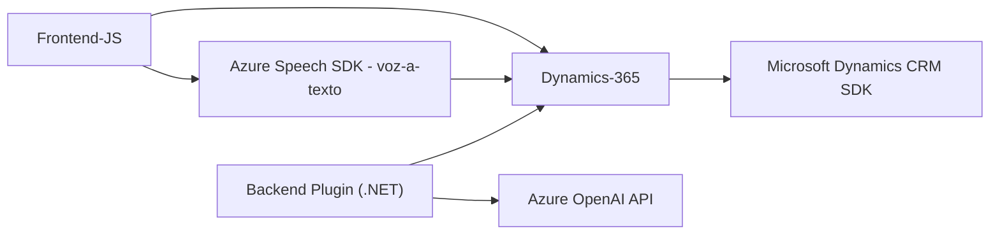

### Resumen técnico
El repositorio está compuesto por tres componentes principales:
1. **Frontend**: JavaScript modular que implementa reconocimiento de voz y síntesis de texto mediante **Azure Speech SDK**, y funciones específicas para interactuar con formularios en **Dynamics 365**.
2. **Backend Plugin**: Código en **C#** que utiliza **Azure OpenAI API** para transformar texto según normas específicas, actuando como un plugin en el sistema **Dynamics CRM**.

La solución general parece estar orientada a simplificar la interacción de usuarios con formularios en un entorno empresarial mediante reconocimiento de voz e inteligencia artificial para procesamiento de datos.

---

### Descripción de arquitectura
1. **Tipo de solución**: API integrada con Inteligencia Artificial (Azure OpenAI/ Azure Speech SDK) + lógica frontend y plugin backend. La solución está construida para integrarse con Microsoft Dynamics CRM.
2. **Arquitectura**: N Capas; donde el frontend interactúa con usuarios, el backend realiza procesamiento avanzado, y los servicios en la nube (Azure) proveen funcionalidades externas como reconocimiento de voz y procesamiento de lenguaje.
3. **Integraciones externas:** 
   - **Azure Speech SDK**: Para síntesis y reconocimiento de voz.
   - **Azure OpenAI API**: Para procesamiento avanzado de lenguaje natural.
   - **Microsoft Dynamics 365 WebApi/SDK**: Para manipulación de datos dentro del sistema CRM.
4. **Patrones utilizados**:
   - **Modularización**: Funciones en cada archivo están divididas por responsabilidades específicas.
   - **Integración con servicios externos**: Uso de APIs para delegar funcionalidades especializadas a la nube.
   - **Asincronismo**: Uso de promesas en JavaScript y manejo de eventos en C#.

---

### Tecnologías usadas
- Lenguajes:
  - **JavaScript**: Para lógica frontend y comunicación con Azure SDK.
  - **C#**: Implementación de plugin backend para Dynamics CRM.
- Frameworks y Servicios:
  - **Azure Speech SDK**
  - **Azure OpenAI API**
  - **Microsoft Dynamics CRM SDK**
- Protocolos y comunicación:
  - Servicios RESTful mediante **HttpClient** en `.NET`.
  - Asincronismo en JavaScript mediante promesas.
  - JSON serialización usando `Newtonsoft.Json` (en C#) y `JSON.parse()`/`JSON.stringify()` (en JS).

---

### Diagrama Mermaid compatible con GitHub Markdown

---

### Conclusión final
La solución aquí descrita es una arquitectura **n-capas**, que integra el frontend, servicios externos (Azure Speech SDK y Azure OpenAI API), y un backend en forma de plugin de Dynamics CRM. Resuelve el problema de interactuar con formularios de Dynamics 365 mediante la entrada de voz y procesamiento de datos utilizando inteligencia artificial.

Es una implementación robusta para un entorno empresarial, donde las capas y la separación de responsabilidades facilitan la integración con servicios externos y la extensibilidad del sistema.