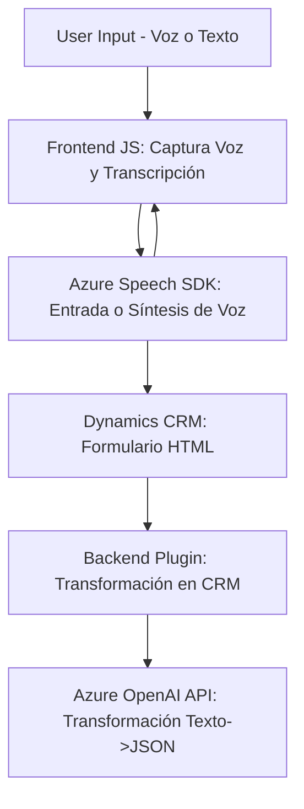

### Breve resumen técnico

Este repositorio contiene tres archivos principales que facilitan la interacción entre formularios de Dynamics CRM, procesamiento de voz y Azure AI. Se incluyen módulos frontend en JavaScript para manejar entradas y salidas de voz sobre formularios web, y un plugin en C# que emplea Azure OpenAI para transformar texto en datos JSON estructurados.

---

### Descripción de arquitectura

La solución utiliza una **arquitectura híbrida**, combinando:

1. **Event-Driven Programming**: Los módulos frontend reaccionan a eventos de usuario como clics, entrada de voz, y actualización de formularios.
2. **Plugin-Based Architecture**: El archivo C# usa el modelo de extensibilidad de Dynamics CRM mediante la interfaz `IPlugin`.
3. **Service-Oriented Architecture**: Todos los archivos integran servicios externos (Azure Speech SDK para procesamiento de voz y Azure OpenAI para análisis de texto).

Cada componente tiene un diseño modular, con una clara separación de responsabilidades:
- **Frontend**: Funciones centradas en la síntesis y reconocimiento de voz, además de manipulación de formularios web.
- **Backend**: Plugin para procesamiento avanzado de datos con inteligencia artificial.

---

### Tecnologías usadas

1. **Frontend:**
   - **JavaScript (ES6)**
   - **Azure Speech SDK**: Entrada y salida de voz, integración dinámica en el navegador.
   - **Dynamics CRM Web API**: Modificación en tiempo real de formularios del CRM.

2. **Backend:**
   - **C# (.NET Framework)**: Código del plugin para Dynamics CRM.
   - **Microsoft.Xrm.Sdk**: API SDK para interacción directa con Dynamics CRM.
   - **Azure OpenAI API**: Transformación de texto en datos JSON según normas específicas.
   - **Newtonsoft.Json**: Procesamiento y manipulación de estructuras JSON.
   - **System.Net.Http**: Llamadas HTTP para consumir servicios en la nube.

3. **Patrones de diseño:**
   - Modularización de funciones.
   - Adaptadores para datos (normalización de entrada de voz).
   - Integración con servicios externos (Speech SDK, OpenAI, y Dynamics CRM).

---

### Diagrama Mermaid

---

### Conclusión final

Este repositorio describe una solución enfocada en mejorar la interacción con formularios de Dynamics CRM mediante el uso de tecnología moderna, como Azure Speech SDK y Azure OpenAI. La arquitectura híbrida tiene un enfoque modular, permitiendo la fácil extensibilidad y mantenimiento del código. Los patrones utilizados, como la programación orientada a eventos y el diseño orientado a servicios, hacen que el sistema sea flexible para adaptarse a nuevas funcionalidades.