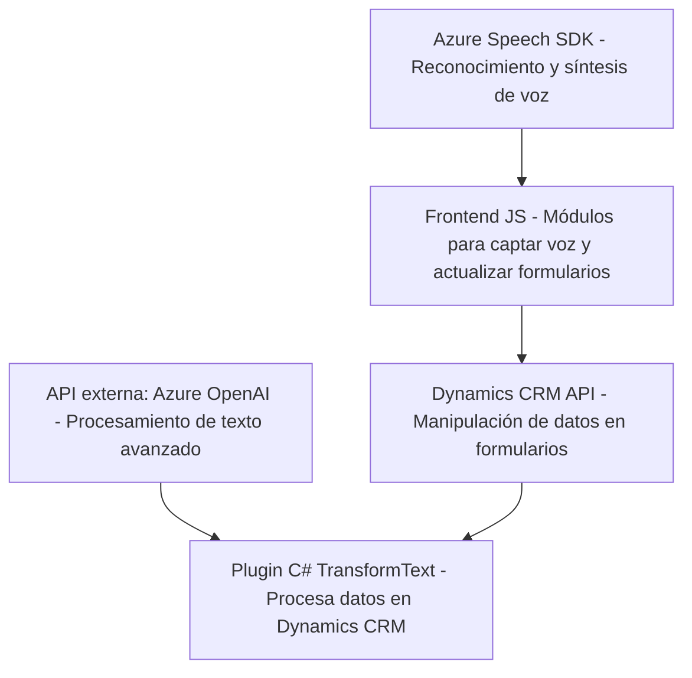

## Breve resumen técnico
La solución integra servicios como **Azure Speech SDK** y **Azure OpenAI** para ofrecer interacción de voz y procesamiento de datos dinámicos en formularios del entorno de **Dynamics 365 CRM**. Se usa código JavaScript para la capa de frontend y C# para la lógica vinculada a la API y plugins de Dynamics.

---

## Descripción de arquitectura
La arquitectura es una combinación de capas que interactúan de manera modular:

1. **Frontend (JavaScript):**
   - Captura datos visibles y facilita la interacción del usuario usando voz mediante reconocimiento de voz.
   - Procesa datos dinámicos y transcripciones para actualizar formularios en entornos de Dynamics 365.

2. **Plugins (C# .NET):**
   - Realiza transformaciones de texto basado en reglas usando **Azure OpenAI API**.
   - Integra lógica para trabajar con el modelo de datos y eventos dentro de Dynamics CRM.

---

## Tecnologías usadas
### Frameworks y Servicios
1. **Azure Speech SDK:** Recognition y síntesis de voz.
2. **Azure OpenAI:** Procesamiento avanzado de texto.
3. **Microsoft Dynamics CRM SDK:** Manipulación de datos y eventos.

### Lenguajes
- **JavaScript**: Implementa lógica en el frontend para procesar voz y datos visibles.
- **C# .NET**: Desarrollo de plugins asociados a Dynamics CRM.

### Librerías
1. En JavaScript:
   - Carga dinámica de SDKs externos.
   - Integración con formularios de CRM (`executionContext`).
2. En C#:
   - `Microsoft.Xrm.Sdk`, `Newtonsoft.Json`, `HttpClient` para invocar servicios externos y gestionar datos JSON.

### Patrones de diseño
1. **Callback y Promesas:** Lógica asíncrona en JavaScript con `ensureSpeechSDKLoaded`.
2. **Strategy:** Plugins C# usan la implementación genérica de la interfaz `IPlugin`.
3. **Modularidad y Delegate:** Organización funcional basada en funciones independientes para extensibilidad y mantenimiento.

---

## Diagrama Mermaid válido para GitHub Markdown

---

## Conclusión final
Esta solución representa una arquitectura **interconectada en múltiples capas**, lo que incluye:
1. **Capa de interacción (frontend)** para capturar y utilizar voz en formularios.
2. **Capa de procesamiento (plugins y backend)** para manejar datos complejos mediante servicios Azure.
3. **Integración RESTful** que conecta Dynamics CRM con servicios como Azure Speech y Azure OpenAI.

El diseño modular permite extensibilidad en el futuro y su estructura fomenta la reutilización de componentes, destacando como una solución eficiente y moderna con procesamiento basado en inteligencia artificial.