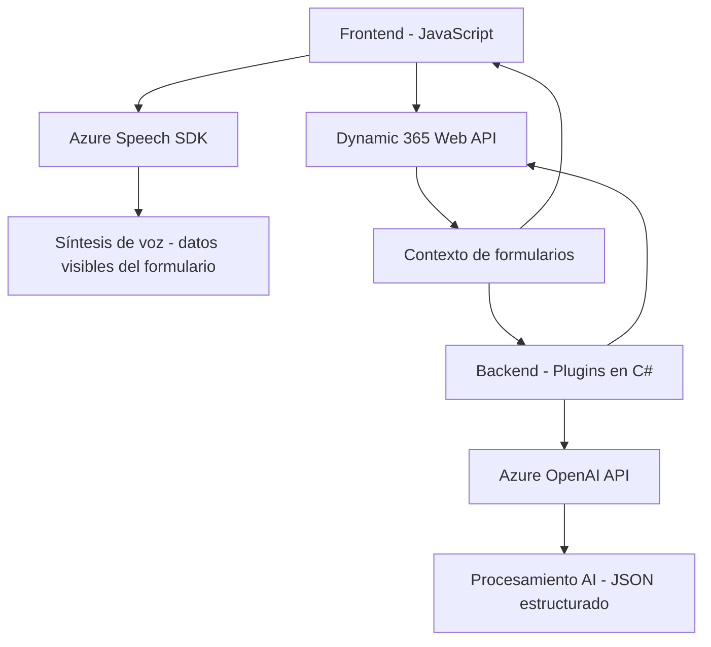

### Breve resumen técnico
El repositorio contiene archivos dedicados principalmente a la interacción con formularios y la conversión de texto utilizando servicios cloud (Azure Speech SDK y Azure OpenAI). Estos archivos implementan integración avanzada entre frontends dinámicos basados en formularios, reconocimiento de voz y procesamiento de texto basado en inteligencia artificial.

---

### Descripción de arquitectura
1. **Tipo de solución**:
   - Solución híbrida que incluye:
     - **Frontend**: Permite interacción con formularios mediante voz y visualización dinámica.
     - **Plugins**: Extiende funcionalidades en Dynamics CRM (como generación de texto estructurado vía Azure OpenAI).

2. **Arquitectura general**:
   - **Multicapa**:
     - Capa de presentación manejada por componentes JS para reconocimiento y síntesis de voz.
     - Capa de backend representada por plugins en C# que procesan datos conectándose a APIs externas de Azure (OpenAI).
   - **Integración de servicios externos**:
     - Uso de patrones como microservicios y external APIs para la interacción con Azure Speech y OpenAI.

3. **Tecnologías utilizadas**:
   - **Frontend**:
     - **JavaScript**: Manipulación DOM, carga dinámica de SDKs, mapeo de formularios.
     - **Azure Speech SDK**: Reconocimiento y síntesis de voz.
     - **Dynamic 365 Web API**: Integración con formularios.
   - **Backend**:
     - **C# en .NET framework**: Desarrollo de plugins para Dynamics CRM.
     - **Azure OpenAI API**: Transformación de texto mediante modelos de AI.
     - **Newtonsoft.Json**: Procesamiento de estructuras JSON.
     - **System.Net.Http**: Envío de solicitudes HTTP.

4. **Patrones detectados**:
   - **Modularidad**: Separación de funciones específicas para reconocimiento de voz, carga de SDK, mapeo de datos y ejecución de lógica.
   - **Integración cloud**: Interacción directa con servicios Azure, encapsulando lógica de interacción.
   - **Plugin-based architecture**: Los plugins extienden capacidades del sistema CRM.
   - **Single Responsibility Principle**: Cada módulo/función tiene una responsabilidad específica.

---

### Dependencias o componentes externos presentes
1. **Frontend**:
   - **Azure Speech SDK**: Para síntesis y reconocimiento de voz.
   - **Dynamic 365 Web API**: Integración directa con formularios de Dynamics.
2. **Backend**:
   - **Azure OpenAI API**: Para generación de contenido en forma estructurada.
   - **Newtonsoft.Json**: Para el manejo eficiente de JSON en las respuestas API.
   - **Dynamics CRM Framework (Xrm)**: Para el manejo del contexto y operaciones en el ecosistema CRM.

---

### Diagrama Mermaid válido para GitHub

---

### Conclusión final
Este repositorio centraliza la interacción entre usuarios y formularios utilizando tecnologías modernas y la nube (Azure). La arquitectura es **multicapa**, con separación entre la lógica del frontend y la lógica de servidor (plugins). Hay una fuerte dependencia de servicios externos (Azure Speech y OpenAI) para agregar capacidades avanzadas de reconocimiento de voz e inteligencia artificial. La modularidad y los patrones de integración optimizan la extensibilidad y la gestión de responsabilidades, mostrando un diseño bien estructurado y adaptable.