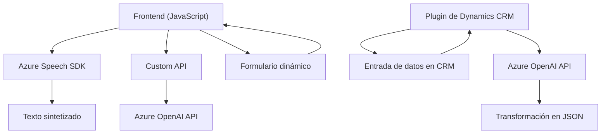

# Breve resumen técnico

El repositorio descrito está orientado a la integración del reconocimiento, transformación y síntesis de voz en formularios dinámicos para aplicaciones CRM como Dynamics 365. Incluye módulos de front-end en JavaScript que interactúan con el contexto de formularios, servicios SDK de Azure Speech, y un plugin en C# que consume Azure OpenAI para procesamiento avanzado de texto.

---

# Descripción de arquitectura

### Tipo de solución:
- **Híbrida**: Contiene elementos de **front-end** (JavaScript) y **back-end** (plugin de Dynamics CRM en C#).
- **Interfaz cliente**: Las partes de front-end recolectan datos de formularios y los procesan.
- **API externa**: Utiliza servicios en la nube (Azure Speech SDK y Azure OpenAI API) para reconocimiento de voz, síntesis de texto y transformación semántica.

### Arquitectura:
- **N-capas**:
  - **Capa 1 (Front-end en JavaScript)**:
    - Proporciona la interfaz cliente responsiva para manejar los formularios y datos visualizados.
    - Se integra con la capa del SDK de Azure Speech.
  - **Capa 2 (Backend/Plugins en C#)**:
    - Implementa lógica avanzada basada en eventos de Dynamics (input/output).
    - Consume la API de Azure OpenAI utilizando solicitudes HTTP.
  - **Capa 3 (Servicios cloud)**:
    - Azure Speech SDK para síntesis y reconocimiento de voz.
    - Azure OpenAI API para transformación semántica.
- Este modelo permite la **extensibilidad modular** en cada nivel (formularios dinámicos, APIs externas y lógica del servidor).

### Patrones destacados:
- **Patrón de integración dinámica**: Carga condicional de Azure Speech SDK (solo en tiempo de ejecución).
- **Patrón de transformación DTO**: Utiliza JSON estructurado para enviar solicitudes y recibir respuestas de la API.
- **Patrón de mapeo datos a lógica (data-binding)**: Mapeo explícito desde etiquetas visibles hacia nombres internos de campos.
- **Patrón de extensibilidad mediante plugins**: En el backend de Dynamics CRM.

---

# Tecnologías usadas

### Frontend:
1. **JavaScript**:
   - Uso de promesas (`async/await`) para llamadas API.
   - Modularización de funciones.
   - Cumplimiento de interoperabilidad con sistemas basados en formularios dinámicos (`executionContext`).
2. **Azure Speech SDK**:
   - Reconocimiento de voz.
   - Síntesis de texto hablado.

### Backend:
1. **Microsoft Dynamics SDK**:
   - `IPlugin` para interacción directa con el CRM.
   - Manipulación de eventos `InputParameters` y `OutputParameters`.
2. **C#**:
   - Código funcional orientado a solicitudes HTTP y procesamiento JSON.
   - Uso de `System.Net.Http` para integración con servicios RESTful.
3. **Azure OpenAI API**:
   - Procesamiento y transformación generativa (JSON estructurado).

---

# Dependencias o componentes externos

1. **Azure Speech SDK**: Dinámicamente cargado desde el navegador para reconocimiento y síntesis de voz.
2. **Azure OpenAI API**: Consumida desde el plugin backend en C#.
3. **Formulario dinámico (`executionContext`)**:
   - Herramienta nativa del entorno Dynamics que mapea y controla los campos interactivos.
4. **Microsoft Dynamics SDK**: Necesario para la ejecución de plugins y manipulación del modelo de datos CRM.

---

# Diagrama Mermaid válido para GitHub

---

# Conclusión final

Este repositorio implementa una solución robusta pero flexible, diseñada para mezclar tecnologías en diferentes capas (front-end y plugin backend) integradas con servicios en la nube (Azure SDK y OpenAI). El proyecto adopta una arquitectura de **n-capas**, enfocada en la extensibilidad y el aprovechamiento integral de APIs externas. Combina mapeo de datos interactivos con inteligencia artificial para mejorar la productividad en sistemas de formularios y CRM.

De manera general, el diseño está alineado a mejores prácticas para soluciones híbridas basadas en Azure y Microsoft Dynamics, siendo adecuado para entornos empresariales escalables.