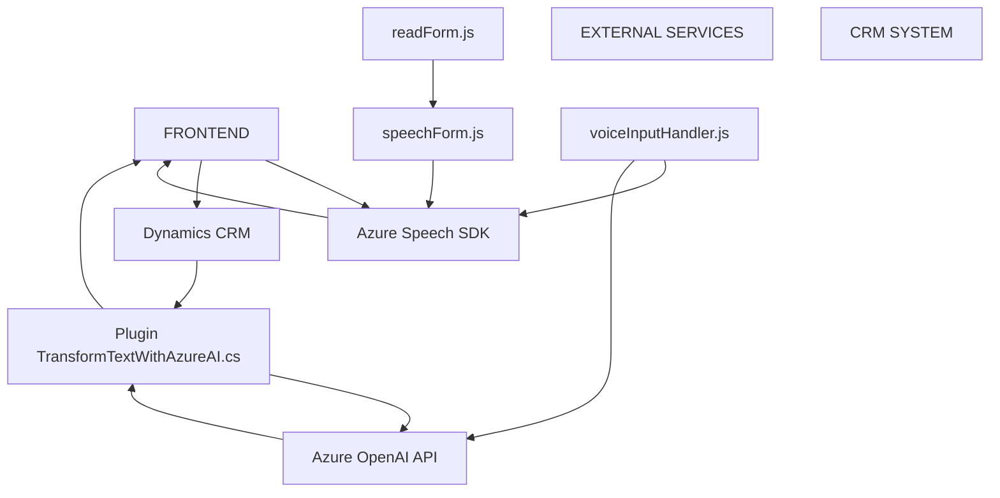

### Breve resumen técnico:
El repositorio presenta una solución distribuida con enfoque en accesibilidad, integración con tecnologías de cliente (frontend basado en JavaScript) y sistemas CRM. Sus componentes incluyen funcionalidad de síntesis y reconocimiento de voz, procesamiento de datos con IA y estructura modular para simplificar la interacción con formularios. También incluye un plugin que procesa texto mediante Azure OpenAI.

### Descripción de arquitectura:
La arquitectura adoptada sigue una configuración **orientada a eventos**, **modularizada** y destinada a sistemas distribuidos. Los componentes principales interactúan con APIs externas como **Azure Speech SDK** y **Azure OpenAI**, además de integrarse con formularios de Dynamics CRM.

#### Características:
1. **Frontend (JS):** Gestión de interacción por voz en formularios.
2. **Plugin (C# Dynamics CRM):** Lógica de procesamiento de texto mediante OpenAI integrada en el sistema del CRM.
3. **Dependencias externas:** Se utilizan servicios en la nube (Azure Speech SDK y Azure OpenAI).

### Tecnologías usadas:
1. **Frontend:**
   - JavaScript.
   - Azure Speech SDK.
   - Dinámicas de eventos y modularidad funcional.
2. **Backoffice (Plugin):**
   - C# con Microsoft Dynamics CRM SDK.
   - Newtonsoft.Json para manejo de JSON.
   - System.Net.Http para interacción con APIs.
   - Azure OpenAI para procesamiento de texto.
3. **Patrones:**
   - **Estructura modular:** Cada archivo JS incluye funciones desacopladas con una única responsabilidad.
   - **Evento y callback driven:** Asegurar la carga de SDK mediante funciones de retorno.
   - **Plugin Pattern:** Utilización de la interfaz `IPlugin` dentro de Dynamics CRM.

### Diagrama Mermaid para GitHub:

### Conclusión final:
El repositorio implementa una solución accesible moderna que combina funcionalidades **frontend**, **plugins de CRM** y **servicios de inteligencia artificial en la nube**. La arquitectura distribuye responsabilidades: procesamiento de campos de formularios mediante eventos en el frontend, interacción con APIs externas y ejecución de un plugin dedicado en el CRM para el manejo de datos estructurados mediante IA. Este diseño refleja principios sólidos de modularidad, integración de servicios, orientación a eventos, y es un sistema ideal para entornos empresariales donde la interacción eficiente y la accesibilidad sean clave.